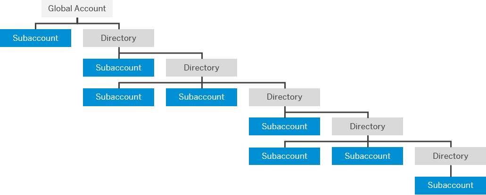

<!-- copy722a4755da7f4b7e9929be8f15af0f1b -->

<link rel="stylesheet" type="text/css" href="../css/sap-icons.css"/>

# Account Model

Learn more about the different types of accounts on SAP BTP and how they relate to each other.

> ### Remember:  
> SAP Business Technology Platform, Neo environment will sunset on **December 31, 2028**, subject to terms of customer or partner contracts.
> 
> For more information, see SAP Note [3351844](https://me.sap.com/notes/3351844).

> ### Tip:  
> **This documentation refers to SAP Business Technology Platform, Neo environment. If you are looking for documentation about other environments, see [SAP Business Technology Platform](https://help.sap.com/viewer/65de2977205c403bbc107264b8eccf4b/Cloud/en-US/6a2c1ab5a31b4ed9a2ce17a5329e1dd8.html "SAP Business Technology Platform (SAP BTP) is an integrated offering comprised of the following technology portfolios: application development; process automation; integration; data, analytics, and enterprise planning; artificial intelligence. The platform offers users the ability to turn data into business value, compose end-to-end business processes, connect entire IT landscapes, and personalize, build and extend SAP applications. This reduces the overall total cost of ownership maintaining SAP landscapes and third-party software across end-to-end business processes.") :arrow_upper_right:.**

<a name="loio9b7d44f92eec44a6ae87129c02aeec0d"/>

<!-- loio9b7d44f92eec44a6ae87129c02aeec0d -->

## Global Accounts

Global accounts are hosted environments that represent the scope of the functionality and the level of support based on a customer or partner’s entitlement to platform resources and services.

The global account is the realization of the commercial contract with SAP. A global account can contain one or more subaccounts in which you deploy applications, use services, and manage your subscriptions.

Global accounts are region- and environment-independent. Within a global account, you manage all of your subaccounts, which in turn are specific to regions and environments.

<a name="copy7b24059e42e34cff882260a5b9c81249"/>

<!-- copy7b24059e42e34cff882260a5b9c81249 -->

## Subaccounts

Subaccounts let you structure a global account according to your organization’s and project’s requirements with regard to members, authorizations, and quotas.

Subaccounts in a global account are independent from each other. This is important to consider with respect to security, member management, data management, data migration, integration, and so on, when you plan your landscape and overall architecture. Each subaccount is associated with a region, which is the physical location where applications, data, or services are hosted. It is also associated with one environment. The specific region and environment are relevant when you deploy applications and access the SAP BTP cockpit. The quotas that have been purchased for a global account have to be assigned to the individual subaccounts.

<a name="copyb7af89ba49504c5997d409f49cc5d3ae"/>

<!-- copyb7af89ba49504c5997d409f49cc5d3ae -->

### Using Beta Features with Subaccounts

SAP may offer, and a customer may choose to accept access to functionality, such as a service or application, which is not generally available and has not been validated and quality assured in accordance with SAP standard processes. Such functionality is defined as a beta feature.

Beta features let customers, developers, and partners test new features on SAP BTP. The beta features have the following characteristics:

-   SAP may require that customers accept additional terms to use beta features.

-   Beta features are released for enterprise accounts, trial accounts, or both.

-   To allow the use of beta services and applications in the subaccounts available to you in the SAP BTP cockpit, you need to set the *Enable beta features* option. You do this on global account level by choosing the edit icon on the subaccount's tile.

-   No personal data may be processed by beta functionality in the context of contractual data processing without additional written agreement.

> ### Caution:  
> You shouldn't use SAP BTP beta features in subaccounts that belong to productive enterprise accounts. For more information, see [Important Disclaimers and Legal Information](https://help.sap.com/viewer/disclaimer).

**Related Information**  

[Change Subaccount Details](../50-administration-and-ops-neo/change-subaccount-details-7614c98.md "Edit subaccounts using the SAP BTP cockpit.")

<a name="loio00a25ed5344443198b9cf3165c072408"/>

<!-- loio00a25ed5344443198b9cf3165c072408 -->

### Using Experimental Features in Subaccounts

SAP may choose to experiment with a feature before it decides whether to make it available for productive use. In such a case, we ask customers, developers, and partners to provide feedback on that feature. 

The experimental features have the following characteristics:

-   Experimental features are not part of the officially delivered scope that SAP guarantees for future releases. This means, that experimental features may be changed by SAP at any time for any reason without notice.

-   Experimental features are not for productive use. You may not demonstrate, test, examine, evaluate, or otherwise use the experimental features in a live operating environment or with data that has not been sufficiently backed up

The purpose of experimental features is to get feedback early on, allowing customers and partners to influence the future product accordingly. By providing your feedback \(for example, in the SAP Community\), you accept that intellectual property rights of the contributions or derivative works shall remain the exclusive property of SAP.

<a name="loioa92721fc75524ec09a7a7255997dbd94"/>

<!-- loioa92721fc75524ec09a7a7255997dbd94 -->

## Directories

With **directories**, you can organize and manage your subaccounts according to your technical and business needs.

A directory can contain directories and subaccounts to create a hierarchy. Using directories to group other directories and subaccounts is optional - you can still create subaccounts directly under your global account.

You can create a hierarchical structure that is up to 7 levels deep. The highest level of a given path is always the global account and the lowest is a subaccount, which means that you can have up to 5 levels of directories between the global account and the lowest level subaccount.

Directories enable you to:

-   Group and filter directories and subaccounts

-   Monitor usage and costs for contracts that use the consumption-based commercial model

Optionally, you can also enable the following features in your directories:

-   Manage Entitlements: Enables the assignment of a quota for services and applications to the directory from the global account quota, for distribution to the directory's subaccounts.

    When you assign entitlements to a directory, you express the entitlements and maximum quota that can be distributed across its children subaccounts. You also have the option to choose the auto-assignment of a set amount of quota to all subaccounts created or moved to that directory. Subaccounts that are already in the directory when you select that option will not be auto-assigned quota.

    > ### Note:  
    > If you've enabled the Manage Entitlements feature for a given directory, you must first assign the necessary entitlements and maximum allowed quota from the global account to that directory. Then you can distribute this "reserved" quota to any of the directory's child subaccounts.

-   Manage Authorizations: Enables authorization management for the directory. For example, it allows certain users to manage directory entitlements. You can only use this feature in combination with the *Manage Entitlements* feature.

**Related Information**  

[Manage the Account Explorer Hierarchy](../50-administration-and-ops-neo/manage-the-account-explorer-hierarchy-2e2a5b6.md "Create an account structure by creating a hierarchy of directories and subaccounts using the SAP BTP cockpit. Add, move, and delete subaccounts and directories in your structure.")

[Configure Entitlements and Quotas for Directories](../50-administration-and-ops-neo/configure-entitlements-and-quotas-for-directories-37f8871.md "Distribute entitlements that are available in your global account to directories by adding service plans and their allowed quotas by using SAP BTP cockpit.")

[Configure Entitlements and Quotas for Subaccounts](https://help.sap.com/viewer/65de2977205c403bbc107264b8eccf4b/Cloud/en-US/5ba357b4fa1e4de4b9fcc4ae771609da.html "Distribute the entitlements that are available in your global account by adding service plans and their allowed quotas to your subaccounts using SAP BTP cockpit.") :arrow_upper_right:

[Getting a Global Account](https://help.sap.com/viewer/65de2977205c403bbc107264b8eccf4b/Cloud/en-US/d61c2819034b48e68145c45c36acba6e.html#loiod61c2819034b48e68145c45c36acba6e "SAP BTP offers two types of global accounts: Trial accounts (completely free of charge) and enterprise accounts. Within an enterprise account, you can use both free and paid plans.") :arrow_upper_right:

[Setting Up Your Account Model](https://help.sap.com/viewer/df50977d8bfa4c9a8a063ddb37113c43/Cloud/en-US/2db81f42f5194454beecde6cd4994dda.html "Learn how to set up your account model with global accounts and subaccounts, and how to use directories, spaces and namespaces to match your business and development needs.") :arrow_upper_right:

[Managing Global Accounts Using the Cockpit](https://help.sap.com/viewer/65de2977205c403bbc107264b8eccf4b/Cloud/en-US/667f34ba9222450491c2b848cd17e189.html "Your SAP BTP global account is the entry point for managing the resources, landscape, and entitlements for your departments and projects in a self-service manner.") :arrow_upper_right:

[Managing Directories Using the Cockpit](../50-administration-and-ops-neo/managing-directories-using-the-cockpit-f495ac1.md "Learn how to organize and manage your subaccounts according to your technical and business needs by using directories in the SAP BTP cockpit.")

[Managing Subaccounts Using the Cockpit](../50-administration-and-ops-neo/managing-subaccounts-using-the-cockpit-55d0b6d.md "Learn how to structure a global account according to your organization’s and project’s requirements with regard to members, authorizations, and entitlements by managing subaccounts.")

[Working with Global Accounts, Directories, and Subaccounts Using the btp CLI](../50-administration-and-ops-neo/working-with-global-accounts-directories-and-subaccounts-using-the-btp-cli-85a683e.md "Use the SAP BTP command line interface (btp CLI) to manage operations with global accounts, directories, and subaccounts.")

[Account Administration Using APIs of the SAP Cloud Management Service](https://help.sap.com/viewer/65de2977205c403bbc107264b8eccf4b/Cloud/en-US/17b6a171552544a6804f12ea83112a3f.html "Provides information about using the APIs of the SAP Cloud Management service for SAP BTP (technical name: cis) to manage some of the administrative operations in your accounts.") :arrow_upper_right:

<a name="loio20828fc639954939890d3d74a22c5f66"/>

<!-- loio20828fc639954939890d3d74a22c5f66 -->

## Relationship Between Global Accounts, Subaccounts, and Directories

A global account can group together different directories and subaccounts that an administrator makes available to users. Administrators can assign the available entitlements and quotas of a global account to its different subaccounts and move it between subaccounts that belong to the same global account.

The hierarchical structure of global accounts, directories, and subaccounts lets you define an account model that accurately fits your business and development needs. For example, if you want to separate development, testing, and productive usage for different departments in your organization, you can create a directory for each department, and within each directory, you group subaccounts for development, testing, and production.

<a name="loioe8663c08ead648faa673b0d63c5b478e"/>

<!-- loioe8663c08ead648faa673b0d63c5b478e -->

## Labels

Labels are user-defined words or phrases that you can assign to various entities in SAP BTP to categorize them in your global account, to identify them more easily.

For example, in the *Account Explorer* page in the cockpit, you can quickly filter for directories and subaccounts by label.

You can assign labels to these entities when you create or edit them using the SAP BTP cockpit, command line interface \(btp CLI\), or REST APIs:

-   Directories

-   Subaccounts

-   Multitenant application subscriptions

-   Service instances

-   Environment instances

    > ### Note:  
    > For environment instances, these custom labels are user defined and apply only to SAP BTP. They are not the same labels that might be defined by your environment broker.

Labels are made up of a *label name* \(also referred to as a *key*\) and up to 10 *values* associated with the label. You can apply label names and values in any way that suits your business and technical needs.

**Types of labels and examples**

<table>
<tr>
<th valign="top">

Types of Labels

</th>
<th valign="top">

Examples

</th>
</tr>
<tr>
<td valign="top">

Single-value labels are useful for labels that have an identifier, or for labels with fixed lists.

</td>
<td valign="top">

-   Label Name: `Cost Object`

    Value: The ID of a cost center number or internal order that is associated with the entity, such as: `000001134789`

-   Label Name: `Status`

    Value: `Active` or `Inactive`

-   Label Name: `Landscape`

    Value: `Dev` or `Test` or `Production`

</td>
</tr>
<tr>
<td valign="top">

Multi-value labels make them useful for labels that typically have more than one value assigned to them.

</td>
<td valign="top">

-   Label Name: `Contacts`

    Value: The e-mail addresses or names of users that are responsible for the entity, such as: `admin-1@example.com` and `admin-2@example.com`

</td>
</tr>
<tr>
<td valign="top">

Labels can also be assigned with a name only and no value. In such cases, the label behaves like tag.

Note that currently for service instances, labels must have at least value.

</td>
<td valign="top">

-   Label Name: `For demo only`

-   Label Name: `Audited`

-   Label Name: `Flagged for deletion`

</td>
</tr>
</table>

> ### Note:  
> Labels replace what were previously called "custom properties". Custom properties supported only single values per label and were available only to directories and subaccounts. As a result of the move to labels, all relevant commands in the SAP BTP command line interface \(btp CLI\) and in the relevant REST APIs in the SAP Cloud Management service have been updated accordingly. The `custom-properties` parameter in the btp CLI and the `customProperties` field in the relevant REST APIs are deprecated.

You can assign labels when you create an entity, and then later add, change, or remove labels by editing the entity.

> ### Tip:  
> -   In the *Account Explorer* and *Instances and Subscriptions* pages in the SAP BTP cockpit, assigned labels are shown in the *Labels* column. To display the column if it is not shown, click :gear:.
> 
> -   In the *Account Explorer* page, you can view the labels that are assigned to a directory or subaccount by choosing the *More Info* option of each directory and subaccount.
> 
>     Assigned labels are also listed under the *Labels* tab when you display the *Overview* page of every directory and subaccount.
> 
> -   In the *Account Explorer* and *Instances and Subscriptions* pages, you can filter the displayed entities by their assigned labels in the *Search* field.
> 
> -   In the *Instances and Subscriptions* page, you can also view the labels that are assigned to a subscription or instance by expanding its details panel.

When working with labels, consider the following aspects:

-   In the cockpit, each entity can have up to 10 labels assigned to it.

-   You cannot add the same label name more than once to the same entity.

-   Existing label names and values are offered as suggestions when you or anyone else assigns a label to other entities of the same type in your global account.

    When you view a subaccount in the cockpit, the subaccount also shows the labels that are assigned to its parent directory and to other directories that are above it in the same path in your account structure. And in the *Account Explorer*, when you filter by labels that are assigned to a directory, the subaccounts in that directory path are also listed. We refer to these as inherited labels.

-   Label names and values are case-sensitive, which means you can create variants of the same label name with a different casing; for example, `My Label` and `My label` can coexist as separate labels. We recommend that you avoid using different casing or styling to create variants of the same names or values.

<a name="loioe8663c08ead648faa673b0d63c5b478e__section_css_zg4_rrb"/>

## Related Links

-   [Create a Subaccount](https://help.sap.com/viewer/65de2977205c403bbc107264b8eccf4b/Cloud/en-US/05280a123d3044ae97457a25b3013918.html "Create subaccounts in your global account using the SAP BTP cockpit.") :arrow_upper_right:
-   [Change Subaccount Details](https://help.sap.com/viewer/65de2977205c403bbc107264b8eccf4b/Cloud/en-US/567d4a84bfdc428f8f3640e07261f73a.html "Edit subaccounts using the SAP BTP cockpit.") :arrow_upper_right:
-   [Create a Directory](../50-administration-and-ops-neo/create-a-directory-b8ef1c4.md)
-   [Commands in the btp CLI](../50-administration-and-ops-neo/commands-in-the-btp-cli-a03a555.md)
-   [Account Administration Using APIs of the SAP Cloud Management Service](https://help.sap.com/viewer/65de2977205c403bbc107264b8eccf4b/Cloud/en-US/17b6a171552544a6804f12ea83112a3f.html "Provides information about using the APIs of the SAP Cloud Management service for SAP BTP (technical name: cis) to manage some of the administrative operations in your accounts.") :arrow_upper_right:
-   [Managing Service Resources Using the APIs of the SAP Service Manager](https://help.sap.com/viewer/65de2977205c403bbc107264b8eccf4b/Cloud/en-US/ee4f871225da4361a41a67ecff2ef123.html "Use the APIs of the SAP Service Manager to work with environments, service brokers, service instances, service bindings, service plans, and service offerings.") :arrow_upper_right:
-   [Creating Service Instances](https://help.sap.com/viewer/09cc82baadc542a688176dce601398de/Cloud/en-US/fad874a99a434ae58c59d7340a528bdc.html)
-   [Working with Environment Instances](https://help.sap.com/viewer/09cc82baadc542a688176dce601398de/Cloud/en-US/1d6897d22f90443c8a3f9f6c8bb41bb8.html#loio1d6897d22f90443c8a3f9f6c8bb41bb8__section_usz_bfz_qrb)
-   [Subscribe to Multitenant Applications Using the Cockpit](https://help.sap.com/viewer/65de2977205c403bbc107264b8eccf4b/Cloud/en-US/7a3e39622be14413b2a4df7c02ca1170.html "Subscribe to multitenant applications from the Subscriptions page in the SAP BTP cockpit.") :arrow_upper_right:

<a name="loio6680883537f34ee4b13d03126471ddc8"/>

<!-- loio6680883537f34ee4b13d03126471ddc8 -->

## User Accounts

A user account corresponds to a particular user in an identity provider, such as the SAP ID service \(for example, an S-user, P-user\) and consists, for example, of an SAP user ID and password.

> ### Remember:  
> SAP Business Technology Platform, Neo environment will sunset on **December 31, 2028**, subject to terms of customer or partner contracts.
> 
> For more information, see SAP Note [3351844](https://me.sap.com/notes/3351844).

> ### Tip:  
> **This documentation refers to SAP Business Technology Platform, Neo environment. If you are looking for documentation about other environments, see [SAP Business Technology Platform](https://help.sap.com/viewer/65de2977205c403bbc107264b8eccf4b/Cloud/en-US/6a2c1ab5a31b4ed9a2ce17a5329e1dd8.html "SAP Business Technology Platform (SAP BTP) is an integrated offering comprised of the following technology portfolios: application development; process automation; integration; data, analytics, and enterprise planning; artificial intelligence. The platform offers users the ability to turn data into business value, compose end-to-end business processes, connect entire IT landscapes, and personalize, build and extend SAP applications. This reduces the overall total cost of ownership maintaining SAP landscapes and third-party software across end-to-end business processes.") :arrow_upper_right:.**

<a name="loio6680883537f34ee4b13d03126471ddc8__section_a5j_45c_dhb"/>

## Platform Users vs Business Users

There are two types of users on SAP BTP: platform users and business users. Platform users are the members of global accounts and subaccounts: usually developers, administrators or operators who deploy, administer, and troubleshoot applications and services. They can view a list of all global accounts and subaccounts, and access them using the cockpit.

Business users are those who use the applications that are deployed to SAP BTP. For example, users of subscribed apps or services, such as SAP Web IDE, are business users.

