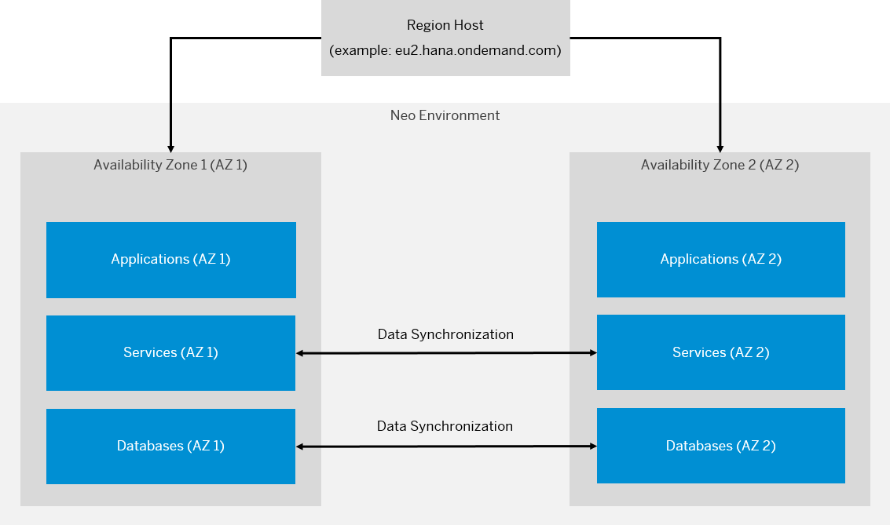

<!-- loio5d5c1ec49c8b4bb6af0a546a8823edc2 -->

# Multi-AZ in the Neo Environment

Multi-AZ aims to improve the availability of your applications, services, and databases within one SAP BTP region in case an availability zone goes down.

<a name="loio5d5c1ec49c8b4bb6af0a546a8823edc2__section_dpz_fkc_tlb"/>

## What Is Multi-AZ?

The Multi-AZ setup relies on two availability zones within one SAP BTP region. Each availability zone is a physically separate location with its own power supply, network, and cooling. These two availability zones operate in separate nearby data centers.

Both availability zones contain your applications, services, and databases. AZ 1 is always the default availability zone when you first set up Multi-AZ, which means that an application first connects to the primary database located in AZ 1. While AZ 1 is the primary zone, your data is being replicated synchronously to the secondary availability zone \(AZ 2\). Thus, if something goes wrong with AZ 1, AZ 2 takes over and ensures the survival of the region.

  
  
**Overview of Multi-AZ**

<a name="loio5d5c1ec49c8b4bb6af0a546a8823edc2__section_gs3_kbs_tlb"/>

## Prerequisites

-   The application doesn't depend on a service that doesn't support Multi-AZ.

-   You've acquired the necessary quota for all the resources you need in both availability zones.

    For more information, see [Configure Entitlements and Quotas for Subaccounts](https://help.sap.com/viewer/ea72206b834e4ace9cd834feed6c0e09/Cloud/en-US/c90f3d522ee04e65bd87cdec8808e5ce.html).

-   Each application has **at least two processes** running.

    > ### Note:  
    > Make sure that you've started at least two application processes in the respective multi-AZ region. The distribution of these processes between AZ 1 and AZ 2 is automated.

-   You've set up your SAP HANA or SAP ASE databases in high availability mode. A high availability setup consists of two SAP HANA or SAP ASE database systems that permanently and synchronously replicate data from a primary to a secondary database system. By default, AZ 1 is the primary database.

    For more information, see [Managing SAP HANA Database Systems in a Multi-AZ Setup](https://help.sap.com/viewer/d4790b2de2f4429db6f3dff54e4d7b3a/Cloud/en-US/cab9622f07a34eac88a707a554cfa6ae.html).

<a name="loio5d5c1ec49c8b4bb6af0a546a8823edc2__section_qcw_fps_tlb"/>

## Features

-   The data centers where the availability zones reside are in nearby locations. Even if something unexpected happens to one of the availability zones, the other one should be able to replace it.

-   The Multi-AZ database setup is similar to the standard process of setting up a database in high availability mode. This is relevant for SAP HANA and SAP ASE databases.

-   The Multi-AZ application setup ensures that your application processes are distributed in both availability zones automatically.

-   The Multi-AZ setup doesn't change the way you've previously consumed any services.

-   HA-enabled databases have synchronous replication between their primary and secondary nodes. In case of an outage, this allows for a failover to the databases in AZ 2.

-   There's only one entry point to both AZ 1 and AZ 2. This is the host of the region where these zones reside.

    For more information about the available regions and their hosts, see [Regions and Hosts Available for the Neo Environment](https://help.sap.com/viewer/ea72206b834e4ace9cd834feed6c0e09/Cloud/en-US/d722f7cea9ec408b85db4c3dcba07b52.html).

<a name="loio5d5c1ec49c8b4bb6af0a546a8823edc2__section_uxz_4rs_tlb"/>

## Scope

Multi-AZ is currently available in only one region: Europe \(Frankfurt\) with region host `eu2.hana.ondemand.com`.

