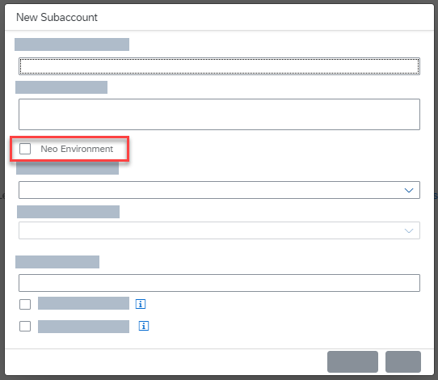

<!-- loio8c963e83a42545e29d1b4277a287a01b -->

# Working with Cloud Management Tools Feature Set B in the Neo Environment

Enterprise accounts in SAP BTP that have access to cloud management tools feature set B, can also use the enhanced capabilities offered by feature set B with their subaccounts in the Neo environment.

## What is cloud management tools feature set B and which enhancements does it offer?

Cloud management tools represent the group of technologies designed for managing SAP BTP.

We're currently renovating and adding core functionalities to SAP BTP. As part of this process, we're migrating accounts from the existing cloud management tools feature set A to the renovated feature set B. We’re doing this migration as a phased rollout, so cloud management tools feature sets A and B will coexist for some time.

In the rest of this topic, we provide information about the scope of specific enhancements in feature set B when working in the Neo environment.

<a name="loio8c963e83a42545e29d1b4277a287a01b__section_v5y_fyn_gnb"/>

## Is cloud management tools feature set B available to all Neo subaccounts?

Access to cloud management tools feature set B with Neo subaccounts is currently available to enterprise customers on a limited basis within the regions that support the Neo environment.

You can also see if your account has access to the Neo environment by creating a subaccount and checking if the *Neo Environment* option is available in the *New Subaccount* dialog box.

<a name="loio8c963e83a42545e29d1b4277a287a01b__section_mnz_fyn_gnb"/>

## Working with Neo subaccounts in the SAP BTP cockpit

Whenever you directly access a Neo subaccount that supports cloud management tools feature set B, you'll be redirected to a cockpit version that is dedicated to the management of Neo subaccounts. In this cockpit version, you'll notice that:

-   The entries in the navigation panel apply only to tools and features that are supported by the Neo environment.

-   The *Entitlements* page is for view-only purposes only. To manage entitlements, you must navigate back to the global account.

-   When you click on the global account in the navigation breadcrumb or on *SAP BTP, Neo Environment Cockpit* in the cockpit banner, you are redirected to the cockpit version with your global account.

<a name="loio8c963e83a42545e29d1b4277a287a01b__section_s11_gyn_gnb"/>

## Working with Neo subaccounts using the SAP BTP command line interface

The SAP BTP command line interface \(btp CLI\) allows you to perform a wide range of account management tasks using the command line. For more information, see [Account Administration Using the SAP BTP Command Line Interface \(btp CLI\)](../50-administration-and-ops-neo/account-administration-using-the-sap-btp-command-line-interface-btp-cli-7c6df2d.md).

Whenever you directly access a Neo subaccount, you need to work with the Neo command console or the SAP BTP cockpit. These are the known conditions and scope when working with Neo subaccounts in the btp CLI:

<table>
<tr>
<th valign="top">

btp CLI Command

</th>
<th valign="top">

Conditions and Scope for the Neo Environment

</th>
</tr>
<tr>
<td valign="top">

`accounts/environment‑instance` 

</td>
<td valign="top">

Not applicable. A Neo environment is created with every Neo subaccount. You cannot enable additional environments within a Neo subaccount.

</td>
</tr>
<tr>
<td valign="top">

`accounts/resource‑provider` 

</td>
<td valign="top">

Not applicable. To consume supported remote-service resources that you already own from a non-SAP cloud vendor, use a multi-environment subaccount.

</td>
</tr>
<tr>
<td valign="top">

`subscribe accounts/subaccount`

`unsubscribe  accounts/subaccount`

`list accounts/subscription`

`get accounts/subscription`

</td>
<td valign="top">

To manage application subscriptions in Neo subaccounts, use the console client in the SAP BTP SDK for the Neo environment.

</td>
</tr>
<tr>
<td valign="top">

`list accounts/available‑environment` 

</td>
<td valign="top">

Not available for Neo subaccounts.

</td>
</tr>
<tr>
<td valign="top">

`list accounts/entitlement` 

</td>
<td valign="top">

Not available for Neo subaccounts.

</td>
</tr>
<tr>
<td valign="top">

`delete accounts/subaccount` 

</td>
<td valign="top">

To delete Neo subaccounts, use the console client in the SAP BTP SDK for the Neo environment.

</td>
</tr>
<tr>
<td valign="top">

`security/app`

`security/role`

`security/role‑collection`

</td>
<td valign="top">

Use the APIs in the SAP BTP SDK for the Neo environment.

</td>
</tr>
<tr>
<td valign="top">

`services/binding`

`services/broker`

`services/instance`

`services/offering`

`services/plan`

`services/platform`

</td>
<td valign="top">

These commands apply only to subaccounts that support the multi-environment configuration, such as Cloud Foundry and Kubernetes.

</td>
</tr>
</table>

Where necessary, you can use the SAP BTP cockpit to fully manage your Neo environment.

<a name="loio8c963e83a42545e29d1b4277a287a01b__section_n51_gyn_gnb"/>

## Working with Neo subaccounts and the APIs of the core services for SAP BTP

Feature set B offers a set of core service APIs that allow you to perform a wider range of account management tasks. For more information, see [Account Administration Using APIs](https://help.sap.com/viewer/65de2977205c403bbc107264b8eccf4b/Cloud/en-US/1c8db1483d914cd99047aac5280f61ea.html "SAP BTP provides REST APIs that enable you to perform administrative tasks on the global account, directory, and subaccount level, such as creating or updating subaccounts, monitoring usage information, managing access, and managing service resources.") :arrow_upper_right:.

These are the known conditions and scope when working with Neo subaccounts and the core APIs for SAP BTP:

<table>
<tr>
<th valign="top">

Service

</th>
<th valign="top">

Conditions and Scope for the Neo Environment

</th>
</tr>
<tr>
<td valign="top">

Accounts service \(provided with the SAP Cloud Management service for SAP BTP\)

</td>
<td valign="top">

When deleting Neo subaccounts, use the SAP BTP SDK for the Neo environment.

</td>
</tr>
<tr>
<td valign="top">

Provisioning service \(provided with the SAP Cloud Management service for SAP BTP\)

</td>
<td valign="top">

Use the SAP BTP SDK for the Neo environment.

</td>
</tr>
<tr>
<td valign="top">

SAP Software-as-a-Service Provisioning service

</td>
<td valign="top">

To manage application subscriptions in Neo subaccounts, use the SAP BTP SDK for the Neo environment.

</td>
</tr>
<tr>
<td valign="top">

SAP Authorization and Trust Management service

</td>
<td valign="top">

Use the SAP BTP SDK for the Neo environment.

</td>
</tr>
<tr>
<td valign="top">

SAP Service Manager

</td>
<td valign="top">

The APIs offered by this service apply only to subaccounts that support the multi-environment configuration, such as Cloud Foundry and Kubernetes.

</td>
</tr>
<tr>
<td valign="top">

Events

</td>
<td valign="top">

You can use the central-based events provided by this service with your Neo subaccounts. See [Using the Events Service APIs](https://help.sap.com/viewer/65de2977205c403bbc107264b8eccf4b/Cloud/en-US/94e1895c16274df2a59196b81e28d1c4.html "The Events service provides REST APIs that collect information about events relating to account administrative operations in the microservices of the SAP Cloud Management service for SAP BTP, such as Accounts, Entitlements, Provisioning, and the SAP SaaS Provisioning service, within central and local regions.") :arrow_upper_right:.

</td>
</tr>
</table>

Where necessary, you can also use the SAP BTP cockpit to fully manage your Neo environment.

**Related Information**  

[Enterprise Accounts](https://help.sap.com/viewer/65de2977205c403bbc107264b8eccf4b/Cloud/en-US/171511cc425c4e079d0684936486eee6.html "Enterprise accounts are usually associated with SAP customer or partner contracts and contain their purchased entitlements to platform resources and services. However, it's also possible to create an enterprise account for personal exploration.") :arrow_upper_right:

[What Is SAP BTP, Neo Environment](what-is-sap-btp-neo-environment-34ac790.md "SAP BTP, Neo environment is an enterprise platform-as-a-service (enterprise PaaS) that provides comprehensive application development services and capabilities, which lets you build, extend, and integrate business applications in the cloud.")

[https://api.hana.ondemand.com/](https://api.hana.ondemand.com/)

[Console Client Commands](../50-administration-and-ops-neo/console-client-commands-56e309f.md "")

[Managing Members Using the Cockpit](../50-administration-and-ops-neo/managing-members-using-the-cockpit-a6cdfd2.md "You can add members to your global accounts and subaccounts and assign different roles to them:")

[https://api.sap.com/api/AccountMembersManagementAPI/resource](https://api.sap.com/api/AccountMembersManagementAPI/resource)

[Platform Authorization Management API](../60-security-neo/platform-authorization-management-api-eb01a9f.md "The Platform Authorization Management API allows you to manage the users authorized to access your subaccount in the Neo environment.")

