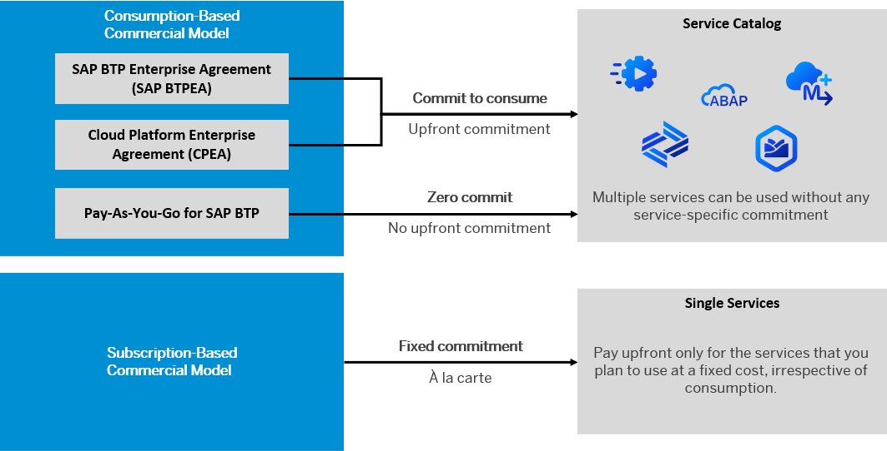

<!-- copy96e78abc7f1c445e880346924441dc51 -->

# Get an Enterprise Account

To use an enterprise account, you can either purchase a customer account, join the partner program to purchase a partner account, or self-register for an enterprise account to try out free tier service plans.

> ### Remember:  
> SAP Business Technology Platform, Neo environment will sunset on **December 31, 2028**, subject to terms of customer or partner contracts.
> 
> For more information, see SAP Note [3351844](https://launchpad.support.sap.com/#/notes/3351844).

> ### Tip:  
> **This documentation refers to SAP Business Technology Platform, Neo environment. If you are looking for documentation about other environments, see [SAP Business Technology Platform](https://help.sap.com/viewer/65de2977205c403bbc107264b8eccf4b/Cloud/en-US/6a2c1ab5a31b4ed9a2ce17a5329e1dd8.html "SAP Business Technology Platform (SAP BTP) is an integrated offering comprised of four technology portfolios: database and data management, application development and integration, analytics, and intelligent technologies. The platform offers users the ability to turn data into business value, compose end-to-end business processes, and build and extend SAP applications quickly.") :arrow_upper_right:.**

**Related Information**  

[Get an Account on SAP BTP to Try Out Free Tier Service Plans](https://developers.sap.com/tutorials/btp-free-tier-account.html)

<a name="copy07a76681cdb64c10ae325ba13b416ed7"/>

<!-- copy07a76681cdb64c10ae325ba13b416ed7 -->

## Sign up for a Customer Account

A customer account is an enterprise account that allows you to host productive, business-critical applications with 24x7 support.

When you want to purchase a customer account, you can select from a set of predefined packages. For information about service availability, prices, and estimators, see [https://www.sap.com/products/extension-suite/pricing.html](https://www.sap.com/products/extension-suite/pricing.html) and [https://www.sap.com/products/integration-suite/pricing.html](https://www.sap.com/products/integration-suite/pricing.html). You can also view the service catalog via the [SAP Discovery Center](https://discovery-center.cloud.sap). Contact us on [SAP BTP](https://www.sap.com/products/business-technology-platform.html) or via an SAP sales representative.

<a name="copy07a76681cdb64c10ae325ba13b416ed7__section_ecc_h3p_stb"/>

## Free Tier

If you want to try out services for free, with the option of easily upgrading them later, you can get an enterprise account and use free tier service plans only. See [Get an Account on SAP BTP to Try Out Free Tier Service Plans](https://developers.sap.com/tutorials/btp-free-tier-account.html). When you sign up for a global account to try out free tier service plans, you need to select either an existing global account of your company, or create a new global account. If you choose an existing global account, make sure to contact the global account admin of this global account, as they'll receive the communication emails. In this case, we recommend to have them add you as Global Account Administrator. See [Assign Users to Role Collections](https://help.sap.com/viewer/ae8e8427ecdf407790d96dad93b5f723/Cloud/en-US/c5766765bda74ad59fe656977c8fa4d6.html "You can assign users to a role collection by adding them to the role collection.") :arrow_upper_right: and [SAP BTP Onboarding Resource Center](https://support.sap.com/en/product/onboarding-resource-center/business-technology-platform.html).

You can upgrade and refine your resources later on. You can also contact your SAP sales representative and opt for a configuration, tailored to your needs.

<a name="copy07a76681cdb64c10ae325ba13b416ed7__section_c5l_n3p_stb"/>

## Onboarding

After you have purchased a new customer account, you will receive an email confirming the provisioning of resources from the platform services team and a second email with the URL and login ID to obtain access. Note, only the person who receives the access email has initial access to SAP BTP.

If you chose an add-on to an existing global account, the initial access email will not be sent to you. You will need to contact the Global Account Administrator from the initial BTP order. If you’re unsure who this person is, please contact your SAP Sales representative. If you need to add a new global admin because the person with initial access is no longer available to grant you access, then you can contact the SAP Support Portal, by creating a ticket at component BC-NEO-CIS-OPS.

> ### Tip:  
> Check out the [Live Onboarding Webinars](https://support.sap.com/en/product/onboarding-resource-center/business-technology-platform.html).

**Related Information**  

[Commercial Models](https://help.sap.com/viewer/df50977d8bfa4c9a8a063ddb37113c43/Cloud/en-US/38ecf59cdda64150a102cfaa62d5faab.html#loio263d40009a5a4237a62e8f5c05ee641e "SAP BTP offers two different commercial models for enterprise accounts.") :arrow_upper_right:

[Using Free Service Plans](https://help.sap.com/viewer/65de2977205c403bbc107264b8eccf4b/Cloud/en-US/524e1081d8dc4b0f9d055a6bec383ec3.html "The free tier model for SAP BTP lets you try out services in global accounts without any additional cost using the consumption-based commercial model and an enterprise account.") :arrow_upper_right:

[Access the Cockpit](https://help.sap.com/viewer/65de2977205c403bbc107264b8eccf4b/Cloud/en-US/4e750660b72e4fd6b2485ffb0b3cbdca.html "Learn how to access the SAP BTP cockpit.") :arrow_upper_right:

<a name="copyad04d906a6564812882346dea9e6e5b5"/>

<!-- copyad04d906a6564812882346dea9e6e5b5 -->

## Join the Partner Program

A partner account is an enterprise account that enables you to build applications and to sell them to your customers.

To become a partner, you need to fill in an application form and then sign your partner contract. You will be assigned to a partner account with the respective resources. To apply for the partner program, visit [https://partneredge.sap.com/content/partnerregistration/en\_us/registration.html?partnertype=BLD&engagement=0002&build=1](https://partneredge.sap.com/content/partnerregistration/en_us/registration.html?partnertype=BLD&engagement=0002&build=1). You will receive a welcome mail with further information afterwards.

General information about the partner program is available on [https://www.sap.com/partner/become/partneredge-build/plan-design.html](https://www.sap.com/partner/become/partneredge-build/plan-design.html).

**Related Information**  

[Account Model](../10-concepts-neo/account-model-722a475.md#copy722a4755da7f4b7e9929be8f15af0f1b "Learn more about the different types of accounts on SAP BTP and how they relate to each other.")

<a name="copya70322730ecf4300acfbd4d2f4903525"/>

<!-- copya70322730ecf4300acfbd4d2f4903525 -->

## Commercial Models

SAP BTP offers two different commercial models for enterprise accounts.

-   **Consumption-based commercial model:** Your organization receives access to all current and future services that are eligible for this model. You have complete flexibility to turn services on and off and to switch between services as your business requires throughout the duration of your contract. This commercial model is available in two flavors: Cloud Platform Enterprise Agreement \(CPEA\) and Pay-As-You-Go for SAP BTP.

    For more information, see [What Is the Consumption-Based Commercial Model?](https://help.sap.com/viewer/65de2977205c403bbc107264b8eccf4b/Cloud/en-US/7047eb4a15a84ac7be3c8612179e6d1f.html "With the consumption-based model, your organization purchases an entitlement to all current and future SAP BTP services that are eligible for this model. Throughout the duration of your contract, you have complete flexibility to turn services on and off and to switch between services as your business requires.") :arrow_upper_right:

-   **Subscription-based commercial model:** Your organization subscribes only to the services that you plan to use. You can then use these services at a fixed cost, irrespective of consumption.

    For more information, see [What Is the Subscription-Based Commercial Model?](get-an-enterprise-account-96e78ab.md#loio239b6e045e7e48f58b61655b02748d45)

> ### Note:  
> You can use both commercial models, either in separate global accounts or in the same global account depending on your business needs. Contact your SAP account executive or sales representative for more information. You cannot however, mix Cloud Platform Enterprise Agreement \(CPEA\) and Pay-As-You-Go for SAP BTP in the same global account.

For information about service availability, prices, and estimators, see [https://www.sap.com/products/technology-platform/solutions.html](https://www.sap.com/products/technology-platform/solutions.html) and [https://www.sap.com/products/technology-platform/integration-suite/pricing.html](https://www.sap.com/products/technology-platform/integration-suite/pricing.html). You can also view the service catalog via the [SAP Discovery Center](https://discovery-center.cloud.sap).

<a name="copy65e4c829bd164477a666529f2f4a72e2"/>

<!-- copy65e4c829bd164477a666529f2f4a72e2 -->

### What Is the Consumption-Based Commercial Model?

> ### Note:  
> The use of the consumption-based commercial model is subject to its availability in your country or region.

With the consumption-based model, your organization purchases an entitlement to all current and future SAP BTP services that are eligible for this model. Throughout the duration of your contract, you have complete flexibility to turn services on and off and to switch between services as your business requires.

The consumption-based commercial model is available in two flavors; the **CPEA** \(**Cloud Platform Enterprise Agreement**\) and **Pay-As-You-Go for SAP BTP**. Each option is suited to different business situations and levels of financial commitment, as described in the table below. For additional information and clarifications, please contact your account executive.

<table>
<tr>
<td valign="top">

**CPEA**

</td>
<td valign="top">

-   Your organization makes a prepaid investment in cloud credits for the contract duration with an annual commitment to consume SAP BTP services.
-   This model is suitable for customers that have well-established and planned use cases, and who want the flexibility of turning services on and off, and switching between services, without the commitment of being tied to a single service throughout the duration of the contract.
-   You receive a monthly balance statement that provides information about the usage consumption of each service and the corresponding costs. The total monthly cost is deducted from your cloud credits balance.
-   This model has a minimum investment entry, and volume-based discounts are available.
-   You are billed annually in advance. Any overages are billed in arrears at list price.
-   You can top up your cloud credits at any time to prevent overages.

</td>
</tr>
<tr>
<td valign="top">

**Pay-As-You-Go for SAP BTP**

</td>
<td valign="top">

-   You have the same access to all the services that are available in CPEA, but with a highly flexible zero-commitment model – you pay nothing upfront and there is no minimum usage requirement or annual commitment.
-   You pay only for the SAP BTP services that you want, when you use them.
-   You are billed monthly in arrears.
-   Service charges are non-discountable.
-   This low-risk model is suitable for customers with use cases that are not well defined, and are interested in running a proof-of-concept in a productive environment. This model provides the flexibility of turning services on and off, and switching between services, as needed throughout the duration of the contract.
-   A seamless transition to the CPEA model is available, on the condition that you have no other CPEA-based global accounts.

If you want information about the **Pay-As-You-Go for SAP BTP for Partners** commercial model , go to the[SAP Partner Portal](https://partneredge.sap.com/en/partnership/licenses/tdd/wp_payg_btp.html).

</td>
</tr>
</table>

> ### Tip:  
> You can monitor costs and service usage throughout the contract period. See [Monitoring Usage and Consumption Costs in Your Global Account](https://help.sap.com/viewer/65de2977205c403bbc107264b8eccf4b/Cloud/en-US/de6f0db8919f4e6f97e54bc4ddaf2ab8.html "In a global account that uses the consumption-based commercial model, you can monitor the usage of billed services and your consumption costs in the SAP BTP cockpit.") :arrow_upper_right: and [View Subaccount Usage Analytics](../50-administration-and-ops-neo/view-subaccount-usage-analytics-8f4d9db.md).

For information about eligible services and pricing for SAP Integration Suite and SAP Extension Suite, see [https://www.sap.com/products/extension-suite/pricing.html](https://www.sap.com/products/extension-suite/pricing.html) and [https://www.sap.com/products/integration-suite/pricing.html](https://www.sap.com/products/integration-suite/pricing.html).see [https://cloudplatform.sap.com/price-lists](https://cloudplatform.sap.com/price-lists), or access the SAP BTP service catalog via the [SAP Discovery Center](https://discovery-center.cloud.sap). The SAP BTP service catalog allows you to identify service availability per data center and to determine licensing model compatibility per available service plan.

As part of the free tier model for SAP BTP, some services offer free service plans that allow you to try out these services without any additional charge within your CPEA or Pay-As-You-Go for SAP BTP global account. For more information, see [Using Free Service Plans](https://help.sap.com/viewer/65de2977205c403bbc107264b8eccf4b/Cloud/en-US/524e1081d8dc4b0f9d055a6bec383ec3.html "The free tier model for SAP BTP lets you try out services in global accounts without any additional cost using the consumption-based commercial model and an enterprise account.") :arrow_upper_right:.

To find frequently asked questions about this licensing model, see the [Consumption-based commercial model CPEA and Cloud Credits - FAQ Document](https://www.sap.com/products/extension-suite/pricing.html?pdf-asset=668ae6f5-cd7d-0010-87a3-c30de2ffd8ff).

> ### Note:  
> Depending on your business needs, you can combine the consumption-based commercial model with the subscription-based commercial model in the same global account, or you can use both commercial models in the same global acccount. Contact your SAP account executive or sales representative for more information. Note however that you cannot mix Cloud Platform Enterprise Agreement \(CPEA\) and Pay-As-You-Go for SAP BTP in the same global account.

**Related Information**  

[What Is the Subscription-Based Commercial Model?](get-an-enterprise-account-96e78ab.md#loio239b6e045e7e48f58b61655b02748d45 "Your organization receives a fixed price and period (typically a 1 to 3-year period) for access to your subscribed SAP BTP services.")

[Monitoring Usage and Consumption Costs in Your Global Account](https://help.sap.com/viewer/65de2977205c403bbc107264b8eccf4b/Cloud/en-US/de6f0db8919f4e6f97e54bc4ddaf2ab8.html "In a global account that uses the consumption-based commercial model, you can monitor the usage of billed services and your consumption costs in the SAP BTP cockpit.") :arrow_upper_right:

[View Subaccount Usage Analytics](../50-administration-and-ops-neo/view-subaccount-usage-analytics-8f4d9db.md "You can explore, compare, and analyze all your actual usage data for the services and applications that are available in your subaccount.")

[Managing Global Accounts Using the Cockpit](https://help.sap.com/viewer/65de2977205c403bbc107264b8eccf4b/Cloud/en-US/667f34ba9222450491c2b848cd17e189.html "Your SAP BTP global account is the entry point for managing the resources, landscape, and entitlements for your departments and projects in a self-service manner.") :arrow_upper_right:

[Managing Directories Using the Cockpit \[Feature Set B\]](../50-administration-and-ops-neo/managing-directories-using-the-cockpit-feature-set-b-f495ac1.md "Learn how to organize and manage your subaccounts according to your technical and business needs by using directories in the SAP BTP cockpit.")

[Managing Subaccounts Using the Cockpit](../50-administration-and-ops-neo/managing-subaccounts-using-the-cockpit-55d0b6d.md "Learn how to structure a global account according to your organization’s and project’s requirements with regard to members, authorizations, and entitlements by managing subaccounts.")

[Managing Entitlements and Quotas Using the Cockpit](https://help.sap.com/viewer/65de2977205c403bbc107264b8eccf4b/Cloud/en-US/c8248745dde24afb91479361de336111.html "When you purchase an enterprise account, you are entitled to use a specific set of resources, such as the amount of memory that can be allocated to your applications.") :arrow_upper_right:

<a name="loio239b6e045e7e48f58b61655b02748d45"/>

<!-- loio239b6e045e7e48f58b61655b02748d45 -->

### What Is the Subscription-Based Commercial Model?

Your organization receives a fixed price and period \(typically a 1 to 3-year period\) for access to your subscribed SAP BTP services.

Under this commercial agreement:

-   You are entitled to use only the subscribed services.

-   To access additional services, at an extra cost, you can modify your contract via your sales representative or account executive.

-   You pay at a fixed cost, regardless of consumption of subscribed services.

-   You pay in advance when the contract period starts.

-   Your organization can renew the subscription at the end of the contract period.

For information about available services and pricing, see [SAP Store](https://www.sapstore.com/Product-Categories/Cloud-Platform/c/sb_cloud).

You can also access the SAP BTP service catalog via the [SAP Discovery Center](https://discovery-center.cloud.sap) to identify the availability of services by data center, and also to determine licensing model compatibility per service plan.

Note that some services can be subscribed based on a user metric or a resource metric. For example, a Portal service can be based on the number of site visits or user metrics. A resource-based metric is more common when dealing with a large number of users; for example, suppliers accessing a portal to interact with your organization. Since it isn't always possible to predict how many resources would be required upfront for a three-year period, you can increase your original order if resource usage exceeds your subscribed quota. Using SAP BTP cockpit, you can view resource consumption within your global account on a monthly basis.

In the subscription-based model, you also get access to bundles or packages that comprise several related services and apps. Most of the time, this works out to be more cost effective when compared to subscribing to individual SAP BTP services.

<a name="loio239b6e045e7e48f58b61655b02748d45__section_hvp_wkp_llb"/>

## Can an existing global account under a consumption-based contract be transformed to the subscription-based model?

You can change your existing contract from the consumption-based commercial model to a subscription license. Keep in mind that not all services that are eligible for the consumption-based model are compatible with the subscription-based model. We recommend that you contact your SAP account executive or sales representative to discuss feasibility and terms of transforming your contract.

Note that you can use both consumption and subscription-based commercial models either in separate global accounts or in the same global acccount depending on your business needs. Contact your SAP account executive or sales representative for more information.

**Related Information**  

[What Is the Consumption-Based Commercial Model?](https://help.sap.com/viewer/65de2977205c403bbc107264b8eccf4b/Cloud/en-US/7047eb4a15a84ac7be3c8612179e6d1f.html "With the consumption-based model, your organization purchases an entitlement to all current and future SAP BTP services that are eligible for this model. Throughout the duration of your contract, you have complete flexibility to turn services on and off and to switch between services as your business requires.") :arrow_upper_right:

[Monitoring Usage and Consumption Costs in Your Global Account](https://help.sap.com/viewer/65de2977205c403bbc107264b8eccf4b/Cloud/en-US/de6f0db8919f4e6f97e54bc4ddaf2ab8.html "In a global account that uses the consumption-based commercial model, you can monitor the usage of billed services and your consumption costs in the SAP BTP cockpit.") :arrow_upper_right:

[View Subaccount Usage Analytics](../50-administration-and-ops-neo/view-subaccount-usage-analytics-8f4d9db.md "You can explore, compare, and analyze all your actual usage data for the services and applications that are available in your subaccount.")

[Managing Global Accounts Using the Cockpit](https://help.sap.com/viewer/65de2977205c403bbc107264b8eccf4b/Cloud/en-US/667f34ba9222450491c2b848cd17e189.html "Your SAP BTP global account is the entry point for managing the resources, landscape, and entitlements for your departments and projects in a self-service manner.") :arrow_upper_right:

[Managing Directories Using the Cockpit \[Feature Set B\]](../50-administration-and-ops-neo/managing-directories-using-the-cockpit-feature-set-b-f495ac1.md "Learn how to organize and manage your subaccounts according to your technical and business needs by using directories in the SAP BTP cockpit.")

[Managing Subaccounts Using the Cockpit](../50-administration-and-ops-neo/managing-subaccounts-using-the-cockpit-55d0b6d.md "Learn how to structure a global account according to your organization’s and project’s requirements with regard to members, authorizations, and entitlements by managing subaccounts.")

[Managing Entitlements and Quotas Using the Cockpit](https://help.sap.com/viewer/65de2977205c403bbc107264b8eccf4b/Cloud/en-US/c8248745dde24afb91479361de336111.html "When you purchase an enterprise account, you are entitled to use a specific set of resources, such as the amount of memory that can be allocated to your applications.") :arrow_upper_right:

