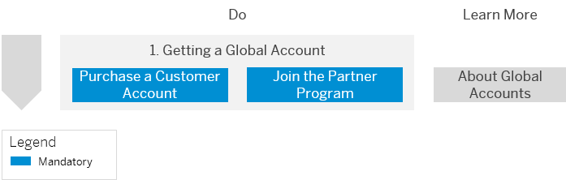
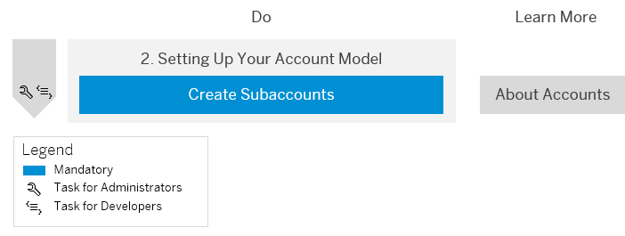
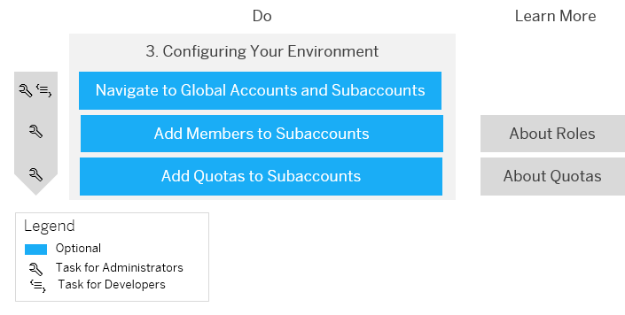
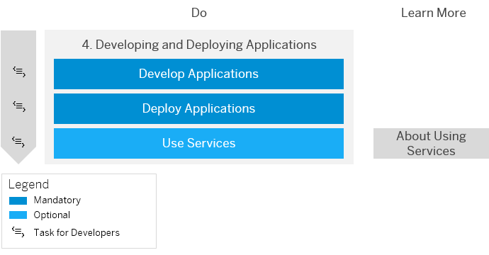

<!-- loio1b335bad21724350b0afca66b2db2ce6 -->

# Getting Started with a Customer Account in the Neo Environment

Quickly get started with a customer account.

> ### Tip:  
> **This documentation refers to SAP Business Technology Platform, Neo environment. If you are looking for documentation about other environments, see [SAP Business Technology Platform](https://help.sap.com/viewer/65de2977205c403bbc107264b8eccf4b/Cloud/en-US/6a2c1ab5a31b4ed9a2ce17a5329e1dd8.html "SAP Business Technology Platform (SAP BTP) is an integrated offering comprised of four technology portfolios: database and data management, application development and integration, analytics, and intelligent technologies. The platform offers users the ability to turn data into business value, compose end-to-end business processes, and build and extend SAP applications quickly.") :arrow_upper_right:.**

<a name="loio1b335bad21724350b0afca66b2db2ce6__section_ncd_t5k_wbb"/>

## 1. Getting a Global Account

Before you begin, purchase a customer account or join the partner program. See [Sign up for a Customer Account](../21-getting-account-neo/get-an-enterprise-account-96e78ab.md#copy07a76681cdb64c10ae325ba13b416ed7) or [Join the Partner Program](../21-getting-account-neo/get-an-enterprise-account-96e78ab.md#copyad04d906a6564812882346dea9e6e5b5).

<a name="loio1b335bad21724350b0afca66b2db2ce6__section_sjn_c1q_ybb"/>

## 2. Setting Up Your Account Model

After you've received your logon data by email, create subaccounts in your global account. This allows you to further break down your account model and structure it according to your business needs. See [Create a Subaccount](https://help.sap.com/viewer/65de2977205c403bbc107264b8eccf4b/Cloud/en-US/05280a123d3044ae97457a25b3013918.html "Create subaccounts in your global account using the SAP BTP cockpit.") :arrow_upper_right:.

<a name="loio1b335bad21724350b0afca66b2db2ce6__section_qr5_wwk_wbb"/>

## 3. Configuring Your Environment

1.  Since you need to use the cockpit to configure your environment, it's important you understand how you can navigate to your global account and subaccounts. See [Navigate in the Cockpit](https://help.sap.com/viewer/65de2977205c403bbc107264b8eccf4b/Cloud/en-US/0874895f1f78459f9517da55a11ffebd.html "Learn how to navigate to your global accounts and subaccounts in the SAP BTP cockpit.") :arrow_upper_right:.

2.  It's time to think about member management. You can add members to subaccounts and assign different roles to those members. For more information, see [Add Members to Your Neo Subaccount](../50-administration-and-ops-neo/add-members-to-your-neo-subaccount-a253570.md). For more information about roles, see [Managing Member Authorizations in the Neo Environment](../50-administration-and-ops-neo/managing-member-authorizations-in-the-neo-environment-a1ab5c4.md).

3.  Before you can start using resources such as application runtimes, you need to manage your entitlements and add quotas to your subaccounts. See [Configure Entitlements and Quotas for Subaccounts](../50-administration-and-ops-neo/configure-entitlements-and-quotas-for-subaccounts-c90f3d5.md). To learn more about entitlements and quotas, see [Managing Entitlements and Quotas Using the Cockpit](../50-administration-and-ops-neo/managing-entitlements-and-quotas-using-the-cockpit-23e9ad3.md).

<a name="loio1b335bad21724350b0afca66b2db2ce6__section_w1d_txk_wbb"/>

## 4. Developing and Deploying Applications

1.  Develop and deploy your application. Check out the Developer Guide for tutorials and more information. See [Developing Java in the Neo Environment](../30-development-neo/developing-java-in-the-neo-environment-9bd4dd1.md).

2.  Enable a service so that you can integrate it with an application. See [Enable Services in the Neo Environment](../30-development-neo/using-services-in-the-neo-environment-a32d3d5.md#loio4e12009d06e44eb1943b94483a505d90).

**Related Information**  

[Getting Started with Business Applications Subscriptions in the Neo Environment](getting-started-with-business-applications-subscriptions-in-the-neo-environment-a55cef9.md "By using SAP BTP, a provider can build and run an application for consumption by multiple consumers. A provider is an SAP partner, who wants to sell business applications to their customers, or an SAP customer, who wants to make their business applications available to different organizational units, for example.")

