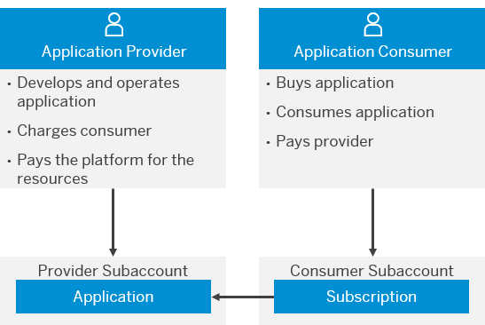

<!-- copya55cef95b7ec4cb78dcb63c2966acdc0 -->

# Getting Started with Business Applications Subscriptions in the Neo Environment

By using SAP BTP, a provider can build and run an application for consumption by multiple consumers. A provider is an SAP partner, who wants to sell business applications to their customers, or an SAP customer, who wants to make their business applications available to different organizational units, for example.

> ### Remember:  
> SAP Business Technology Platform, Neo environment will sunset on **December 31, 2028**, subject to terms of customer or partner contracts.
> 
> For more information, see SAP Note [3351844](https://me.sap.com/notes/3351844).

> ### Tip:  
> **This documentation refers to SAP Business Technology Platform, Neo environment. If you are looking for documentation about other environments, see [SAP Business Technology Platform](https://help.sap.com/viewer/65de2977205c403bbc107264b8eccf4b/Cloud/en-US/6a2c1ab5a31b4ed9a2ce17a5329e1dd8.html "SAP Business Technology Platform (SAP BTP) is an integrated offering comprised of four technology portfolios: database and data management, application development and integration, analytics, and intelligent technologies. The platform offers users the ability to turn data into business value, compose end-to-end business processes, and build and extend SAP applications quickly.") :arrow_upper_right:.**

<a name="copya55cef95b7ec4cb78dcb63c2966acdc0__section_wvb_svq_3cb"/>

## Overview

The platform provides a multitenant functionality, which allows providers to own, deploy, and operate an application for multiple consumers with reduced costs. For example, the provider can upgrade the application for all consumers instead of performing each update individually, or can share resources across many consumers. Application consumers can configure certain application features and launch them using consumer-specific URLs. Furthermore, they can protect the application by isolating their tenants.

Consumers do not deploy applications in their subaccounts, but simply subscribe to the provider application. As a result, a subscription is created in the consumer subaccount. This subscription represents the contract or relation between a subaccount \(tenant\) and a provider application.

> ### Note:  
> SAP Partners that wish to offer SAP BTP multitenant business applications in the Cloud Foundry environment should contact SAP.

In the Neo environment, SAP BTP supports Java and HTML5 subscriptions. You configure HTML5 subscriptions used for HTML5 provider applications through the cockpit only. While for Java applications, you can only use the console client. When such a subscription is set in the consumer subaccount, the Java provider application can use a connectivity destination that you configure in the consumer subaccount.

<a name="copya55cef95b7ec4cb78dcb63c2966acdc0__section_lbr_pzq_3cb"/>

## Multitenancy Roles

The multitenancy concept concerns two main user roles:

-   ***Application Provider*** - an organizational unit that uses SAP BTP to build, run, and sell applications to customers, that is, the application consumers.

    For more information about providing applications, see [Providing Multitenant Applications to Consumers in the Neo Environment](providing-multitenant-applications-to-consumers-in-the-neo-environment-a8b790e.md).

-   ***Application Consumer*** - an organizational unit, typically a customer or a department inside an organization of a customer, which uses an SAP BTP application for a certain purpose. Obviously, the application is in fact used by end users, who might be employees of the organization \(for instance, in the case of an HR application\) or just arbitrary users, internal or external \(for instance, in the case of a collaborative supplier application\).

    For more information about consuming applications, see [Subscribe to Java Multitenant Applications in the Neo Environment](subscribe-to-java-multitenant-applications-in-the-neo-environment-e7e62c8.md) or [Subscribe to HTML5 Multitenant Applications in the Neo Environment](subscribe-to-html5-multitenant-applications-in-the-neo-environment-f16cd5b.md).

<a name="copya55cef95b7ec4cb78dcb63c2966acdc0__section_x4v_1br_3cb"/>

## Subaccounts and Subaccount Members

To use SAP BTP, both the application provider and the application consumer must have a subaccount. The subaccount is the central organizational unit in SAP BTP. It is the central entry point to SAP BTP for both application providers and consumers. It may consist of a set of applications, a set of subaccount members and a subaccount-specific configuration.

Subaccount members are users who are registered via the SAP ID service. Subaccount members may have different privileges regarding the operations that are possible for a subaccount \(for example, subaccount administration, deploy, start, and stop applications\). Note that the subaccount belongs to an organization and not to an individual. Nevertheless, the interaction with the subaccount is performed by individuals, the members of the subaccount. The subaccount-specific configuration allows application providers and application consumers to adapt their subaccount to their specific environment and needs.

An application resides in exactly one subaccount, the hosting subaccount. It is uniquely identified by the subaccount name and the application name. Applications consume SAP BTP resources, for instance, compute units, structured and unstructured storage and outgoing bandwidth. Costs for consumed resources are billed to the owner of the hosting subaccount, who can be an application provider, an application consumer, or both.

**Related Information**  

[Getting Started with a Customer Account in the Neo Environment](getting-started-with-a-customer-account-in-the-neo-environment-1b335ba.md "Quickly get started with a customer account.")

[Providing Multitenant Applications to Consumers in the Neo Environment](providing-multitenant-applications-to-consumers-in-the-neo-environment-a8b790e.md "In the Neo environment, you can develop and run multitenant (tenant-aware) applications that you can make available to multiple consumers.")

[Providing Java Multitenant Applications to Tenants for Testing](providing-java-multitenant-applications-to-tenants-for-testing-b093032.md "Using the console client, you can create subaccounts and subscribe them to a provider application to test how applications can be provided to multiple consumers.")

[Subscribe to Java Multitenant Applications in the Neo Environment](subscribe-to-java-multitenant-applications-in-the-neo-environment-e7e62c8.md "Create, list, and remove subscriptions for a Java application using the console client and view all our subscriptions in the cockpit.")

[Subscribe to HTML5 Multitenant Applications in the Neo Environment](subscribe-to-html5-multitenant-applications-in-the-neo-environment-f16cd5b.md "Manage subscriptions to HTML5 applications by viewing, creating, or removing subscriptions in the cockpit.")

