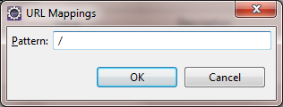

<!-- loio893f71c42a944f938d078c89bf39f3d7 -->

# Create an Exemplary Provider Application \(Servlet\)

This tutorial explains how to create a sample application which makes use of the multitenancy concept. That is, you can enable your application to be consumed by users, members of a tenant which is subscribed to this application in a multitenant flavor.


## Prerequisites

-   You have downloaded and set up your Eclipse IDE, SAP HANA Cloud Tools for Java and SAP BTP SDK for Neo environment. For more information, see [Setting Up the Development Environment](setting-up-the-development-environment-e815ca4.md).
-   You are an application provider. For more information, see [Multitenancy Roles](multitenancy-roles-48b552f.md).


## Context

> ### Tip:  
> **This documentation refers to SAP Business Technology Platform, Neo environment. If you are looking for documentation about other environments, see [SAP Business Technology Platform](https://help.sap.com/viewer/65de2977205c403bbc107264b8eccf4b/Cloud/en-US/6a2c1ab5a31b4ed9a2ce17a5329e1dd8.html "SAP Business Technology Platform (SAP BTP) is an integrated offering comprised of four technology portfolios: database and data management, application development and integration, analytics, and intelligent technologies. The platform offers users the ability to turn data into business value, compose end-to-end business processes, and build and extend SAP applications quickly.") :arrow_upper_right:.**

> ### Note:  
> The Java tools for Eclipse used in this page are no longer available. We are in the process of updating the content accordingly.

 <a name="concept_fg2_nmy_xl"/>

<!-- concept\_fg2\_nmy\_xl -->

## Procedure


<a name="concept_fg2_nmy_xl__section_02D65FD5DB1740B28F2E46E4CCEA71C7"/>

## 1. Create a dynamic Web project

1.  Open the *Java EE* perspective of the Eclipse IDE.
2.  In the *Project Explorer* view, from the context menu, choose *New* \> *Dynamic Web Project*.
3.  Enter ***TenantContextApp*** as the *Project name*.
4.  In the *Target Runtime* pane, select the runtime you want to use to deploy the application. In this tutorial, we choose ***Java Web***.
5.  In the *Configuration* pane, leave the default configuration and check the option *Generate web.xml deployment descriptor*.
6.  Choose *Finish* to finalize the creation of your project.

 


<a name="concept_fg2_nmy_xl__section_N100A5_N10013_N10001"/>

## 2. Create a sample servlet

1.  From the *TenantContextApp* context menu, choose *New* \> *Servlet*.
2.  Enter ***tenantcontext.demo*** as the Java package and ***TenantContextServlet*** as the *Class name* and choose *Next*.
3.  In the *URL mappings* field, select */TenantContext* and choose *Edit*.
4.  In the *Pattern* field, replace the current value with just "***/***". In this way, the servlet will be mapped as a welcome page for the application.

     

5.  Choose *Finish* so that the *TenantContext.java* servlet is created and opened in the Java editor.
6.  Go to `/TenantContextApp/WebContent/WEB-INF` and open the *web.xml* file.
7.  Choose the *Source* tab page.
8.  Add the following code block to the `<web-app>` element:

    ```
    
    <resource-ref>
    	<res-ref-name>TenantContext</res-ref-name>
    	<res-type>com.sap.cloud.account.TenantContext</res-type>
    </resource-ref>
    
    ```

9.  Replace the entire servlet class with the following sample code:

    ```
    
    package tenantcontext.demo;
    
    import java.io.IOException;
    import java.io.PrintWriter;
    
    import javax.naming.Context;
    import javax.naming.InitialContext;
    import javax.servlet.ServletException;
    import javax.servlet.http.HttpServlet;
    import javax.servlet.http.HttpServletRequest;
    import javax.servlet.http.HttpServletResponse;
    
    import com.sap.cloud.account.TenantContext;
    
    /**
     * Servlet implementation class TenantContextServlet
     */
    public class TenantContextServlet extends HttpServlet {
    	private static final long serialVersionUID = 1L;
    
        /**
         * @see HttpServlet#HttpServlet()
         */
        public TenantContextServlet() {
            super();
        }
    
    	/**
    	 * @see HttpServlet#doGet(HttpServletRequest request, HttpServletResponse response)
    	 */
    	protected void doGet(HttpServletRequest request, HttpServletResponse response) throws ServletException, IOException {
    
    
    		try {
    			InitialContext ctx = new InitialContext();
    			Context envCtx = (Context)ctx.lookup("java:comp/env");
    			TenantContext tenantContext = (TenantContext) envCtx.lookup("TenantContext");
    
    			response.setContentType("text/html");
    			PrintWriter writer = response.getWriter();
    
    			writer.println("<!DOCTYPE html PUBLIC \"-//W3C//DTD HTML 4.01 Transitional//EN\" \"http://www.w3.org/TR/html4/loose.dtd\">");
    			writer.println("<html>");
    			writer.println("<head>");
    			writer.println("<title>SAP BTP - Tenant Context Demo Application</title>");
    			writer.println("</head>");
    			writer.println("<body>");
    			writer.println("<h2> Welcome to the SAP BTP Tenant Context demo application</h2>");
    			writer.println("<br></br>");
    
    			String currentTenantId = tenantContext.getTenant().getId();
    			writer.println("<p><font size=\"5\"> The application was accessed on behalf of a tenant with an ID: <b>" + currentTenantId + "</b></font></p>");
    
    			writer.println("</body>");
    			writer.println("</html>");
    
    		} catch (Exception e) {
    			throw new ServletException(e.getCause());
    		}
    
    	}
    
    
    	/**
    	 * @see HttpServlet#doPost(HttpServletRequest request, HttpServletResponse response)
    	 */
    	@Override
    	protected void doPost(HttpServletRequest req, HttpServletResponse resp)
    			throws ServletException, IOException {
    		doGet(req, resp);
    	}
    }
    	
    
    ```

10. Save the Java editor. The project compiles without errors.

You have successfully created a Web application containing a sample servlet and connectivity functionality.


## 3. Deploy the application

To learn how to deploy your application, see [Deploy on the Cloud with the Cockpit](deploy-on-the-cloud-with-the-cockpit-abded96.md).


## Result

You have created a sample application that can be requested in a browser. Its output depends on the tenant context.


## Next Steps

-   To test the access to your multitenant application, go to a browser and request it on behalf of your subaccount. Use the following URL pattern: `https://<application_name><provider_subaccount>.<host>/<application_path>`
-   If you want to test the access to your multitenant application on behalf of a consumer subaccount, follow the steps in page: [Consume a Multitenant Connectivity Application](consume-a-multitenant-connectivity-application-d2886a5.md)


## Related Information

[Developing Java Applications](developing-java-applications-ac36e1f.md)

[Developing Multitenant Applications in the Neo Environment](developing-multitenant-applications-in-the-neo-environment-54a7615.md)

