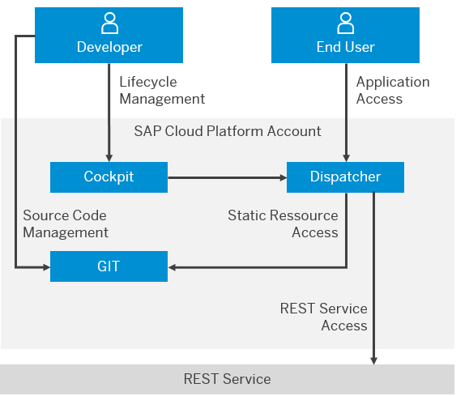

<!-- loio39723061bc4b4b679726b120cbefdf5a -->

# Developing HTML5 Applications in the Neo Environment

SAP BTP enables you to easily develop and run HTML5 applications in a cloud environment.

> ### Remember:  
> SAP Business Technology Platform, Neo environment will sunset on **December 31, 2028**, subject to terms of customer or partner contracts.
> 
> For more information, see SAP Note [3351844](https://me.sap.com/notes/3351844).

> ### Tip:  
> **This documentation refers to SAP Business Technology Platform, Neo environment. If you are looking for documentation about other environments, see [SAP Business Technology Platform](https://help.sap.com/docs/btp/sap-business-technology-platform/sap-business-technology-platform?version=Cloud) .**

HTML5 applications on SAP BTP consist of static resources and can connect to any existing on-premise or on-demand REST services. Compared to a Java application, there is no need to start a dedicated process for an HTML5 application. Instead the static resources and REST calls are served using a shared dispatcher service provided by the SAP BTP.

The static content of the HTML5 applications is stored and versioned in Git repositories. Each HTML5 application has its own Git repository assigned. For offline editing, developers can directly interact with the Git service using a Git client of their choice. They may use any Git client like EGit or a native Git implementation to perform Git operations. A Git repository is created automatically when a new HTML5 application is created.

Lifecycle operations, for example, creating new HTML5 applications, creating new versions, activating, starting and stopping or testing applications, can be performed using the SAP BTP cockpit. As the static resources are stored in a versioned Git repository, not only the latest version of an application can be tested, but the complete version history of the application is always available for testing. The version that is delivered to the end users of that application is called the "active version". Each application can have only one active version.

  
  
**HTML5 Applications Overview**

**Related Information**  

[HTML5: Getting Started](html5-getting-started-b120163.md "Set up your HTML5 development environment and run your first application in the cloud.")

[HTML5: Application Operations](../50-administration-and-ops-neo/html5-application-operations-ef21fb1.md "For an overview of the current status of the individual HTML5 applications in your subaccount, use the SAP BTP cockpit.")

[Securing HTML5 Applications](../60-security-neo/securing-html5-applications-55f7c9d.md "The security guide provides an overview of the security-relevant information that applies to HTML5 applications.")

