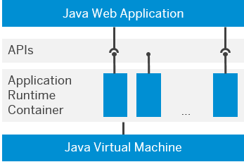

<!-- loio9bd4dd19aef947b58eadf688ccc90de7 -->

# Developing Java in the Neo Environment

SAP BTP enables you to develop, deploy and use Java applications in a cloud environment. Applications run on a runtime container where they can use the platform services APIs and Java EE APIs according to standard patterns.

> ### Remember:  
> SAP Business Technology Platform, Neo environment will sunset on **December 31, 2028**, subject to terms of customer or partner contracts.
> 
> For more information, see SAP Note [3351844](https://me.sap.com/notes/3351844).

> ### Tip:  
> **This documentation refers to SAP Business Technology Platform, Neo environment. If you are looking for documentation about other environments, see [SAP Business Technology Platform](https://help.sap.com/docs/btp/sap-business-technology-platform/sap-business-technology-platform?version=Cloud) .**

The SAP BTP Runtime for Java enables the provisioning and running applications on the platform. The runtime is represented by Java Virtual Machine, Application Runtime Container and Compute Units. Cloud applications interact at runtime with the containers and services via the platform APIs.

  
  
**Compute Unit**

The Java development process is enabled by the SAP BTP Tools, which include the SAP BTP SDK.

During and after development, you can configure and operate an application using the cockpit and the console client.

**Benefits and advantages**

-   Offers standardized environment
-   Supports a wide-spread Apache Tomcat Web container
-   Supports the platform services APIs

**Appropriate for**

-   Developing and running Java Web applications based on standard JSR APIs
-   Executing Java Web applications which include third-party Java libraries and frameworks supporting standard JSR APIs
-   Supporting Apache Tomcat Java Web applications.

**Not appropriate for**

-   Applications featuring modifications of JSR APIs and their implementations
-   Applications requiring modified or customized Java Apache Tomcat Web container

**Related Information**  

[Java: Getting Started](java-getting-started-e66f3ee.md "Set up your Java development environment and deploy your first application in the cloud.")

[Runtime for Java](runtime-for-java-7613c8c.md)

[Development Environment](development-environment-7613405.md "The basic tools of the SAP BTP development environment, the SAP BTP Tools, include the SAP BTP SDK for Neo environment.")

[Developing Java Applications](developing-java-applications-ac36e1f.md "")

[Supported Java APIs](supported-java-apis-e836a95.md)

