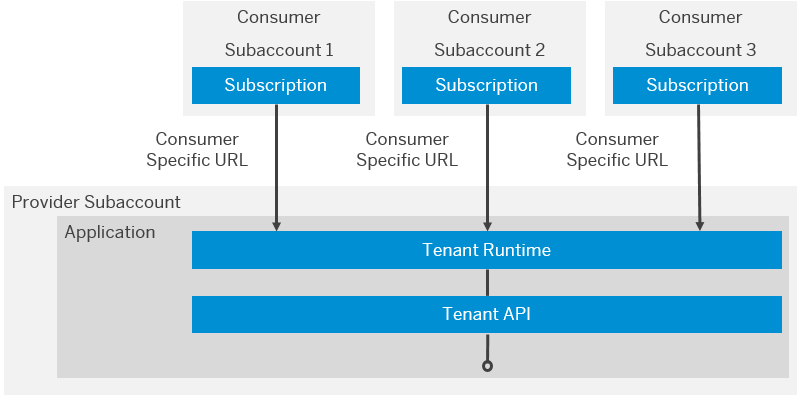

<!-- loio54a76156cd114e5d928642b8dde47b91 -->

# Developing Multitenant Applications in the Neo Environment

In the Neo environment of SAP BTP, you can develop and run multitenant \(tenant-aware\) applications. These applications run on a shared compute unit that can be used by multiple consumers \(tenants\). Each consumer accesses the application through a dedicated URL.

> ### Remember:  
> SAP Business Technology Platform, Neo environment will sunset on **December 31, 2028**, subject to terms of customer or partner contracts.
> 
> For more information, see SAP Note [3351844](https://me.sap.com/notes/3351844).

> ### Tip:  
> **This documentation refers to SAP Business Technology Platform, Neo environment. If you are looking for documentation about other environments, see [SAP Business Technology Platform](https://help.sap.com/docs/btp/sap-business-technology-platform/sap-business-technology-platform?version=Cloud) .**

You can read about the specifics of each platform service with regards to multitenancy in the respective section below:

-   [Connectivity Service](developing-multitenant-applications-in-the-neo-environment-54a7615.md#loio54a76156cd114e5d928642b8dde47b91__connectivity_service)
-   [SAP HANA / SAP ASE Service](developing-multitenant-applications-in-the-neo-environment-54a7615.md#loio54a76156cd114e5d928642b8dde47b91__sap_hana_ase_service)
-   [Keystore Service](developing-multitenant-applications-in-the-neo-environment-54a7615.md#loio54a76156cd114e5d928642b8dde47b91__keystore_service)
-   [Identity and Access Management](developing-multitenant-applications-in-the-neo-environment-54a7615.md#loio54a76156cd114e5d928642b8dde47b91__iam)

With tenant-aware applications, you can achieve the following:

-   Isolate data
-   Save resources by sharing them among tenants
-   Perform updates efficiently, that is, in one step

To be able to use a tenant-aware application, a consumer:

-   Must have a subaccount for SAP BTP
-   Must be subscribed to this application
-   Receives a dedicated URL where to access the application

A subscription means that there is a contract between an application provider and a tenant who authorizes the tenant to use the provider's application.

Currently, you can trigger the subscription via the console client. For more information, see [Providing Java Multitenant Applications to Tenants for Testing](../22-getting-started-neo/providing-java-multitenant-applications-to-tenants-for-testing-b093032.md).

When an application is accessed via a consumer specific URL, the application environment is able to identify the current consumer. The application developer can use the tenant context API to retrieve and distinguish the tenant ID, which is the unique ID of the consumer. When developing tenant-aware applications, data isolation for different consumers is essential. It can be achieved by distinguishing the requests based on the tenant ID. There are also some specifics in the usage of different services when you develop your multitenant application.

For more information, see [Tenant Context API](tenant-context-api-a8f2255.md).

## General Programming Guidelines

When developing tenant-aware applications, keep in mind the following:

-   Shared in-memory data such as Java static fields will be available to all tenants.
-   Avoid any possibility that an application user can execute custom code in the application JVM, as this may give them access to other tenants' data.
-   Avoid any possibility that an application user can access a file system, as this may give them access to other tenants' data.

<a name="loio54a76156cd114e5d928642b8dde47b91__connectivity_service"/>

## Connectivity Service

For more information, see [Multitenancy in the Connectivity Service](https://help.sap.com/viewer/b865ed651e414196b39f8922db2122c7/Cloud/en-US/b92140a0c6b942e1a0f72e9fd1133fd9.html "Using multitenancy for applications that require a connection to a remote service or on-premise application.") :arrow_upper_right:.

<a name="loio54a76156cd114e5d928642b8dde47b91__sap_hana_ase_service"/>

## SAP HANA / SAP ASE Service

Multitenant applications on SAP BTP have two approaches available to separate the data of the different consumers:

-   **Use a discriminator column in each table storing tenant data**

    With this approach, a single database schema is shared between all application consumers. The tenant ID can be used as a value in the discriminator column. To ensure data separation in the application, each SQL statement must include the tenant ID.

    To apply data separation with a discriminator column, you can use the multitenancy annotations provided by EclipseLink JPA. For more information, see the EclipseLink User Guide: [http://wiki.eclipse.org/EclipseLink/UserGuide/JPA/Advanced\_JPA\_Development/Single-Table\_Multi-Tenancy](http://wiki.eclipse.org/EclipseLink/UserGuide/JPA/Advanced_JPA_Development/Single-Table_Multi-Tenancy).

    The basic approach is as follows:

    -   Annotate entities that are to be tenant-aware with the `@Multitenant` annotation.
    -   Define the discriminator column using the `@TenantDiscriminatorColumn` annotation. As the length of the tenant ID on SAP BTP differs from the default length for the discriminator column in EclipseLink, it is important to set the correct length of 36 characters.
    -   Provide the tenant ID to the entity manager when accessing data for a multitenant entity.

-   **Use a separate schema for each tenant**

    With this approach, you create a new schema for each tenant, bind it to the application, and the application uses JNDI to dynamically look up the data source. The multitenant application must then use the appropriate data source when accessing tenant data. For more information, see [Apply Dynamic Data Source Lookup](apply-dynamic-data-source-lookup-bb269c2.md).

<a name="loio54a76156cd114e5d928642b8dde47b91__keystore_service"/>

## Keystore Service

The Keystore Service provides a repository for cryptographic keys and certificates to tenant-aware applications hosted on SAP BTP. Because the tenant defines a specific configuration of an application, you can configure an application to use different keys and certificates for different tenants.

For more information about the Keystore Service, see [Keys and Certificates](../60-security-neo/keys-and-certificates-3735938.md).

<a name="loio54a76156cd114e5d928642b8dde47b91__iam"/>

## Identity and Access Management

Access rights for tenant-aware application are usually maintained by the application consumer, not by the application provider. An application provider may predefine roles in the `web.xml` when developing the application. By default, predefined roles are shared with all application consumers, but could also be made visible only to the provider subaccount. Once a consumer is subscribed to this application, shared predefined roles become visible in the cockpit of the application consumer. Then, the application consumer can assign users to these roles to give them access to the provider application. In addition, application consumer subaccounts can add their own custom roles to the subscribed application. Custom roles are visible only within the application consumer subaccount where they are created.

For more information about managing application roles, see [Managing Roles](../60-security-neo/managing-roles-db8175b.md).

Trust configuration regarding authentication with SAML2.0 protocol is maintained by the application consumer.

For more information about configuring trust, see [Application Identity Provider](../60-security-neo/application-identity-provider-dc61853.md#loiodc618538d97610148155d97dcd123c24).

**Related Information**  

[Multitenancy Tutorials](multitenancy-tutorials-39be2d2.md "")

[Default Trace File](../50-administration-and-ops-neo/default-trace-file-1b651b3.md "")

[Providing Java Multitenant Applications to Tenants for Testing](../22-getting-started-neo/providing-java-multitenant-applications-to-tenants-for-testing-b093032.md "Using the console client, you can create subaccounts and subscribe them to a provider application to test how applications can be provided to multiple consumers.")

