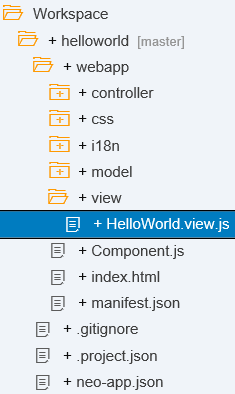

<!-- loioe42cc1597a0945b3b6321cb55bbc9c22 -->

# Edit the HTML5 Application

SAP Web IDE already created an HTML page for your project. You now adapt this page.

## Context

> ### Remember:  
> SAP Business Technology Platform, Neo environment will sunset on **December 31, 2028**, subject to terms of customer or partner contracts.
> 
> For more information, see SAP Note [3351844](https://launchpad.support.sap.com/#/notes/3351844).

> ### Tip:  
> **This documentation refers to SAP Business Technology Platform, Neo environment. If you are looking for documentation about other environments, see [SAP Business Technology Platform](https://help.sap.com/viewer/65de2977205c403bbc107264b8eccf4b/Cloud/en-US/6a2c1ab5a31b4ed9a2ce17a5329e1dd8.html "SAP Business Technology Platform (SAP BTP) is an integrated offering comprised of four technology portfolios: database and data management, application development and integration, analytics, and intelligent technologies. The platform offers users the ability to turn data into business value, compose end-to-end business processes, and build and extend SAP applications quickly.") :arrow_upper_right:.**

## Procedure

1.  In SAP Web IDE, expand the project node in the navigation tree and open the `HelloWorld.view.js` using a double-click.

    

2.  In the `HelloWorld.view.js` view, replace `Title` in the `title: "{i18n>title}"` line with the title of your application `Hello World`.

3.  Save your changes using *Save* \(\).

4.  To test your Hello World application, select the `index.html` file and choose *Run* \(\).

