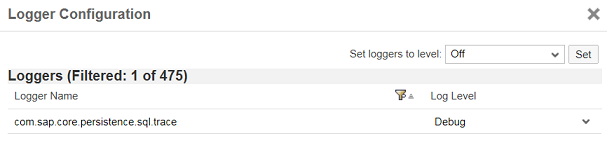

<!-- loioe820e184bb5710149196a0f47db853cd -->

# Investigating Performance Issues Using the SQL Trace

Identify inefficient SQL statements in your applications in the Neo environment and investigate performance issues.


## Context

> ### Remember:  
> SAP Business Technology Platform, Neo environment will sunset on **December 31, 2028**, subject to terms of customer or partner contracts.
> 
> For more information, see SAP Note [3351844](https://me.sap.com/notes/3351844).

> ### Tip:  
> **This documentation refers to SAP Business Technology Platform, Neo environment. If you are looking for documentation about other environments, see [SAP Business Technology Platform](https://help.sap.com/viewer/65de2977205c403bbc107264b8eccf4b/Cloud/en-US/6a2c1ab5a31b4ed9a2ce17a5329e1dd8.html "SAP Business Technology Platform (SAP BTP) is an integrated offering comprised of the following technology portfolios: application development; process automation; integration; data, analytics, and enterprise planning; artificial intelligence. The platform offers users the ability to turn data into business value, compose end-to-end business processes, connect entire IT landscapes, and personalize, build and extend SAP applications. This reduces the overall total cost of ownership maintaining SAP landscapes and third-party software across end-to-end business processes.") :arrow_upper_right:.**

The SQL trace provides a log of selected SQL statements with details about when a statement was executed and its duration, allowing you to identify inefficient SQL statements in your applications and investigate performance issues. SQL trace records are integrated in the standard trace log files written at runtime.

By default, the SQL trace is disabled. Generally, you enable it when you require SQL trace information for a particular application and disable it again once you have completed your investigation. It is not intended for general performance monitoring.

You can use the cockpit to enable the SQL trace by setting the log level of the logger `com.sap.core.persistence.sql.trace` to the log level *DEBUG* in the application’s log configuration. Once you've changed this setting, you can view trace information in the log files.

<a name="task_jjv_tbh_gn"/>

<!-- task\_jjv\_tbh\_gn -->

## Enable the SQL Trace


<a name="task_jjv_tbh_gn__steps_hlw_3ch_gn"/>

## Procedure

1.  In the SAP BTP cockpit, navigate to a subaccount. For more information, see [Navigate in the Cockpit](https://help.sap.com/viewer/65de2977205c403bbc107264b8eccf4b/Cloud/en-US/0874895f1f78459f9517da55a11ffebd.html "Learn how to navigate to your global accounts, directories, and subaccounts in the SAP BTP cockpit.") :arrow_upper_right:.

2.  In the navigation are, choose *Applications* \> *Java Applications*.

3.  Click the relevant application to go to the dashboard.

4.  In the navigation area, choose *Monitoring* \> *Logging*.

5.  Choose *Configure Loggers*.

    In the *Logger Configuration* dialog box, all loggers used since the application was started are listed with the log levels that are currently applicable.

    > ### Note:  
    > You can set log levels only when an application is running. Loggers are not listed if the relevant application code has not been executed.

6.  Enter `com.sap.core.persistence.sql.trace` in the *Filter* field.

7.  In the row containing the `com.sap.core.persistence.sql.trace` logger, select the log level `Debug`:

    

    The new log setting takes effect immediately. Log settings are saved permanently and do not revert to their initial values when an application is restarted.


<a name="task_rnm_rbh_gn"/>

<!-- task\_rnm\_rbh\_gn -->

## View the SQL Trace Details


<a name="task_rnm_rbh_gn__steps_gyj_wbh_gn"/>

## Procedure

1.  See the application's trace logs, which contain the SQL trace records, either in the *Most Recent Logging* panel on the application dashboard or on the *Logging* page by navigating to *Monitoring* \> *Logging* in the navigation area.

2.  To display the contents of a particular log file, choose  \(*Show*\). You can also download the file by choosing  \(*Download*\).

    In the log file, you can identify the SQL trace information by the logger name `com.sap.core.persistence.sql.trace`.The entries written by the logger include the following details:

    -   Date and time written
    -   System time in nanoseconds
    -   The name of the interface and method that produced the log entry, for example, `java.sql.Connection.prepareStatement (sql)`
    -   The status of the method call \(`begin` and `end`\)
    -   The database connection ID, for example, `conn=[3d194ab9]` 
    -   The text of the SQL statement, for example, `"INSERT INTO T_PERSONS (ID, FIRSTNAME, LASTNAME) VALUES (?, ?, ?)"`. For security reasons, parameter values are not shown.
    -   Duration of the request \(in milliseconds with microsecond precision\), for example, `Request duration = 2,770.743µs`


### Example

The SQL-specific information from the default trace is shown below in plain text format:

```
#DEBUG#com.sap.core.persistence.sql.trace#Thu Apr 10 13:25:03 UTC 2014 - 4913676098596447 - javax.sql.DataSource.getConnection() - begin|
#DEBUG#com.sap.core.persistence.sql.trace#Thu Apr 10 13:25:03 UTC 2014 - 4913676344945627 - javax.sql.DataSource.getConnection() - end - conn=[3d194ab9] - Request duration = 227,773.804µs - Network traffic = 1462 bytes|
#DEBUG#com.sap.core.persistence.sql.trace#Thu Apr 10 13:25:03 UTC 2014 - 4913676677332569 - java.sql.Connection.prepareStatement(sql) - begin - conn=[3d194ab9]|
#DEBUG#com.sap.core.persistence.sql.trace#Thu Apr 10 13:25:03 UTC 2014 - 4913676723144228 - java.sql.Connection.prepareStatement(sql) - end - conn=[3d194ab9] - Request duration = 2,850.647µs - Network traffic = 384 bytes|
#DEBUG#com.sap.core.persistence.sql.trace#Thu Apr 10 13:25:03 UTC 2014 - 4913676723530647 - java.sql.PreparedStatement.executeUpdate() - begin - conn=[3d194ab9] - SQL="CREATE TABLE T_PERSONS (ID VARCHAR(255) PRIMARY KEY NOT NULL, FIRSTNAME VARCHAR (255),LASTNAME VARCHAR (255))"|
#DEBUG#com.sap.core.persistence.sql.trace#Thu Apr 10 13:25:03 UTC 2014 - 4913676736488953 - java.sql.PreparedStatement.executeUpdate() - end - conn=[3d194ab9] - Request duration = 12,760.375µs - Network traffic = 272 bytes|
#DEBUG#com.sap.core.persistence.sql.trace#Thu Apr 10 13:25:03 UTC 2014 - 4913676767170228 - java.sql.Connection.prepareStatement(sql) - begin - conn=[3d194ab9]|
#DEBUG#com.sap.core.persistence.sql.trace#Thu Apr 10 13:25:03 UTC 2014 - 4913676781082955 - java.sql.Connection.prepareStatement(sql) - end - conn=[3d194ab9] - Request duration = 12,987.704µs - Network traffic = 464 bytes|
#DEBUG#com.sap.core.persistence.sql.trace#Thu Apr 10 13:25:03 UTC 2014 - 4913676781376595 - java.sql.PreparedStatement.executeQuery() - begin - conn=[3d194ab9] - SQL="SELECT ID, FIRSTNAME, LASTNAME FROM T_PERSONS"|
#DEBUG#com.sap.core.persistence.sql.trace#Thu Apr 10 13:25:03 UTC 2014 - 4913676786626464 - java.sql.PreparedStatement.executeQuery() - end - conn=[3d194ab9] - Request duration = 5,118.69µs - Network traffic = 264 bytes|
#DEBUG#com.sap.core.persistence.sql.trace#Thu Apr 10 13:25:09 UTC 2014 - 4913682088475475 - java.sql.Connection.prepareStatement(sql) - begin - conn=[3d194ab9]|
#DEBUG#com.sap.core.persistence.sql.trace#Thu Apr 10 13:25:09 UTC 2014 - 4913682093620026 - java.sql.Connection.prepareStatement(sql) - end - conn=[3d194ab9] - Request duration = 4,676.661µs - Network traffic = 392 bytes|
#DEBUG#com.sap.core.persistence.sql.trace#Thu Apr 10 13:25:09 UTC 2014 - 4913682094713377 - java.sql.PreparedStatement.executeUpdate() - begin - conn=[3d194ab9] - SQL="INSERT INTO T_PERSONS (ID, FIRSTNAME, LASTNAME) VALUES (?, ?, ?)"|
#DEBUG#com.sap.core.persistence.sql.trace#Thu Apr 10 13:25:09 UTC 2014 - 4913682097611865 - java.sql.PreparedStatement.executeUpdate() - end - conn=[3d194ab9] - Request duration = 2,770.743µs - Network traffic = 336 bytes|
#DEBUG#com.sap.core.persistence.sql.trace#Thu Apr 10 13:25:09 UTC 2014 - 4913682099273612 - java.sql.Connection.prepareStatement(sql) - begin - conn=[3d194ab9]|
#DEBUG#com.sap.core.persistence.sql.trace#Thu Apr 10 13:25:09 UTC 2014 - 4913682100587082 - java.sql.Connection.prepareStatement(sql) - end - conn=[3d194ab9] - Request duration = 1,097.86µs - Network traffic = 464 bytes|
#DEBUG#com.sap.core.persistence.sql.trace#Thu Apr 10 13:25:09 UTC 2014 - 4913682100784872 - java.sql.PreparedStatement.executeQuery() - begin - conn=[3d194ab9] - SQL="SELECT ID, FIRSTNAME, LASTNAME FROM T_PERSONS"|
#DEBUG#com.sap.core.persistence.sql.trace#Thu Apr 10 13:25:09 UTC 2014 - 4913682104569784 - java.sql.PreparedStatement.executeQuery() - end - conn=[3d194ab9] - Request duration = 3,626.846µs - Network traffic = 308 bytes|

```

**Related Information**  


[Alternative Tools for Enabling the SQL Trace](alternative-tools-for-enabling-the-sql-trace-269860a.md "In addition to using the cockpit, you can also enable the SQL trace from the Eclipse IDE, and using the console client. Whichever tool you use, you need to set the log level of the logger com.sap.core.persistence.sql.trace to the log level DEBUG.")

[Using Logs in the Cockpit](https://help.sap.com/viewer/ee8e8a203e024bbb8c8c2d03fce527dc/Cloud/en-US/2555df65182c4b09a25e56fa3b57b0a8.html)

