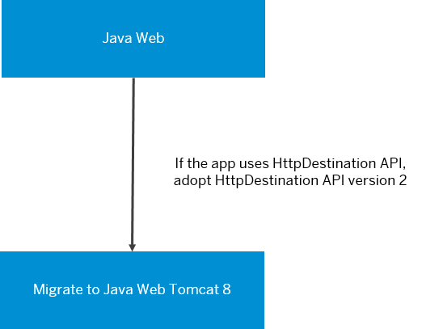
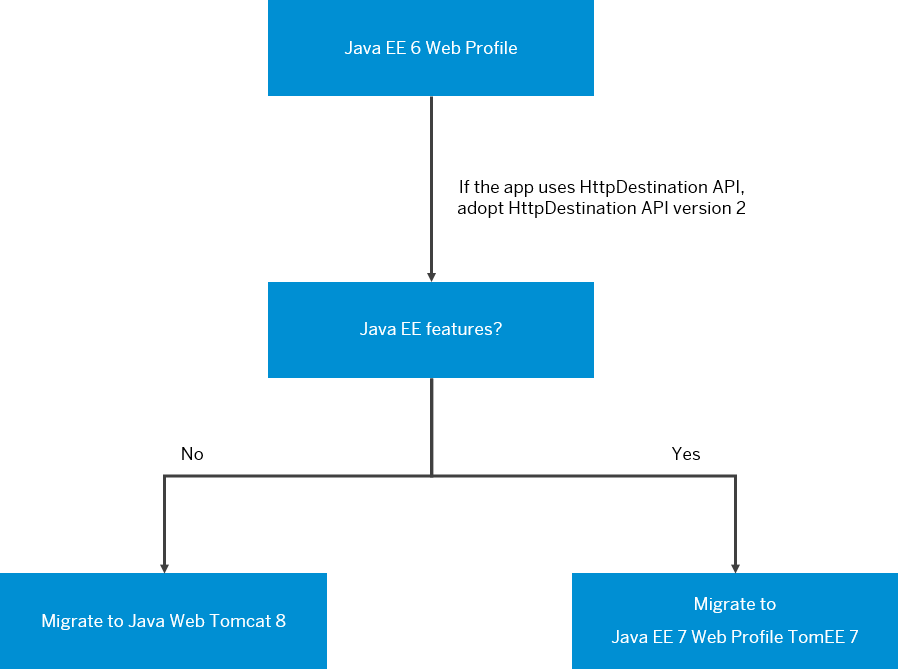
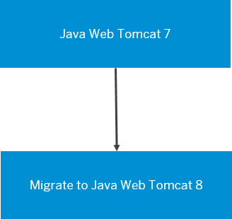

<!-- loio1c3c8d4b5dd34caba087fadd5fba99a1 -->

# Migrating from an Unsupported Runtime

Migrate an application running on an unsupported Java runtime \(such as Java Web, Java EE 6 Web Profile or Java Web Tomcat 7\) to a supported one \(Java EE 7 Web Profile TomEE 7 or Java Web Tomcat 8\).

<a name="loio1c3c8d4b5dd34caba087fadd5fba99a1__section_v4z_qkf_r4b"/>

## Overview

> ### Tip:  
> If you no longer need this application, skip the migration and directly stop \(if started\) and undeploy the application \(see [Start and Stop Applications](../50-administration-and-ops-neo/start-and-stop-applications-7612f03.md) or [stop](../50-administration-and-ops-neo/stop-b5bfcbf.md) / [undeploy](../50-administration-and-ops-neo/undeploy-7e09b85.md) command\).

If you still need the application, then you have the following migration paths:

**Java Web**

If your application runs on Java Web, migrate it to **Java Web Tomcat 8 runtime with Java 8**.

Before migrating, check if the application uses HttpDestination API. If it does, switch to [HttpDestination API \(version 2\)](https://help.sap.com/viewer/b865ed651e414196b39f8922db2122c7/Cloud/en-US/c2a0d33bbc464b8fae30fed707ae9034.html) \(this is the version of the API available in the new runtime\).

**Java EE 6 Web Profile**

-   Check if the application uses HttpDestination API. If it does, switch to [HttpDestination API \(version 2\)](https://help.sap.com/viewer/b865ed651e414196b39f8922db2122c7/Cloud/en-US/c2a0d33bbc464b8fae30fed707ae9034.html) \(this is the version of the API available in the new runtime\).

-   Check if the application is using Java EE features, different from servlets, jsp, el, websockets \(e.g., EJBs, CDI, container managed transactions, etc.\):
    -   If it does not use such features, migrate to **Java Web Tomcat 8 runtime with Java 8**.
    -   If it uses such features, migrate to **Java EE 7 Web Profile TomEE 7** runtime.

**Java Web Tomcat 7**

Migrate it to **Java Web Tomcat 8 runtime with Java 8**.

<a name="loio1c3c8d4b5dd34caba087fadd5fba99a1__section_d5g_xmf_r4b"/>

## Migration Steps

1.  Redeploy it \(see [Deploying and Updating Java Applications](deploying-and-updating-java-applications-e5dfbc6.md).\)
2.  Restart it \(see [Start and Stop Applications](../50-administration-and-ops-neo/start-and-stop-applications-7612f03.md) or [restart](../50-administration-and-ops-neo/restart-7c0f7a1.md) console command\).

> ### Tip:  
> You may also consider [Update Applications with Zero Downtime](../50-administration-and-ops-neo/update-applications-with-zero-downtime-a10f6c2.md) or [rolling-update](../50-administration-and-ops-neo/rolling-update-3f5d412.md), both of which are performed only from command line.

**Related Information**  

[Java EE 7 Web Profile TomEE 7](java-ee-7-web-profile-tomee-7-f177a15.md "The Java EE 7 Web Profile TomEE 7 provides implementation of the Java EE 7 Web Profile specification.")

[Java Web Tomcat 8](java-web-tomcat-8-fd6b72f.md "Java Web Apache Tomcat 8 (Java Web Tomcat 8) is the next edition of the Java Web application runtime container that has all characteristics and features of its predecessor Java Web Tomcat 7.")

