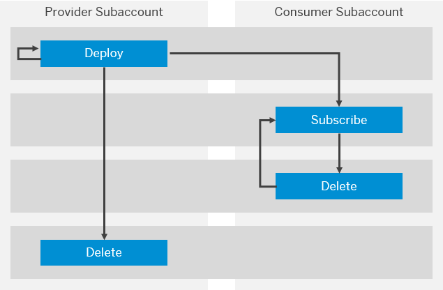

<!-- loio2abf7d47063542208d0d99f7bc05f4f4 -->

# Operating Solutions

You can deploy, update, monitor, and delete a solution.

> ### Tip:  
> **This documentation refers to SAP Business Technology Platform, Neo environment. If you are looking for documentation about other environments, see [SAP Business Technology Platform](https://help.sap.com/viewer/65de2977205c403bbc107264b8eccf4b/Cloud/en-US/6a2c1ab5a31b4ed9a2ce17a5329e1dd8.html "SAP Business Technology Platform (SAP BTP) is an integrated offering comprised of four technology portfolios: database and data management, application development and integration, analytics, and intelligent technologies. The platform offers users the ability to turn data into business value, compose end-to-end business processes, and build and extend SAP applications quickly.") :arrow_upper_right:.**

To operate a solution you require at least one of the following roles in your subaccount:

-   Default role *Administrator*
-   Default role *Developer*
-   A custom role with all following permissions: `manageMultiTargetApplication`, `readMultiTargetApplication`, `readJavaApplications`, and `manageJavaApplications`. For more information about custom roles, see [Managing Roles](../60-security-neo/managing-roles-db8175b.md) and [Manage Custom Platform Roles](../50-administration-and-ops-neo/manage-custom-platform-roles-ede5f72.md).

> ### Note:  
> Currently you can operate SAP SuccessFactors extensions using only the *Administrator* or *Developer* roles.

## Deploying Solutions

Depending on the type of the solution, you can operate it using the cockpit, CTS+ and the SAP Business Technology Platform\(SAP BTP\) console client for the Neo environment:

### **Standard Solution**

This solution is only deployed and can be used in the current SAP BTP subaccount and subscription to it is not possible. All entities that are part of the solution will be deployed and managed within this subaccount.

You can deploy a standard solution using the:

-   Cockpit: [Deploy a Standard Solution](deploy-a-standard-solution-fea07de.md)

    By using the cockpit, you can deploy all of the solution artifacts to your subaccount in one go.

-   Transport Managament Service: [Integration with Transport Management Tools](integration-with-transport-management-tools-905baea.md)

    You can use the CTS+ to transport and promote a solution among different environments or landscapes.

    > ### Note:  
    > The CTS+ cannot be used for providing a solution for subscription, or for subscribing to a solution that is provided by another subaccount.

-   Console client command: [deploy-mta](../50-administration-and-ops-neo/deploy-mta-1e12331.md)

    By using the `deploy-mta` command, you can deploy one or several solutions in one run.

### **Provided Solution**

This is a solution that is deployed to the current subaccount, but provided for subscription to another SAP BTP subaccount. Before the deployment of your solution, you have to set it as a provided solution. After that you have to grant entitlements to a given SAP BTP global account that will allow its subaccounts to subscribe to the solutions.

When providing a solution for subscription, you can define which parts of it will be deployed to your subaccount, and which parts will be deployed to the subscriber's subaccount. Note that the parts deployed to your subaccount will consume resources from your quotas. All parts deployed to the subaccount of the subscriber will consume resources from its own quotas.

You can provide a solution for subscription using the:

-   Cockpit: [Deploy a Provided Solution](deploy-a-provided-solution-8f48815.md)

    You can provide a solution for subscription by selecting the *Provider deploy* checkbox in the *Deploy a Solution from an MTA Archive* dialog box that appears when you start a deployment process..

-   Console client command: [deploy-mta](../50-administration-and-ops-neo/deploy-mta-1e12331.md)

    By using the `deploy-mta` command, you can provide a solution for subsription, using the `providerImport` value of the `-mode` parameter.

### **Available Solutions**

This is a solution that is available for subscription. It has been provided by another SAP BTP subaccount and you have granted entitlements to subscribe to it. After subscribing to the solution, you can use it.

You can list the solutions that are available for subscription using the:

-   Cockpit: [Subscribe to a Solution Available for Subscription](subscribe-to-a-solution-available-for-subscription-bd7602e.md)

    By using the cockpit, you can deploy all of the solution artifacts to your subaccount in one go.

-   Console client command: [list-mtas](../50-administration-and-ops-neo/list-mtas-b8b51ef.md)

    By using the `--available-for-subscription` parameter of the `list-mtas` command, you can list all solutions that are available for subsription to your subaccount.

### **Subscribed Solution**

This is a solution that has been provided by another SAP BTP subaccount. You have subscribed to it, and thus have a limited set of management operations.

When providing a solution for subscription, the provider defines which parts of it are deployed to your subaccount, and which parts are deployed to the provider subaccount. Note that the parts deployed to your subaccount consume resources from your quotas. All parts deployed to the provider subaccount consume resources from its own quotas.

You can list the solutions that are available for subscription using the:

-   Cockpit: [Subscribe to a Solution Available for Subscription](subscribe-to-a-solution-available-for-subscription-bd7602e.md)

    By using the cockpit, you can deploy all of the solution artifacts to your subaccount in one go.

-   Console client command: [subscribe-mta](../50-administration-and-ops-neo/subscribe-mta-ea358be.md)

    By using the `subscribe-mta` command, you can subscribe to a solution that is available for subsription to your subaccount.

   
  
<a name="loio2abf7d47063542208d0d99f7bc05f4f4__fig_xpg_1xh_mz"/>Operations Lifecycle of a Solution

  

<a name="loio2abf7d47063542208d0d99f7bc05f4f4__section_ofc_3gn_cdb"/>

## Updating Solutions

-   Using the cockpit: [Updating Solutions](updating-solutions-4bec3f1.md)

    You can update solutions that have already been deployed to your subaccount by using the option in the dedicated solution overview page. Depending on the deployer version, several distinctions exist, as described in [General Information About Solution Updates](general-information-about-solution-updates-2b1c4ed.md).

<a name="loio2abf7d47063542208d0d99f7bc05f4f4__section_zqg_t3n_cdb"/>

## Monitoring Solutions

After deploying a solution, you can monitor it using the:

-   Cockpit: [Monitor Solutions Using the Cockpit](monitor-solutions-using-the-cockpit-5d5debc.md).
-   Console client command: [display-mta](../50-administration-and-ops-neo/display-mta-974dbbb.md)

<a name="loio2abf7d47063542208d0d99f7bc05f4f4__section_wx4_fjn_cdb"/>

## Deleting Solutions

You can delete a solution using the:

-   Cockpit: [Delete Solutions Using the Cockpit](delete-solutions-using-the-cockpit-0f1844f.md)
-   Console client command: [delete-mta](../50-administration-and-ops-neo/delete-mta-3d1163e.md)

**Related Information**  

[Deploying Solutions Using the Cockpit](deploying-solutions-using-the-cockpit-a5db17e.md "")

[Transporting Multitarget Applications with CTS+](transporting-multitarget-applications-with-cts-f598f69.md "You can enable transport of SAP BTP applications and application content that is available as Multitarget Applications (MTA) using the Enhanced Change and Transport System (CTS+).")

[deploy-mta](../50-administration-and-ops-neo/deploy-mta-1e12331.md "This command deploys Multitarget Application (MTA) archives. One or more than one MTA archives can be deployed to your subaccount in one go.")

[subscribe-mta](../50-administration-and-ops-neo/subscribe-mta-ea358be.md "This command subscribes the subaccount of the consumer to a Multitarget Application (MTA), which is available for subscription.")

[Updating Solutions](updating-solutions-4bec3f1.md)

[Monitor Solutions Using the Cockpit](monitor-solutions-using-the-cockpit-5d5debc.md "When deployed to your SAP BTP subaccount, a solution consists of various solution components. Each solution component originates from a certain MTA module that in turn can result in several solution components. That is, one MTA module corresponds to given solution components.")

[Delete Solutions Using the Cockpit](delete-solutions-using-the-cockpit-0f1844f.md "Delete a solution from your subaccount following the steps for the corresponding solution types.")

