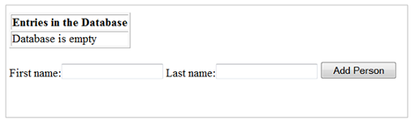

<!-- loio7612e180711e1014839a8273b0e91070 -->

<link rel="stylesheet" type="text/css" href="../css/sap-icons.css"/>

# Tutorial: Adding Container-Managed Persistence with JPA \(SDK for Java EE 7 Web Profile\)

Use JPA together with EJB to apply container-managed persistence in a simple Java EE web application that manages a list of persons.

> ### Remember:  
> SAP Business Technology Platform, Neo environment will sunset on **December 31, 2028**, subject to terms of customer or partner contracts.
> 
> For more information, see SAP Note [3351844](https://me.sap.com/notes/3351844).

> ### Tip:  
> **This documentation refers to SAP Business Technology Platform, Neo environment. If you are looking for documentation about other environments, see [SAP Business Technology Platform](https://help.sap.com/viewer/65de2977205c403bbc107264b8eccf4b/Cloud/en-US/6a2c1ab5a31b4ed9a2ce17a5329e1dd8.html "SAP Business Technology Platform (SAP BTP) is an integrated offering comprised of the following technology portfolios: application development; process automation; integration; data, analytics, and enterprise planning; artificial intelligence. The platform offers users the ability to turn data into business value, compose end-to-end business processes, connect entire IT landscapes, and personalize, build and extend SAP applications. This reduces the overall total cost of ownership maintaining SAP landscapes and third-party software across end-to-end business processes.") :arrow_upper_right:.**


<a name="loio7612e180711e1014839a8273b0e91070__section_prereq"/>

## Prerequisites

-   Download and set up your Eclipse IDE and the **SDK for Java EE 7 Web Profile**. For more information, see [Setting Up the Development Environment](setting-up-the-development-environment-e815ca4.md).

-   Set up your runtime environment in the Eclipse IDE.

-   Download and unzip the following external JAR files:

    -   javax.ejb \(http://www.java2s.com/Code/JarDownload/javax.ejb/javax.ejb-3.1.2.2.jar.zip\)

    -   javax.servlet \(http://www.java2s.com/Code/JarDownload/javax.servlet/javax.servlet-3.0.0.v201112011016.jar.zip\)

    -   javax.persistence \(http://www.java2s.com/Code/JarDownload/javax.persistence/javax.persistence-2.0.3.jar.zip\)

    -   slf4j \(http://www.java2s.com/Code/JarDownload/org.slf4j/org.slf4j.jar.zip\)


<a name="loio7612e180711e1014839a8273b0e91070__section_hyb_dm5_1bb"/>

## Context

Perform the following steps:

1.  [Import Java Web Application](tutorial-adding-container-managed-persistence-with-jpa-sdk-for-java-ee-7-web-profile-7612e18.md#loio79c4ed09521b418397aa35627562b4b1)

2.  [Add External JARs](tutorial-adding-persistence-with-jdbc-sdk-for-java-web-e4c5285.md#loio77dbc96e96ac4df7bc4fa96bacbb255c)

3.  [Building the WAR File](tutorial-adding-container-managed-persistence-with-jpa-sdk-for-java-ee-7-web-profile-7612e18.md#loio1287c89101514eb1bef60ec15833b39b)

4.  [Test the Web Application on the Local Server](tutorial-adding-container-managed-persistence-with-jpa-sdk-for-java-ee-7-web-profile-7612e18.md#loio8ed4fbd7ddf74cff9cb8c5f0534f2af7)

5.  [Deploy on the Cloud](tutorial-adding-container-managed-persistence-with-jpa-sdk-for-java-ee-7-web-profile-7612e18.md#loio2fc4f6d5f4e3421fb92fdd5ccc737299)

6.  [Configure Applications Using the Cockpit](tutorial-adding-container-managed-persistence-with-jpa-sdk-for-java-ee-7-web-profile-7612e18.md#loiof1e8adb468004a9e84c32006c73d6b24)

7.  [Start Applications](tutorial-adding-container-managed-persistence-with-jpa-sdk-for-java-ee-7-web-profile-7612e18.md#loio5c95035f19c0458f8528ff2be51822de)


<a name="loio79c4ed09521b418397aa35627562b4b1"/>

<!-- loio79c4ed09521b418397aa35627562b4b1 -->

## Import Java Web Application

Import the *persistence-with-ejb* Java Web application in Eclipse IDE.


## Procedure

1.  Open *Eclipse* \> *File* \> *Import …* \> *General* \> *Existing Projects Into Workspace* and then click *Next*.

2.  In *Select root directory*, enter the path to the project in the samples folder of the downloaded SDK.

    > ### Example:  
    > <SDK for Java EE 7 Web Profile\>/samples/persistence-with-ejb

3.  Click *Finish*.


<a name="loio77dbc96e96ac4df7bc4fa96bacbb255c"/>

<!-- loio77dbc96e96ac4df7bc4fa96bacbb255c -->

## Add External JARs

Add the JAR files you've downloaded earlier to the Web application build path.


## Procedure

1.  Open *Context Menu of Project* \> *Build Path* \> *Configure Build Path …*.

2.  In the *Java Build Path* dialog that appears, click *Libraries*, and then click *Add External JARs*.

3.  Go to the folder to which you downloaded and unzipped the JAR files listed in the prerequisites.

4.  Select *javax.servlet.\*.jar* and click *Open* to add the JAR file.

5.  Repeat the previous steps for the other JAR files.

6.  In the *Java Build Path* dialog, click *Apply and Close*.

7.  Right-click on the project to open the context menu and choose *Validate*.


<a name="loio1287c89101514eb1bef60ec15833b39b"/>

<!-- loio1287c89101514eb1bef60ec15833b39b -->

## Building the WAR File


## Procedure

1.  Go to *File* \> *Export...* and in the *Export* dialog, select *Web* \> *War file* and choose *Next*.

2.  Select your web project in the *Web Project* dropdown.

3.  Use the browse button to specify the name and destination for the WAR file. Note the location of WAR file.*Build Path* \> *Configure Build Path …*

4.  Choose *Finish*. The WAR file is now generated.


<a name="loio8ed4fbd7ddf74cff9cb8c5f0534f2af7"/>

<!-- loio8ed4fbd7ddf74cff9cb8c5f0534f2af7 -->

## Test the Web Application on the Local Server

Test your application by deploying it locally.


## Procedure

1.  To test your web application on the local server, follow the steps for deploying a web application locally as described in [Deploy Locally with the Console Client](https://help.sap.com/viewer/ea72206b834e4ace9cd834feed6c0e09/Cloud/en-US/937c833b72bb101490cf767db0e91070.html).

    You should see the following output:

    

2.  Enter a first name \(for example, `John`\) and a last name \(for example, `Smith`\) and choose *Add Person*.

    `John Smith` is added to the database as shown below:

    

    > ### Note:  
    > If you add more names to the database, they are also listed in the table. This confirms that you have successfully enabled persistence using the `Person` entity.


<a name="loio2fc4f6d5f4e3421fb92fdd5ccc737299"/>

<!-- loio2fc4f6d5f4e3421fb92fdd5ccc737299 -->

## Deploy on the Cloud

Deploy your application to the cloud using the SAP BTP cockpit or the console client.

> ### Note:  
> You must perform the following step before you bind your application to the database.

<a name="copyae1e7e23bfe34b6db1a40d84f307bf7b"/>

<!-- copyae1e7e23bfe34b6db1a40d84f307bf7b -->

### Deploy on the Cloud with the Cockpit

The cockpit allows you to deploy Java applications as WAR files and supports a number of deployment options for configuring the application.


## Context

> ### Remember:  
> SAP Business Technology Platform, Neo environment will sunset on **December 31, 2028**, subject to terms of customer or partner contracts.
> 
> For more information, see SAP Note [3351844](https://me.sap.com/notes/3351844).

> ### Tip:  
> **This documentation refers to SAP Business Technology Platform, Neo environment. If you are looking for documentation about other environments, see [SAP Business Technology Platform](https://help.sap.com/viewer/65de2977205c403bbc107264b8eccf4b/Cloud/en-US/6a2c1ab5a31b4ed9a2ce17a5329e1dd8.html "SAP Business Technology Platform (SAP BTP) is an integrated offering comprised of the following technology portfolios: application development; process automation; integration; data, analytics, and enterprise planning; artificial intelligence. The platform offers users the ability to turn data into business value, compose end-to-end business processes, connect entire IT landscapes, and personalize, build and extend SAP applications. This reduces the overall total cost of ownership maintaining SAP landscapes and third-party software across end-to-end business processes.") :arrow_upper_right:.**


## Procedure

1.  Log on to the cockpit and select an account.

2.  Choose *Java Applications* in the navigation area.

3.  Choose *Deploy Application*.

4.  Select the WAR file that you want to deploy, for example, in directory `<SDK_location>/tools/samples/deploy_war`.

5.  Use the application name that the cockpit proposes to you. It's the same name as for the WAR file. Alternatively, enter an application name. Note that application names must start with a letter, can contain lowercase letters and numbers only, and must not exceed 30 characters.

    You can also assign a display name and a description to a Java application.

    > ### Note:  
    > When the sum of the characters of the subaccount technical name and the application name exceeds 30, the default application URL is truncated. This means that parts of the subaccount name and the application name will be missing from the application URL:
    > 
    > > ### Example:  
    > > Subaccount name: mycompanyextensionspoc
    > > 
    > > Application name: myappsimplesimplereq
    > > 
    > > Application URL: `https://myappsimplemycompanyextensions.us1.hana.ondemand.com`

6.  Optionally specify additional parameters to configure the application. If omitted, default values are assigned.

    For more information about the deploy parameters, see the [deploy](../50-administration-and-ops-neo/deploy-937db4f.md) command documentation.

7.  Choose *Deploy* to deploy the WAR file to the cloud platform.

    > ### Note:  
    > Make sure that the subaccount size hasn't reached the allowed 100-GB quota for Java applications.
    > 
    > If the used space exceeds 80% of the subaccount size quota, the *Used space:* progress bar shows a <span style="color:#d14900;"><span class="SAP-icons-V5"></span></span> \(Warning\) status. In such a case, you can still deploy Java applications until you reach the maximum subaccount size quota.
    > 
    > If the used space reaches the maximum subaccount size quota, the *Used space:* progress bar shows an <span style="color:#cc1919;"><span class="SAP-icons-V5"></span></span> \(Error\) status. In such a case, you can't deploy Java applications.

    -   The *Deploy Application* dialog box remains on the screen while the deployment is in progress. When the deployment is over, a confirmation appears that the application has been successfully deployed. Note that at this stage the application isn’t yet up and running.

    -   The *Used space:* progress bar is updated to show what percent of the subaccount size quota is used for Java applications.

    -   The size of the deployed Java application in megabytes is also included in the list of Java applications. If the size of the application is less than 0.1 MB, the value in the *Size* column shows *< 0.1 MB*.


8.  In the dialog box, choose one of the following options:

    -   *Start*: Start the application to activate its URL and make the application available to your end users.
    -   *Close*: Simply close the dialog box if you don't want to start the application immediately.


## Results

Your newly deployed application appears in the list of Java applications.

**Updating a deployed application**

You can update or redeploy the application whenever required. To do this operation, choose an application from the list of deployed Java applications. Then choose the *Update* button. You can update the application with a new WAR file or change the configuration parameters.

To change the name of a deployed application, deploy a new application under the desired name, and delete the application whose name you want to change.

**Related Information**  


[deploy](../50-administration-and-ops-neo/deploy-937db4f.md "Deploying an application publishes it to SAP BTP. Use the optional parameters to make some specific configurations of the deployed application.")

[Define Application Details \(Java Apps\)](../50-administration-and-ops-neo/define-application-details-java-apps-9b23270.md "You can view details about your currently selected Java application. By adding a suitable display name and a description, you can identify the application more easily.")

<a name="copycdeb9d5c874f404caeaf7e0f0e239092"/>

<!-- copycdeb9d5c874f404caeaf7e0f0e239092 -->

### Deploy on the Cloud with the Console Client

Deploying an application publishes it to SAP BTP. During deploy, you can define various specifics of the deployed application using the deploy command optional parameters.


<a name="copycdeb9d5c874f404caeaf7e0f0e239092__prereq_N10019_N10016_N10001"/>

## Prerequisites

-   You have downloaded and configured SAP BTP console client. For more information, see [Set Up the Console Client](set-up-the-console-client-7613dee.md)
-   Depending on your subaccount type, deploy the application on the respective region host. For more information, see [Regions](https://help.sap.com/viewer/65de2977205c403bbc107264b8eccf4b/Cloud/en-US/350356d1dc314d3199dca15bd2ab9b0e.html "You can deploy applications in different regions. Each region represents a geographical location (for example, Europe, US East) where applications, data, or services are hosted.") :arrow_upper_right:


## Context

> ### Remember:  
> SAP Business Technology Platform, Neo environment will sunset on **December 31, 2028**, subject to terms of customer or partner contracts.
> 
> For more information, see SAP Note [3351844](https://me.sap.com/notes/3351844).

> ### Tip:  
> **This documentation refers to SAP Business Technology Platform, Neo environment. If you are looking for documentation about other environments, see [SAP Business Technology Platform](https://help.sap.com/viewer/65de2977205c403bbc107264b8eccf4b/Cloud/en-US/6a2c1ab5a31b4ed9a2ce17a5329e1dd8.html "SAP Business Technology Platform (SAP BTP) is an integrated offering comprised of the following technology portfolios: application development; process automation; integration; data, analytics, and enterprise planning; artificial intelligence. The platform offers users the ability to turn data into business value, compose end-to-end business processes, connect entire IT landscapes, and personalize, build and extend SAP applications. This reduces the overall total cost of ownership maintaining SAP landscapes and third-party software across end-to-end business processes.") :arrow_upper_right:.**


## Procedure

1.  In the opened command line console, execute `neo deploy` command with the appropriate parameters.

    You can define the parameters of commands directly in the command line as in the example below, or in the properties file. For more information, see [Using the Console Client](../50-administration-and-ops-neo/using-the-console-client-8900b22.md).

2.  Enter your password if requested.

3.  Press ENTER and deployment of your application will start. If deployment fails, check if you have defined the parameters correctly.

    > ### Note:  
    > The size of an application deployed on SAP BTP can be up to 1.5 GB. If the application is packaged as a WAR file, the size of the unzipped content is taken into account.


#### Example

```
neo deploy --host <host> --account <subaccount_name> --application <application_name> --source samples/deploy_war/example.war --user <email_or_user>  
```


<a name="copycdeb9d5c874f404caeaf7e0f0e239092__postreq_N1005A_N10016_N10001"/>

## Next Steps

To make your deployed application available for requests, you need to start it by executing the `neo start` command.

Then, you can manage the application lifecycle \(check the status; stop; restart; undeploy\) using dedicated console client commands.

**Related Information**  


[deploy](../50-administration-and-ops-neo/deploy-937db4f.md "Deploying an application publishes it to SAP BTP. Use the optional parameters to make some specific configurations of the deployed application.")

[start](../50-administration-and-ops-neo/start-cc417d7.md "Starts a deployed application in order to make it available for customers. In case the application is already started, the command starts an additional application process if the quota for maximum allowed number of application processes is not exceeded.")

[restart](../50-administration-and-ops-neo/restart-7c0f7a1.md "Use this command to restart your application or a single application process. The effect of the restart command is the same as executing the stop command first and when the application is stopped, starting it with the start command.")

[stop](../50-administration-and-ops-neo/stop-b5bfcbf.md "Use this command to stop your deployed and started application or application process.")

[status](../50-administration-and-ops-neo/status-d4f6592.md "You can check the current status of an application or application process. The command lists all application processes with their IDs, state, last change date sorted chronologically, and runtime information.")

[undeploy](../50-administration-and-ops-neo/undeploy-7e09b85.md "Undeploying an application removes it from SAP BTP. To undeploy an application, you have to stop it first.")

[Use Delta Deployment](use-delta-deployment-7a4aba2.md "By using the delta deployment option, you can apply changes in a deployed application faster without uploading the entire set of files tо SAP BTP.")

[Managing Applications in the Neo Console Client](../50-administration-and-ops-neo/managing-applications-in-the-neo-console-client-87cfe1b.md "If you are an application operator and need to deploy a new version of a productive application or perform maintenance, you can choose among several approaches.")

[Update Application Properties](../50-administration-and-ops-neo/update-application-properties-cadb1dd.md "You can update a property of an application running on SAP BTP without redeploying it.")

<a name="loiof1e8adb468004a9e84c32006c73d6b24"/>

<!-- loiof1e8adb468004a9e84c32006c73d6b24 -->

## Configure Applications Using the Cockpit

Use the cockpit to create a default binding for your application.


## Procedure

1.  In the cockpit, select a subaccount, then choose *SAP HANA / SAP ASE* \> *Databases & Schemas* in the navigation area.

2.  Select the database you want to create a binding for.

3.  Choose *Data Source Bindings*. For more information, see .

4.  Define a binding \(<DEFAULT\>\) for the application and select a database ID. Choose *Save*.

    You can use an existing database or create a new one.


<a name="loio5c95035f19c0458f8528ff2be51822de"/>

<!-- loio5c95035f19c0458f8528ff2be51822de -->

## Start Applications

Start your application using the SAP BTP cockpit or the console client.

> ### Note:  
> You must bind your application to the database before you perform the following step.

<a name="copy149909bf80974ce4bf003a2ef502398e"/>

<!-- copy149909bf80974ce4bf003a2ef502398e -->

### Start Applications with the Cockpit

Use the SAP BTP cockpit to start your application.


## Procedure

1.  In the cockpit, select a subaccount, then choose *Java Applications* in the navigation area.

2.  Select your application from the list shown. Your application is shown using the name you chose during the step [Deploy on the Cloud](tutorial-adding-container-managed-persistence-with-jpa-sdk-for-java-ee-7-web-profile-7612e18.md#loio2fc4f6d5f4e3421fb92fdd5ccc737299).

3.  Click on *Start* to start your application on the application page.

4.  When the application has finished starting, click on the URL that appears in Application URLs.

    You should see your application running as shown earlier in [Test the Web Application on the Local Server](tutorial-adding-container-managed-persistence-with-jpa-sdk-for-java-ee-7-web-profile-7612e18.md#loio8ed4fbd7ddf74cff9cb8c5f0534f2af7).


<a name="copy48043802d6244e019787d3ff4cc69241"/>

<!-- copy48043802d6244e019787d3ff4cc69241 -->

### Start Applications with the Console Client

To make your deployed application available for requests, start it by executing the `neo start` command.

**Related Information**  


[start](../50-administration-and-ops-neo/start-cc417d7.md "Starts a deployed application in order to make it available for customers. In case the application is already started, the command starts an additional application process if the quota for maximum allowed number of application processes is not exceeded.")

