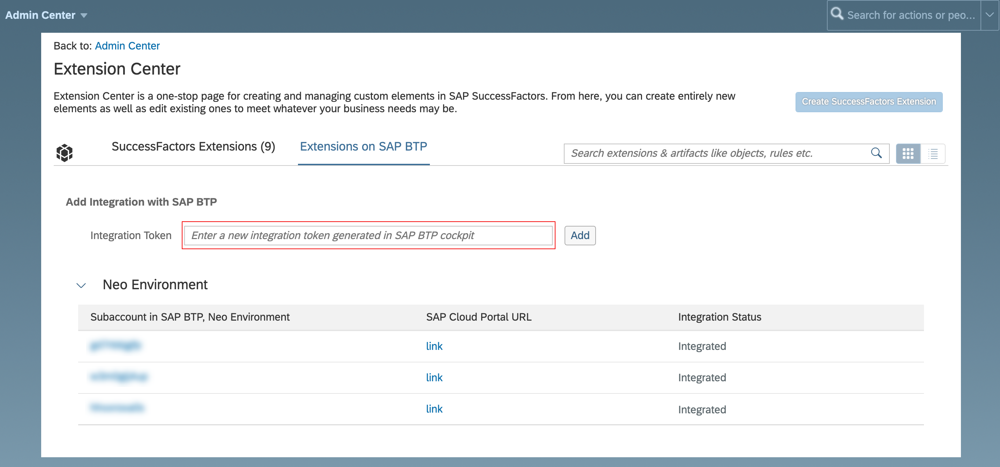

<!-- loio09bb734cf5614896a4cdb66f3e1528ec -->

# Configure the Extension Integration Between SAP BTP and SAP SuccessFactors

Depending on your SAP SuccessFactors release version, you configure the extension integration between SAP BTP and SAP SuccessFactors from the Extension Center.

## Prerequisites

-   You have a dedicated SAP SuccessFactors company instance.

-   You have a user with permissions to access *Extension Center* in SAP SuccessFactors Admin Center that include:

    -   *Configure Object Definitions* and *Admin Access to MDF OData API* permissions from the *Metadata Framework* category

    -   *Create Integration with SAP BTP* permission from the *Manage Extensions on SAP BTP* category

    To assign these permissions to your user, you might need the help of an administrator.

    To get a user with the respective permissions, follow these steps:

    1.  Make sure you have an access to the SAP SuccessFactors Admin Center. See [Permission to Access Admin Center](https://help.sap.com/viewer/6c9f794920b947648737d914a669f195/latest/en-US/83c5a81ecd51478db1dcc23835f80339.html).

    2.  Add your user to an already existing group or create a new dedicated group and add your user. See [Creating Dynamic Permission Groups](https://help.sap.com/viewer/b569eee64d3f4159b2b5272ba7d6b127/LATEST/en-US/6adf50f40a86406a917a54ce7fd2131b.html).

    3.  Use an already existing role or create a new dedicated role. See [Creating Permission Roles](https://help.sap.com/viewer/b569eee64d3f4159b2b5272ba7d6b127/LATEST/en-US/6d8998d9504843a58fe299ff6935a268.html).

    4.  Assign the respective permissions to your role. See [Assigning Permissions to a Role](https://help.sap.com/viewer/b569eee64d3f4159b2b5272ba7d6b127/LATEST/en-US/f412b2160c2348b8b357fb3f6290d4b8.html).

    5.  Add your role to the dedicated group. See [Assigning Roles to Groups](https://help.sap.com/viewer/b569eee64d3f4159b2b5272ba7d6b127/LATEST/en-US/fbaadf758e00485893d6f099e9f342fa.html).

    6.  To fully activate the permissions, log out and log in again to the SAP SuccessFactors company instance.

-   You have the integration token required to trigger the automated configuration. For more information, see [Create an Integration Token for SAP SuccessFactors](create-an-integration-token-for-sap-successfactors-6ef1e3b.md).

    > ### Note:  
    > The integration token is used only to trigger the automated configuration and can be used only once. Once the integration token is used, it is no longer valid.

## Context

> ### Remember:  
> SAP Business Technology Platform, Neo environment will sunset on **December 31, 2028**, subject to terms of customer or partner contracts.
> 
> For more information, see SAP Note [3351844](https://me.sap.com/notes/3351844).

> ### Tip:  
> **This documentation refers to SAP Business Technology Platform, Neo environment. If you are looking for documentation about other environments, see [SAP Business Technology Platform](https://help.sap.com/viewer/65de2977205c403bbc107264b8eccf4b/Cloud/en-US/6a2c1ab5a31b4ed9a2ce17a5329e1dd8.html "SAP Business Technology Platform (SAP BTP) is an integrated offering comprised of four technology portfolios: database and data management, application development and integration, analytics, and intelligent technologies. The platform offers users the ability to turn data into business value, compose end-to-end business processes, and build and extend SAP applications quickly.") :arrow_upper_right:.**

You can configure the extension integration between your SAP SuccessFactors company and a subaccount in SAP BTP from the Extension Center in the SAP SuccessFactors Admin Center.

## Procedure

1.  Add the integration token.

    1.  In SAP SuccessFactors *Admin Center*, open the *Extension Center*.

    2.  On the *Extensions on SAP BTP* tab page, navigate to the *Add Integration with SAP BTP* screen area, and paste the integration token in the *Integration Token* input field.

        > ### Note:  
        > If the *Integration Token* field is not available, make sure you have fulfilled all the prerequisites and your user is assigned the *Create Integration with SAP BTP* permission from the *Manage Extensions on SAP BTP* category. See the *Prerequisites* section in this document.

    3.  Choose *Add*.

        The system appears in the integration list in the *Neo Environment* screen area, and the status of the integration is displayed in the *Integration Status* column. To refresh the status of the process, choose the *Check Status* icon.

    The integration token determines the subaccount that will be integrated with your SAP SuccessFactors company.

    > ### Note:  
    > One SAP SuccessFactors company can be integrated with more than one subaccount, while one subaccount can be associated with exactly one SAP SuccessFactors company.

    

2.  Wait for the integration to finish.

    Once the integration has finished, the system appears in the *Integrated System* screen area in the *Integration Token* panel in the cockpit and its status is *Integrated* By choosing the SAP SuccessFactors Company ID link, you open the logon screen for the corresponding SAP SuccessFactors company.

<a name="loio09bb734cf5614896a4cdb66f3e1528ec__result_qh1_lks_yqb"/>

## Results

After the automated configuration has finished:

-   SAP Cloud Portal service is enabled \(if it hasn't already been enabled\) and configured for extensibility in your subaccount.
-   A corresponding service provider is configured if there wasn't an already existing one. SAP SuccessFactors is added as a default trusted application identity provider in your subaccount if you have selected this option when creating the integration token.
-   You have the `Extensions Administrators` group and the `Extensions Admin` permission role created in SAP SuccessFactors.

    > ### Caution:  
    > You must not rename or delete the `Extensions Administrators` group and the `Extensions Admin` permission role. Otherwise, you will not be able to use the SAP Cloud Portal service UI from SAP SuccessFactors.

## Next Steps

-   Once you have performed the automated configuration, you include members in the *Extensions Administrators* group to define who can access the SAP Cloud Portal service UI from SAP SuccessFactors. For more information, see [Defining the People Pool for Managing Extensions](defining-the-people-pool-for-managing-extensions-ccd49f2.md).
-   If you use the SAP SuccessFactors identity provider, you need to configure the access to SAP Web IDE Full-Stack. To do so, you assign developer permissions to the required users or groups. For more information, see [Assign Users Permission for SAP Web IDE](https://help.sap.com/viewer/825270ffffe74d9f988a0f0066ad59f0/CF/en-US/102a024b1e344c54a0df7d835163b039.html) .
-   Once you have performed the automated configuration of the extension integration, you continue with the installation and configuration of your extension applications. For more information, see [Installing and Configuring Extension Applications](installing-and-configuring-extension-applications-fd92f74.md).
-   Optional: You can refresh the extension integration. For more information, see [Refresh the Extension Integration for SAP SuccessFactors](refresh-the-extension-integration-for-sap-successfactors-9d3f809.md).
-   Optional: You can remove the extension integration. For more information, see [Remove the Extension Integration](remove-the-extension-integration-e73bc61.md).

