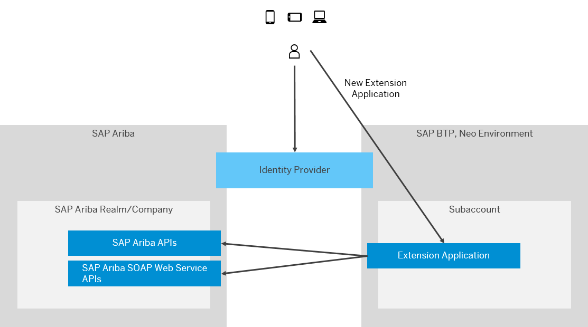

<!-- loiob418c61f501f41f798d68d7396991f50 -->

# Extending SAP Ariba in the Neo Environment

This document guides you through the configuration tasks that you need to perform to enable the use of the extension capabilities of SAP BTP for your SAP Ariba solution.

> ### Remember:  
> SAP Business Technology Platform, Neo environment will sunset on **December 31, 2028**, subject to terms of customer or partner contracts.
> 
> For more information, see SAP Note [3351844](https://launchpad.support.sap.com/#/notes/3351844).

> ### Tip:  
> **This documentation refers to SAP Business Technology Platform, Neo environment. If you are looking for documentation about other environments, see [SAP Business Technology Platform](https://help.sap.com/viewer/65de2977205c403bbc107264b8eccf4b/Cloud/en-US/6a2c1ab5a31b4ed9a2ce17a5329e1dd8.html "SAP Business Technology Platform (SAP BTP) is an integrated offering comprised of four technology portfolios: database and data management, application development and integration, analytics, and intelligent technologies. The platform offers users the ability to turn data into business value, compose end-to-end business processes, and build and extend SAP applications quickly.") :arrow_upper_right:.**

SAP BTP is the extension platform from SAP. It enables you to develop loosely coupled extension applications, thus implementing additional workflows or modules on top of the existing SAP Ariba solution you already have. Depending on the extension application and the SAP Ariba solution you use, you have an SAP Ariba Company/SAP Ariba Realm.

> ### Note:  
> You can extend SAP Ariba only using the Neo environment of the SAP BTP.

The functionality is available for enterprise accounts.

In this scenario these are the important aspects:

-   You need to set up the trust between SAP Ariba and an identity provider.

-   You also need to set up the trust between SAP BTP and the same identity provider you used for the trust with SAP Ariba.

-   The extension applications for SAP Ariba are hosted or subscribed in a dedicated subaccount in SAP BTP.

<a name="loiob418c61f501f41f798d68d7396991f50__section_pvm_t54_11b"/>

## Procedure

1.  Get a global account in the Neo environment. See [Get an Enterprise Account](https://help.sap.com/viewer/65de2977205c403bbc107264b8eccf4b/Cloud/en-US/d61c2819034b48e68145c45c36acba6e.html#loio82f9ff522f754e26ae89e0cd7ec7aa11 "To use an enterprise account, you can either purchase a customer account, join the partner program to purchase a partner account, or self-register for an enterprise account to try out free tier service plans.") :arrow_upper_right:.

2.  Have an SAP Ariba solution.

    You can check the available SAP Ariba solutions at [https://www.ariba.com/solutions/solutions-overview](https://www.ariba.com/solutions/solutions-overview).

3.  [Configure Single Sign-On \(SSO\)](configure-single-sign-on-sso-aeca2d4.md):

    -   [Set Up Trust Between SAP Ariba and Corporate Identity Provider Using SAML 2.0](set-up-trust-between-sap-ariba-and-corporate-identity-provider-using-saml-2-0-3108789.md).

    -   [Application Identity Provider](https://help.sap.com/viewer/65de2977205c403bbc107264b8eccf4b/Cloud/en-US/dc618538d97610148155d97dcd123c24.html).

4.  [Connect the Application Running on SAP BTP to SAP Ariba](connect-the-application-running-on-sap-btp-to-sap-ariba-94918b6.md).

    -   [Using SAP Ariba APIs](using-sap-ariba-apis-3804226.md)

    -   [Using SAP Ariba SOAP Web Service APIs](using-sap-ariba-soap-web-service-apis-7d75a46.md)

