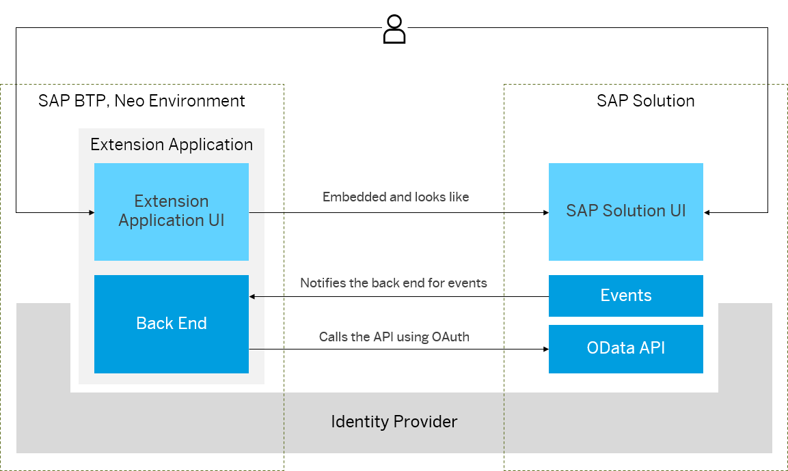

<!-- loio11fbee6f83ad4a70819775f72b65773c -->

# Extensions, Neo Environment

The extension capabilities of SAP Business Technology Platform \(SAP BTP\) enables developers to implement loosely coupled extension applications securely, thus implementing additional workflows or modules on top of the existing SAP cloud solution they already have.

> ### Remember:  
> SAP Business Technology Platform, Neo environment will sunset on **December 31, 2028**, subject to terms of customer or partner contracts.
> 
> For more information, see SAP Note [3351844](https://me.sap.com/notes/3351844).

> ### Tip:  
> **This documentation refers to SAP Business Technology Platform, Neo environment. If you are looking for documentation about other environments, see [SAP Business Technology Platform](https://help.sap.com/viewer/65de2977205c403bbc107264b8eccf4b/Cloud/en-US/6a2c1ab5a31b4ed9a2ce17a5329e1dd8.html "SAP Business Technology Platform (SAP BTP) is an integrated offering comprised of four technology portfolios: database and data management, application development and integration, analytics, and intelligent technologies. The platform offers users the ability to turn data into business value, compose end-to-end business processes, and build and extend SAP applications quickly.") :arrow_upper_right:.**

<a name="loio11fbee6f83ad4a70819775f72b65773c__section_odp_tz5_2fb"/>

## Introduction

All standard SAP solutions are offered with customizing capabilities. Additionally, customers often have their own requirements for innovative or industry-specific extensions and the extension capability of SAP BTP can help them build, deploy, and operate their new functionalities easily and securely.

<a name="loio11fbee6f83ad4a70819775f72b65773c__section_xxk_s2y_y2b"/>

## Extension Application

SAP BTP, Neo environment offers ready-to-use development and runtime environment in the cloud. You can extend standard SAP solutions without disrupting their performance and core processes. When building extension applications, you can also benefit from the automation of the integration between the SAP BTP, Neo environment and the extended SAP solutions.

These are the specifics of an extension application:

-   The extension application needs to call APIs from the SAP solution.

-   The SAP solution \(for example, SAP SuccessFactors\) can notify the extension application using APIs exposed from the extension application.

-   The UI of the extension application can:

    -   Be embedded in the UI of the SAP solution

    -   Be separate from the SAP solution, for example embedded into a corporate or a consumer portal

<a name="loio11fbee6f83ad4a70819775f72b65773c__section_cjc_p2y_y2b"/>

## Extension Subaccount

An extension subaccount is part of a customer or partner global account in SAP BTP which is configured to interact with a particular SAP solution through standardized destinations, usually with identity propagation turned on. This subaccount is paired with the extended SAP solution.

<a name="loio11fbee6f83ad4a70819775f72b65773c__section_pxm_ply_y2b"/>

## Provide Extension Applications

There are two deployment models for providing an extension application:

-   Provider-managed deployment model: an extension application is deployed in a separate subaccount in SAP BTP, and the customer's extension subaccount is subscribed for this application.

    For example, an SAP partner can use this deployment model to offer his extension applications as a software-as-a-service \(SaaS\).

-   Consumer-managed deployment model: an extension application is deployed directly in the extension subaccount of the customer.

    This deployment model can be used for extension applications built by the customer, or purchased from an SAP partner as a deployable solution.

**Related Information**  

[Extending SAP SuccessFactors in the Neo Environment](extending-sap-successfactors-in-the-neo-environment-bd585c8.md "You can extend the scope of SAP SuccessFactors HXM Suite using extension applications on SAP BTP.")

[Extending SAP S/4HANA Cloud in the Neo Environment](extending-sap-s-4hana-cloud-in-the-neo-environment-fa132ee.md "This section guides you through the configuration tasks that you need to perform to enable the SAP BTP, Neo environment for developing extension applications for your SAP S/4HANA Cloud tenant.")

[Extending SAP Cloud for Customer in the Neo Environment](extending-sap-cloud-for-customer-in-the-neo-environment-eea73b4.md "")

[Extending SAP Ariba in the Neo Environment](extending-sap-ariba-in-the-neo-environment-b418c61.md "This document guides you through the configuration tasks that you need to perform to enable the use of the extension capabilities of SAP BTP for your SAP Ariba solution.")

