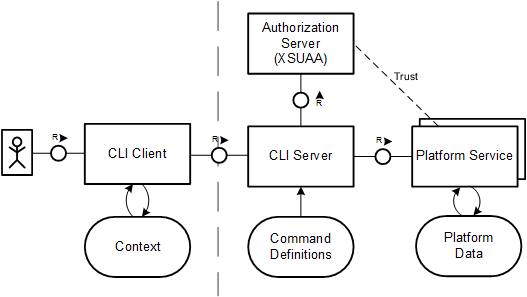

<!-- loio7c6df2db6332419ea7a862191525377c -->

# Account Administration Using the SAP BTP Command Line Interface \(btp CLI\)

Use the SAP BTP command line interface \(btp CLI\) for account management tasks, such as creating or updating subaccounts and directories, and managing entitlements. It is an alternative to the SAP BTP cockpit for users who like to work in a terminal or want to automate operations using scripts.

The btp CLI offers convenient features for interactive use as well as for scripting: For the interactice user, there's login via SSO, command autocompletion, as well as several interactive commands with prompts. But all commands can also be run with parameters, and the command output can be set to json format, so the btp CLI is perfect for scripting.

If you want to use the btp CLI for scripting, we recommend to use the `--format json` option or to persistently set the output format to json with `btp set config --format json`. See [Change the Output Format to JSON](change-the-output-format-to-json-dcb85b7.md) and [Change Configuration Settings](change-configuration-settings-dba4eb6.md).

> ### Note:  
> The content in this section is only relevant for cloud management tools feature set B. For more information, see [Cloud Management Tools - Feature Set Overview](https://help.sap.com/viewer/65de2977205c403bbc107264b8eccf4b/Cloud/en-US/caf4e4e23aef4666ad8f125af393dfb2.html).

<a name="loio7c6df2db6332419ea7a862191525377c__section_nc4_bpf_15b"/>

## Documentation

In this documentation, you learn how to download, install, update, and use the btp CLI. Additionally, see the following:

-   [btp CLI Command Reference](https://help.sap.com/docs/BTP/btp-cli/intro.html): The command reference contains descriptions of all commands with their parameters, as well as examples, tips, and links to further conceptual documenation.

-   [Get Started with the SAP BTP Command Line Interface \(btp CLI\)](https://developers.sap.com/tutorials/cp-sapcp-getstarted.html): This tutorial walks you through downloading and installing the btp CLI client, understanding the syntax, and running your first commands.

-   [Automate Account Operations with the Command Line Interface](https://developers.sap.com/tutorials/cp-cli-automate-operations.html): This tutorial uses a bash shell script to automate the setup of a global account.

-   [Setting Up a Global Account via the Command Line [Feature Set B]](https://help.sap.com/viewer/65de2977205c403bbc107264b8eccf4b/Cloud/en-US/accd5b2389b04f4daf8a79b606435927.html "Your global account is the entry point for managing the resources, landscape, and entitlements for your departments and projects in a self-service manner in SAP BTP. You can use the command-line tool btp CLI to set it up.") :arrow_upper_right:: This chapter lists the commands of the btp CLI and the cf CLI that you need to create a subaccount and enable Cloud Foundry.

Whe working with the btp CLI in your terminal, you can access the help by executing `btp help` or by appending `--help` to a command.

<a name="loio7c6df2db6332419ea7a862191525377c__section_lk5_xjg_qjb"/>

## How the btp CLI Works

You download the btp CLI client to your local desktop and access it through the shell of your operating system. The client then accesses all required platform services through its backend, the CLI server, where the command definitions are stored. The CLI server delegates authentication and authorization to the authorization server, and forwards trust to the platform services, which then take care of authorization at the execution of each command.

**Related Information**  

[btp CLI Command Reference](https://help.sap.com/docs/BTP/btp-cli/intro.html)

