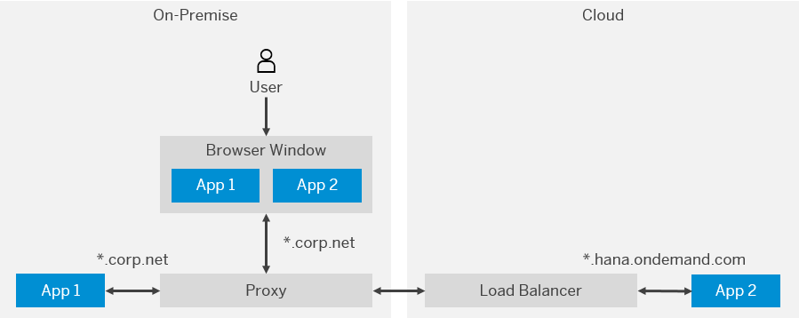

<!-- loio79773d1793d745b2b943e7bce12bbc51 -->

# Configuring Application Access via On-Premise Reverse Proxy

Using an on-premise reverse proxy allows you to combine on-premise and cloud-based web applications in the same browser window.

> ### Remember:  
> SAP Business Technology Platform, Neo environment will sunset on **December 31, 2028**, subject to terms of customer or partner contracts.
> 
> For more information, see SAP Note [3351844](https://me.sap.com/notes/3351844).

> ### Tip:  
> **This documentation refers to SAP Business Technology Platform, Neo environment. If you are looking for documentation about other environments, see [SAP Business Technology Platform](https://help.sap.com/viewer/65de2977205c403bbc107264b8eccf4b/Cloud/en-US/6a2c1ab5a31b4ed9a2ce17a5329e1dd8.html "SAP Business Technology Platform (SAP BTP) is an integrated offering comprised of four technology portfolios: database and data management, application development and integration, analytics, and intelligent technologies. The platform offers users the ability to turn data into business value, compose end-to-end business processes, and build and extend SAP applications quickly.") :arrow_upper_right:.**


<a name="loio79773d1793d745b2b943e7bce12bbc51__section_s22_fpy_dz"/>

## Scope

The on-premise reverse proxy method is applicable to:

-   Java applications

    > ### Note:  
    > A Java application must be deployed and started in advance.

-   HTML5 applications

-   Both host and port mapping for reverse proxy

-   More than one reverse proxy address can be mapped to the same application URL.


<a name="loio79773d1793d745b2b943e7bce12bbc51__section_pkh_1jy_dz"/>

## Context

You are often not allowed to combine on-premise and cloud-based web applications in one browser window. It is not allowed because browsers use the cross-site information transfer prevention policy. Browsers count this type of information transfer as a security threat by default, which makes it impossible to perform cookie exchange and, in particular, cookie-based authentication.



You can use an on-premise reverse proxy as the sole origin for the browser. This feature allows you to manage on-premise and cloud applications in the same browser window. The commands listed in this topic allow applications running on SAP BTP to be accessed via such proxies.

> ### Note:  
> Please have in mind that you cannot use these commands for applications configured with custom domains.

There are several options available for managing mappings between the cloud application uniform resource identifier \(URI\) and the proxy host. Having a proxy-to-application mapping allows access to the application via the on-premise reverse proxy.


<a name="loio79773d1793d745b2b943e7bce12bbc51__section_jh1_wd2_2z"/>

## Managing Proxy-to-Application Mappings

Open the command prompt and navigate to the folder containing `neo.bat/neo.sh` \(`<SDK installation folder>/tools`\). Then, you can manage the proxy host mappings by using the reverse-proxy group of console client commands:

-   The `map-proxy-host` command maps an application host to an on-premise reverse proxy host and port.

    > ### Example:  
    > ```
    > neo map-proxy-host --account mysubaccount --app-host app.hana.ondemand.com --proxy loc.corp:123 -h hana.ondemand.com -u username -p ******
    > ```

-   The `unmap-proxy-host` command deletes the mapping between an application host and an on-premise reverse proxy host and port.

    > ### Example:  
    > ```
    > neo unmap-proxy-host --account mysubaccount --app-host app.hana.ondemand.com --proxy loc.corp:123 -h hana.ondemand.com -u username -p ******
    > ```

-   The `list-proxy-host-mappings` command lists the proxy hosts mapped to an application host.

    > ### Example:  
    > ```
    > neo list-proxy-host-mappings --account mysubaccount --app-host app.hana.ondemand.com --proxy loc.corp:123 -h hana.ondemand.com -u username -p ******
    > ```


<a name="loio79773d1793d745b2b943e7bce12bbc51__section_rdl_gjn_mz"/>

## Proxy Configuration

You need to set the on-premise proxy with a header with key `x-proxy-host`. As a result, when your HTTP request arrives at the cloud, it will be routed properly to App 2. The header value should contain the application host of App 2, which is `app.hana.ondemand.com` in this specific example.

> ### Note:  
> If you do not use the `x-proxy-host` header, you will receive the ***Service Unavailable*** error message.

**Related Information**  


[map-proxy-host](map-proxy-host-12b5cc4.md "Maps an application host to an on-premise reverse proxy host and port.")

[unmap-proxy-host](unmap-proxy-host-10ddad9.md "Deletes the mapping between an application host and an on-premise reverse proxy host and port.")

[list-proxy-host-mappings](list-proxy-host-mappings-9fbd139.md "Lists the proxy hosts mapped to an application hostname.")

[API Documentation](../30-development-neo/api-documentation-4570e92.md "API documentation for the Neo environment.")

