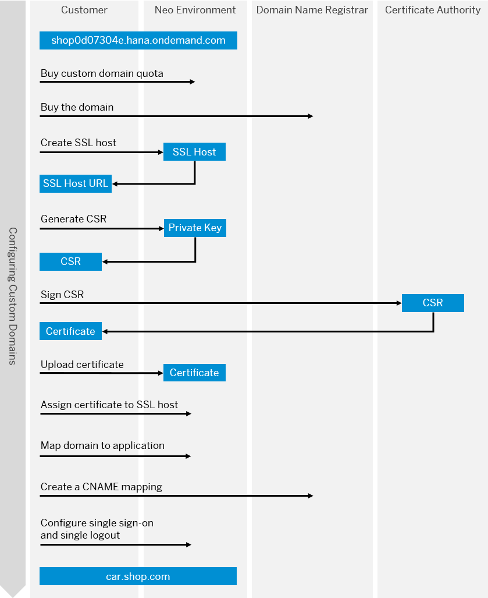
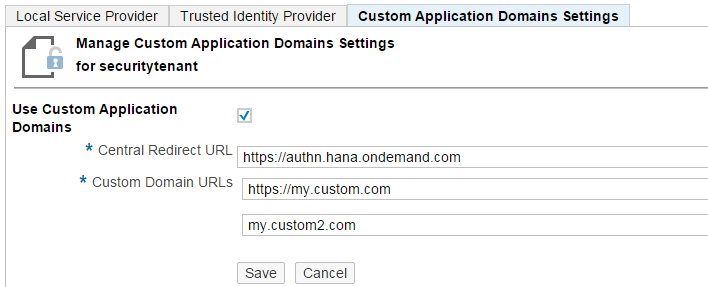

<!-- loio77cf0e6cd32e496c9cc8eeac4bedde94 -->

# Configuring Custom Domains

To make sure that your domain is trusted and all application data is protected, you need to first set up secure SSL communication. The next step will then be to make your application accessible via the custom domain and route traffic to it.


## Context

> ### Tip:  
> **This documentation refers to SAP Business Technology Platform, Neo environment. If you are looking for documentation about other environments, see [SAP Business Technology Platform](https://help.sap.com/viewer/65de2977205c403bbc107264b8eccf4b/Cloud/en-US/6a2c1ab5a31b4ed9a2ce17a5329e1dd8.html "SAP Business Technology Platform (SAP BTP) is an integrated offering comprised of four technology portfolios: database and data management, application development and integration, analytics, and intelligent technologies. The platform offers users the ability to turn data into business value, compose end-to-end business processes, and build and extend SAP applications quickly.") :arrow_upper_right:.**

This documentation is related to SAP BTP, Neo environment.

If you want to configure a custom domain:

-   in the SAP BTP, Cloud Foundry environment, see [Configuring Application URLs](https://help.sap.com/viewer/65de2977205c403bbc107264b8eccf4b/Cloud/en-US/e623e372e6174f81af2b9b8ef8f6d6d3.html).

-   for an SAP Cloud Integration application, see [Configuring Custom Domains for SAP Cloud Integration](https://help.sap.com/viewer/368c481cd6954bdfa5d0435479fd4eaf/Cloud/en-US/7230b9ff41914cc0969223e6a020104b.html).

-   in the context of SAP Cloud Portal service, see [Configure a Custom Domain for the Default Site](https://help.sap.com/viewer/8422cb487c2146999a2a7dab9cc85cf7/Cloud/en-US/b5c7fa40ef394f28bf954eec5ed907d6.html).

-   with regard to eDocument for Italy, see SAP Note [2583309 - eDocument Italy: Communication Channel Registration](https://launchpad.support.sap.com/#/notes/2583309).


The end-to-end process for configuring a custom domain in the Neo environment is described in the following diagram:



For more information about purchasing the custom domain quota and the domain, see [Prerequisites](prerequisites-cde2547.md).

Perform the following steps:

-   [Create an SSL Host](configuring-custom-domains-77cf0e6.md#loio70f4d19d3dbd434aa9aa165d53e2896c)
-   [Upload a Certificate](configuring-custom-domains-77cf0e6.md#loio55120d899d314e23ab8e33b4b388cea6)
-   [Bind the Certificate to the SSL Host](configuring-custom-domains-77cf0e6.md#loio1d4248f3582a40cdb6f4a2439a55fb65)
-   [Add the Custom Domain](configuring-custom-domains-77cf0e6.md#loiobf395cf25683491eabefadb4383ed7ff)
-   [Configure DNS](configuring-custom-domains-77cf0e6.md#loio004406e1c9a8441fb05a25f5f87d45b7)
-   [Configure Single Sign-On and Single Logout](configuring-custom-domains-77cf0e6.md#loioc990788e18c2412281a2abd9c41ad766)
-   [Test the Custom Domain](configuring-custom-domains-77cf0e6.md#loio6b671d39f46c41d1bbd89b7e698fe384)

> ### Note:  
> For SAP Cloud Integration applications, there are some differences in the procedure. For more information, see [Configuring Custom Domains for SAP Cloud Integration](https://help.sap.com/viewer/368c481cd6954bdfa5d0435479fd4eaf/Cloud/en-US/7230b9ff41914cc0969223e6a020104b.html).

 <a name="loio70f4d19d3dbd434aa9aa165d53e2896c"/>

<!-- loio70f4d19d3dbd434aa9aa165d53e2896c -->

## Create an SSL Host

You have to create an SSL host that will serve your custom domain. This host holds the mapping between your chosen custom domain and the application on SAP BTP as well as the SSL configuration for secure communication through this custom domain.


<a name="loio70f4d19d3dbd434aa9aa165d53e2896c__prereq_hgd_m5z_jz"/>

## Prerequisites

To use the console commands, install an SDK according to the instructions in [Install the SAP BTP SDK for Neo Environment](../30-development-neo/install-the-sap-btp-sdk-for-neo-environment-7613843.md).


## Procedure

1.  Open the command prompt and navigate to the folder containing `neo.bat/neo.sh`\(`<SDK installation folder>/tools`\).

2.  Create an SSL host. In the console client command line, execute `neo create-ssl-host`. For example:

    ```
    neo create-ssl-host --account mysubaccount --user mymail@example.com --host hana.ondemand.com --name mysslhostname
    ```

    > ### Note:  
    > In the command output, you get the SSL host. For example, `"A new SSL host [mysslhostname] was created and is now accessible on host [123456.ssl.ondemand.com]"`. Write down the `123456.ssl.ondemand.com` host as you will later need it for the DNS configuration.

    For more information, see [create-ssl-host](create-ssl-host-3c890d5.md).

3.  Optional: Check all the SSL hosts created for your subaccount using the `list-ssl-hosts` command.

    ```
    neo list-ssl-hosts --account mysubaccount --user mymail@example.com --host hana.ondemand.com
    ```

    For more information, see [list-ssl-hosts](list-ssl-hosts-e8fc50c.md).


 <a name="loio55120d899d314e23ab8e33b4b388cea6"/>

<!-- loio55120d899d314e23ab8e33b4b388cea6 -->

## Upload a Certificate

You need an SSL certificate to allow secure communication with your application. Once installed, the SSL certificate is used to identify the client/individual and to authenticate the owner of the site.


## Context

The certificate generation process starts with certificate signing request \(CSR\) generation. A CSR is an encoded file containing your public key and specific information that identifies your company and domain name.

The next step is to use the CSR to get a server certificate signed by a certificate authority \(CA\) chosen by you. Before buying, carefully consider the appropriate type of SSL certificate you need. For more information, see [Prerequisites](prerequisites-cde2547.md).


## Procedure

1.  Generate a CSR.

    The `--name` parameter is the unique identifier of the certificate within your subaccount and will be used later. It can contain alphanumeric symbols, '.', '-' and '\_'.

    The `--certificate-distinguished-name` contains the attributes of the CSR formatted as type0=value0,type1=value1,type2=..., characters may be escaped by \\ \(backslash\), no spaces are skipped. Here you need to provide the following information:

    -   CN = Common Name – the domain name\(s\) for which you are requesting the certificate - for example ‘www.example.com’
    -   C = Country - two-digit code - for example, ‘GB’
    -   ST = State - state or province name - for example, ‘Hampshire’
    -   L = Locality – city full name - for example ‘Portsmouth’
    -   O = Organization – company name
    -   OU = Organizational Unit – for example ‘IT Department’
    -   E = Email Address – to validate the certificate request, some certificate authorities require the email address of the domain owner

    In the console client command line, execute `neo generate-csr`:

    ```
    neo generate-csr --account mysubaccount --user mymail@example.com --host hana.ondemand.com
    --name myfirstcert --certificate-distinguished-name "C=GB,O=MyCompany,CN=www.example.com,E=admin@example.com"
    ```

    For more information, see [generate-csr](generate-csr-f02258d.md).

    > ### Note:  
    > For security reasons, SAP recommends that you use only certificates that are based on CSRs generated via the `generate-csr` command.

    In the command line output, you get the generated CSR.

2.  Send the CSR to a CA. Copy and send the CSR you got in the previous step to your trusted CA who will sign the certificate.

    > ### Note:  
    > When sending the CSR to be signed by a CA, make sure you choose F5 BigIP for server type.

3.  Upload the SSL certificate you received from the CA:

    ```
    neo upload-domain-certificate --account mysubaccount --user mymail@example.com --host hana.ondemand.com --name myfirstcert --location ./certificate.pub
    
    ```

    > ### Note:  
    > The certificate must be in Privacy-enhanced Electronic Mail \(PEM\) format \(128 or 256 bits\) with private key \(2048-4096 bits\).

    Some CAs issue chained root certificates that contain one or more intermediate certificates. In such cases, put all certificates in the file for upload starting with the signed SSL certificate.

    If you did not upload an intermediate certificate for some reason, you can use the `--force` parameter option. Put the missing certificate in the file, add the `--force` parameter, and retry the previously executed `upload-domain-certificate` command without changing the values of the remaining parameters.

    > ### Caution:  
    > Once uploaded, the domain certificate \(including the private key\) is securely stored on the platform and cannot be downloaded for security reasons.

    For more information, see [upload-domain-certificate](upload-domain-certificate-bb54abf.md).

    Note that when the certificate expires, you will receive a notification from your CA. You need to take care of the certificate update. For more information, see [Update an Expired Certificate](update-an-expired-certificate-11da7c3.md#loio11da7c3a91f24206a68f70b5d6cb3d88)

    > ### Tip:  
    > If you have one custom domain quota, you can upload up to four certificates \(standard, wildcard, or SAN\). However, you can bind only one certificate for production purposes.
    > 
    > If you reach thе upload limit, you can free up some space for new certificates by executing `list-domain-certificates` to get the names of the uploaded certificates and then `delete-domain-certificate` for each certificate you do not need. Deleting a certificate cannot be undone.


 <a name="loio1d4248f3582a40cdb6f4a2439a55fb65"/>

<!-- loio1d4248f3582a40cdb6f4a2439a55fb65 -->

## Bind the Certificate to the SSL Host

You need to bind the uploaded certificate to the created SSL host so that it can be used as SSL certificate for requests to this SSL host.


## Procedure

1.  Bind the certificate by executing `neo bind-domain-certificate`:

    ```
    neo bind-domain-certificate --account mysubaccount --user mymail@example.com --host hana.ondemand.com --ssl-host mysslhostname --certificate myfirstcert
    
    ```

    For more information, see [bind-domain-certificate](bind-domain-certificate-8722bcb.md).

2.  Optional: If you want to list your custom domain certificates, execute: `neo list-domain-certificates`.

    ```
    neo list-domain-certificates --account mysubaccount --user mymail@example.com --host hana.ondemand.com 
    
    ```

    For more information, see [list-domain-certificates](list-domain-certificates-dfb8438.md).

    > ### Note:  
    > Optionally, you can use the `set-ssl-host` command to manage TLS protocol versions and ciphers. For more information, see [set-ssl-host](set-ssl-host-2956975.md).


 <a name="loiobf395cf25683491eabefadb4383ed7ff"/>

<!-- loiobf395cf25683491eabefadb4383ed7ff -->

## Add the Custom Domain

To make your application on the platform accessible via the custom domain, you need to map the custom domain to the application URL.


## Procedure

1.  In the console client command line, execute `neo add-custom-domain` with the appropriate parameters. Note that you can only do this for a started application.

    ```
    neo add-custom-domain --account mysubaccount --user mymail@example.com --host hana.ondemand.com
    --custom-domain www.example.com --application-url mysubaccountmyapp.hana.ondemand.com --ssl-host mysslhostname
    
    ```

    > ### Note:  
    > Query strings are not supported in the `--application-url` parameter and are ignored. For example, if you specify “mysubaccountmyapp.hana.ondemand.com/sites?idp=example” for `--application-url`, the “?idp=example” part will be ignored.

    After you configure an application to be accessed over a custom domain, its default platform URL `hana.ondemand.com` will no longer be accessible. It will only remain accessible for subscribed applications with a URL of type `https://<application_name><provider_subaccount>-<consumer_subaccount>.<domain>`. You have the option to disable the access to the default platform URL for subscribed applications with the `--disable-application-url` parameter of the `add-custom-domain` command.

    For more information, see [add-custom-domain](add-custom-domain-ebc5269.md).

2.  Optional: If you want to list all custom domains configured as access points for applications in your subaccount, execute `neo list-custom-domain-mappings`.

    For more information, see [list-custom-domain-mappings](list-custom-domain-mappings-7dfeeb2.md).


 <a name="loio004406e1c9a8441fb05a25f5f87d45b7"/>

<!-- loio004406e1c9a8441fb05a25f5f87d45b7 -->

## Configure DNS

To route the traffic for your custom domain to your application on the platform, you also need to configure it in the Domain Name System \(DNS\) that you use.


## Context

You need to make a CNAME mapping from your custom domain to the created SSL host for each custom domain you want to use. This mapping is specific for the domain name provider you are using. Usually, you can modify CNAME records using the administration tools available from your domain name registrar.

> ### Note:  
> We don't recommend that you use A records, because they will map your domain to the IP address of the SSL host. This IP address can change and cause your custom domain setup to stop working.


## Procedure

1.  Sign in to the domain name registrar's administrative tool and find the place where you can update the domain DNS records.

2.  Locate and update the CNAME records for your domain to point to the DNS entry you received from us \(`*.ssl.ondemand.com`\) - the one that you got as a result when you created the SSL host using the `create-ssl-host` command. For example, `123456.ssl.ondemand.com`. You can check the SSL host by executing the `list-ssl-hosts` command.

    For example, if you have two DNS records : `myhost.com` and `www.myhost.com`, you need to configure them both to point to the SSL host `123456.ssl.ondemand.com`.

    It may take some time for the configuration to take effect.

    For further details, consult your domain name registrar documentation.


 <a name="loio6b671d39f46c41d1bbd89b7e698fe384"/>

<!-- loio6b671d39f46c41d1bbd89b7e698fe384 -->

## Test the Custom Domain

After you configure the custom domain, make sure that the setup is correct and your application is accessible on the new domain.


## Procedure

1.  Log on to the cockpit, select an subaccount and go to your *Application Dashboard*. In *Application URLs*, check if the new custom URL has replaced the default one.

    > ### Note:  
    > To learn about the accessibility features available in the SAP BTP cockpit, see [Accessibility Features in SAP BTP Cockpit](../10-concepts-neo/accessibility-features-in-sap-btp-cockpit-185161b.md).

2.  Open the new application URL in a browser. Make sure that your application responds as expected.

3.  Check that there are no security warnings in the browser. View the certificate in the browser. Check the *Subject* and *Subject Alternative Name* fields - the domain names there must match the custom domain.

4.  Perform a small load test - request the application from different browser sessions making at least 15 different requests.


## Results

After this procedure, your application will be accessible on the custom domain, but you will not be able to log on \(single sign-on\) and log out \(single logout\), respectively. If you have a custom trust configuration in your subaccount, you will need to perform an additional configuration to enable single sign-on and single logout.


## Next Steps

Configure single sign-on and single logout. For more information, see [Configure Single Sign-On and Single Logout](configuring-custom-domains-77cf0e6.md#loioc990788e18c2412281a2abd9c41ad766).

 <a name="loioc990788e18c2412281a2abd9c41ad766"/>

<!-- loioc990788e18c2412281a2abd9c41ad766 -->

## Configure Single Sign-On and Single Logout

To enable single sign-on and single logout, you need to configure the *Custom Domain URLs* and the *Central Redirect URL* for the SAML single sign-on flow. To configure single sign-on and single logout, follow this procedure.


## Prerequisites

-   You are logged on with a user with administrator role. See [Managing Member Authorizations in the Neo Environment](managing-member-authorizations-in-the-neo-environment-a1ab5c4.md).

-   You are aware of the productive region that hosts your subaccount. See [Regions and Hosts Available for the Neo Environment](../10-concepts-neo/regions-and-hosts-available-for-the-neo-environment-d722f7c.md).

-   You are using a custom trust configuration for your subaccount. See [Configure the Local Service Provider](../60-security-neo/application-identity-provider-dc61853.md#loiodcdfe339f94947bc96508daa686cc56d).

-   You have configured the required trust settings for your subaccount. See [Configure Trust to the SAML Identity Provider](../60-security-neo/application-identity-provider-dc61853.md#loiob6cfc4bb4bff4ace90afc71b0962fcb5).


## Context

*Central Redirect URL* is the central node that facilitates assertion consumer service \(ACS\) and single logout \(SLO\) service. By default, this node is provided by the platform, and has the `authn.<productive region host>.com` URL \(for example, `authn.hana.ondemand.com`\). If you want to use your application’s root URL as the ACS, instead of the central node, you will need to maintain the *Central Redirect URL*.

For Java applications, you can follow the procedure described in the current document.

> ### Note:  
> For HANA XS applications that use SAP ID Service as authenticating authority, create an incident in component BC-IAM-IDS. For HANA XS applications that use SAP Cloud Identity Services - Identity Authentication for authentication, see [Configure a Trusted Service Provider](https://help.sap.com/viewer/6d6d63354d1242d185ab4830fc04feb1/Cloud/en-US/f96e4c5930a94d1ba117e05a3f3c30fc.html) to learn how to update the ACS and SLO endpoints.


## Procedure

1.  In your Web browser, open the SAP BTP cockpit and choose *Security* \> *Trust* in the navigation area.

    > ### Note:  
    > To learn about the accessibility features available in the SAP BTP cockpit, see [Accessibility Features in SAP BTP Cockpit](../10-concepts-neo/accessibility-features-in-sap-btp-cockpit-185161b.md).

2.  Choose the *Custom Application Domains Settings* subtab.

3.  Choose *Edit*. The custom domains properties become editable.

4.  Select the *Use Custom Application Domains* option.

5.  In *Central Redirect URL*, enter the URL of your application process that will serve as the central node.

    > ### Tip:  
    > The *Central Redirect URL* value has to be the same as the host of the ACS endpoint value in the metadata of the service provider.

    > ### Note:  
    > Make sure you do not stop the application VM specified as the *Central Redirect URL*. Otherwise, SAML authentication will fail for all applications in your subaccount.

6.  The values in *Custom Domain URLs* are used for SLO. Enter the required values \(all custom domain URLs\) in *Custom Domain URLs*.

7.  Save your changes. The system generates the respective SLO endpoints. Test them in your Web browser and make sure they are accessible from there.

    

    > ### Tip:  
    > The system will accept URL values with or without `https://`. Either way, the system will generate the correct ACS and SLO endpoint URLs.

    > ### Note:  
    > If you are using SAP Cloud Portal service and some of the tiles are configured to open an application on а different domain, as is the case with Web Dynpro ABAP applications, SAP recommends that you create а custom domain for each backend system. You need to add all custom domains in the *Custom Domain Application Settings* tab.
    > 
    > For more information about configuring a custom domain in the context of SAP Cloud Portal service, see [Configure a Custom Domain for the Default Site](https://help.sap.com/viewer/8422cb487c2146999a2a7dab9cc85cf7/Cloud/en-US/b5c7fa40ef394f28bf954eec5ed907d6.html).


