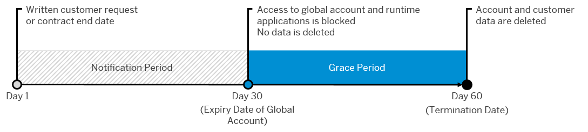

<!-- copy2de4d748269244c596cb7578df9e218d -->

# \[DEPRECATED\] Global Account Termination

> ### Tip:  
> **This documentation refers to SAP Business Technology Platform, Neo environment. If you are looking for documentation about other environments, see [SAP Business Technology Platform](https://help.sap.com/viewer/65de2977205c403bbc107264b8eccf4b/Cloud/en-US/6a2c1ab5a31b4ed9a2ce17a5329e1dd8.html "SAP Business Technology Platform (SAP BTP) is an integrated offering comprised of four technology portfolios: database and data management, application development and integration, analytics, and intelligent technologies. The platform offers users the ability to turn data into business value, compose end-to-end business processes, and build and extend SAP applications quickly.") :arrow_upper_right:.**

When the contract of an SAP BTP customer ends, SAP is legally obligated to delete all the data in the customer’s accounts. The data is physically and irreversibly deleted, so that it cannot be restored or recovered by reuse of resources.

The termination process is triggered when a customer contract expires or a customer notifies SAP that they wish to terminate their contract.

1.  When the termination process is triggered, SAP sends a notification e-mail to the customer regarding the expired contract, and the dates on which the account will be blocked and then deleted.

2.  During the 30-day notification period before the global account is closed, a banner is displayed in the SAP BTP cockpit reminding users of the global account about the pending termination.

    The customer can export their data, or they can open an incident to download their data before the termination date.

    The customer can cancel the termination during this period and renew their contract with SAP.

3.  After the notification period, a grace period of 30 days begins.

    During the grace period:

    -   Access is blocked to the global account, and to deployed and subscribed applications.
    -   No data is deleted, and backups are still ongoing.
    -   The global account is displayed in the cockpit with the label *Expired*, and the number of days left in the grace period is displayed.

    The customer can contact SAP to restore their account to a fully active account without data loss.

4.  At the end of the grace period, all customer-related data for the account and services is deleted and cannot be restored. The global account tile is removed from the cockpit.

**Related Information**  

[Getting Support, Neo Environment](../70-getting-support-neo/getting-support-neo-environment-fc2bf6a.md "Use SAP Community, get guided answers, or explore SAP Support Portal.")

