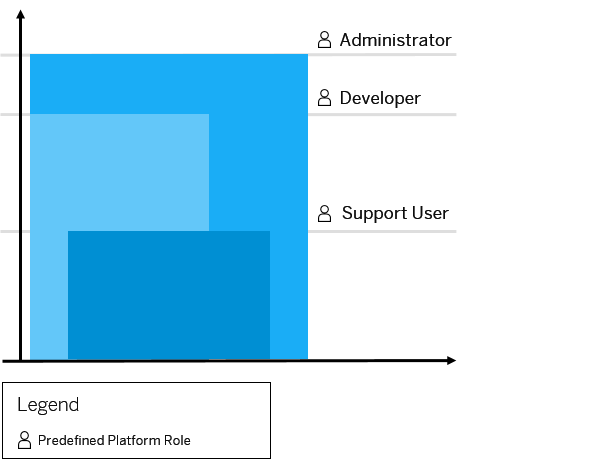
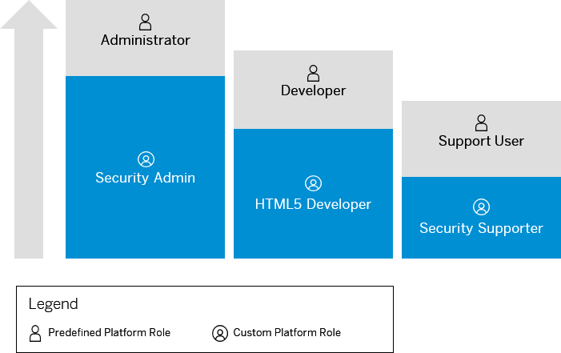

<!-- loioa1ab5c4cc117455392cd0a512c7f890d -->

# Managing Member Authorizations in the Neo Environment

SAP BTP includes predefined platform roles that support the typical tasks performed by users when interacting with the platform. In addition, subaccount administrators can combine various scopes into a custom platform role that addresses their individual requirements.

> ### Remember:  
> SAP Business Technology Platform, Neo environment will sunset on **December 31, 2028**, subject to terms of customer or partner contracts.
> 
> For more information, see SAP Note [3351844](https://me.sap.com/notes/3351844).

> ### Tip:  
> **This documentation refers to SAP Business Technology Platform, Neo environment. If you are looking for documentation about other environments, see [SAP Business Technology Platform](https://help.sap.com/viewer/65de2977205c403bbc107264b8eccf4b/Cloud/en-US/6a2c1ab5a31b4ed9a2ce17a5329e1dd8.html "SAP Business Technology Platform (SAP BTP) is an integrated offering comprised of four technology portfolios: database and data management, application development and integration, analytics, and intelligent technologies. The platform offers users the ability to turn data into business value, compose end-to-end business processes, and build and extend SAP applications quickly.") :arrow_upper_right:.**

A platform role is a set of permissions, or scopes, managed by the platform. Scopes are the building blocks for platform roles. They represent a set of permissions that define what members can do and what platform resources they can access \(for example, configuration settings such as destinations or quotas\). Most scopes follow a “Manage” and “Read” pattern. For example, `manageXYZ` comprises the actions create, update, and delete on platform resource XYZ. However, some areas use a different pattern, for example, Application Lifecycle Management.

## Predefined Platform Roles

Predefined platform roles cannot be changed. However, global account administrators can copy from predefined roles, and then modify the copies.

SAP BTP includes the following predefined platform roles:

<table>
<tr>
<th valign="top">

Role

</th>
<th valign="top">

Description

</th>
</tr>
<tr>
<td valign="top">

Administrator

</td>
<td valign="top">

Manage subaccount members

You can also manage subscriptions, trust, authorizations, and OAuth settings, and restart SAP HANA services on HANA databases.

Furthermore, you can view heap dumps and download a heap dump file.

In addition, you have all permissions granted by the developer role, except the debug permission.

> ### Note:  
> This role also grants permissions to view the *Connectivity* tab in the SAP BTP cockpit.

</td>
</tr>
<tr>
<td valign="top">

Cloud Connector Admin

</td>
<td valign="top">

Open secure tunnels via Cloud Connector from on-premise networks to your subaccounts.

> ### Note:  
> This role also grants permissions to view the *Connectivity* tab in the SAP BTP cockpit.

</td>
</tr>
<tr>
<td valign="top">

Developer

</td>
<td valign="top">

Supports typical development tasks, such as deploying, starting, stopping, and debugging applications. You can also change loggers and perform monitoring tasks, such as creating availability checks for your applications and executing MBean operations.

> ### Note:  
> By default, this role is assigned to a newly created user.

</td>
</tr>
<tr>
<td valign="top">

Support User

</td>
<td valign="top">

Designed for technical support engineers, this role enables you to read almost all data related to a subaccount, including its metadata, configuration settings, and log files. For you to read database content, a database administrator must assign the appropriate database permissions to you.

</td>
</tr>
<tr>
<td valign="top">

Application User Admin

</td>
<td valign="top">

Assigned by the subaccount administrator to a subaccount member. Manage user permissions on application level to access Java, HTML5 applications, and subscriptions. You can control permissions directly by assigning users to specific application roles or indirectly by assigning users to groups, which you then assign to application roles. You can also unassign users from the roles or groups.

> ### Note:  
> This role does not let you manage subaccount roles and perform actions at the subaccount level \(for example, stopping or deleting applications\).

</td>
</tr>
</table>

The following graphic illustrates the predefined Administrator, Developer, and Support User roles and their amount of scopes:

  
  
**Amount of Platform Scopes**

The Admin role includes all platform scopes available on SAP BTP. The Developer and Support User are subsets of the Admin role.

<a name="loioa1ab5c4cc117455392cd0a512c7f890d__section_sfm_2x3_d1b"/>

## Custom Platform Roles

Administrators of a subaccount can define custom platform roles based on their needs by assembling the different scopes they want their custom platform role to include. Custom platform roles are managed at subaccount level and can be changed at any time.

Subaccount administrators can combine various scopes into a custom platform role that addresses their individual requirements. Scopes are the building blocks for platform roles. They represent a set of permissions that define what members can do and what platform resources they can access \(for example, configuration settings such as destinations or quotas\).

The following example illustrates how custom platform roles in SAP BTP typically look like regarding their amount of scopes:

  
  
**Number of Platform Scopes**

**Related Information**  

[Platform Scopes](platform-scopes-f226074.md "")

[Manage Custom Platform Roles](manage-custom-platform-roles-ede5f72.md "Subaccount administrators can define custom platform roles and assign them to the members of its subaccounts.")

