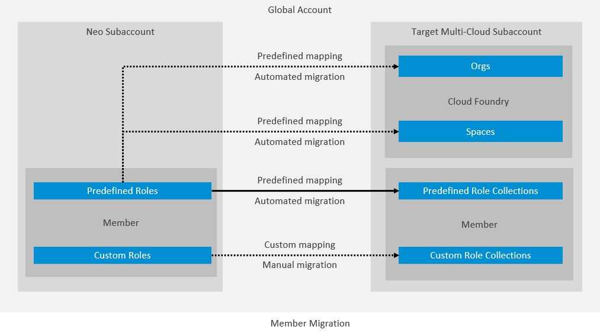

<!-- loioc5d6531e4e8b4cdda36ca8319be12463 -->

# Migrating Your Neo Subaccount Members to a Multi-Environment Subaccount

Use this procedure to benefit from automated migration of existing subaccount members from the deprecated Neo environment.

<a name="concept_s12_djh_n3c"/>

<!-- concept\_s12\_djh\_n3c -->

## Context

> ### Tip:  
> As the SAP BTP, Neo environment is deprecated, you need to migrate to the multi-cloud environment. For more information, see [Why You Should Migrate from the Neo Environment to the Multi-Cloud Foundation](https://help.sap.com/viewer/b017fc4f944e4eb5b31501b3d1b6a1f0/Cloud/en-US/b02b326062c34bf19ea1ab395bc9891f.html#loiob02b326062c34bf19ea1ab395bc9891f "Learn how the multi-cloud foundation differs from the Neo environment and why you should migrate to it.") :arrow_upper_right:.

You can benefit from automated migraion of all members of your current **Neo subaccount** to a **target multi-environment subaccount** within **the same global account**.

Optionally, you may choose to additionally migrate the Neo subaccount members to **orgs** and **spaces** in the Cloud Foundry environment of the target multi-environment subaccount \(additional prerequisites apply\).

## Which Roles Will Be Migrated

-   **Predefined platform roles**

    All migrated members will be replicated in the target multi-environment subaccount, with their existing **predefined platform roles** \(see [Predefined Platform Roles](managing-member-authorizations-in-the-neo-environment-a1ab5c4.md#loioa1ab5c4cc117455392cd0a512c7f890d__PredefRoles)\) mapped to corresponding Could Foundry **role collections** \(see [Role Collections and Roles in Global Accounts, Directories, and Subaccounts](https://help.sap.com/viewer/65de2977205c403bbc107264b8eccf4b/Cloud/en-US/0039cf082d3d43eba9200fe15647922a.html "SAP BTP provides a set of role collections to set up administrator access to your global account and subaccounts.") :arrow_upper_right:\).

-   **Custom platform roles**

    **Custom platform roles** \(see [Custom Platform Roles](managing-member-authorizations-in-the-neo-environment-a1ab5c4.md#loioa1ab5c4cc117455392cd0a512c7f890d__section_sfm_2x3_d1b)\) are not in the scope of automated migration. If your Neo subaccount members have custom roles defined, you can manually re-create them in the multi-environment subaccount or the Cloud Foundry environment \(orgs and spaces\) afterwards.

The following graphic shows how Neo subaccount members are migrated to multi-environment subaccounts and Cloud Foundry orgs and spaces.

## Predefined Role Mappings

The following table describes how the predefined roles in the Neo subaccount will be mapped to role collections in the target multi-environment subaccount and target Cloud Foundry orgs and spaces.

<table>
<tr>
<th valign="top">

Neo Role

</th>
<th valign="top">

Multi-Environment Role

</th>
<th valign="top">

Org Role

</th>
<th valign="top">

Space Role

</th>
</tr>
<tr>
<td valign="top">

Account Administrator

</td>
<td valign="top">

Subaccount Administrator

</td>
<td valign="top">

Organization User

Organization Manager

</td>
<td valign="top">

Space Manager

Space Developer

</td>
</tr>
<tr>
<td valign="top">

Application User Administrator

</td>
<td valign="top">

Subaccount Viewer

</td>
<td valign="top">

Organization User

</td>
<td valign="top">

Space Developer

</td>
</tr>
<tr>
<td valign="top">

Cloud Connector Administrator

</td>
<td valign="top">

Cloud Connector Administrator

</td>
<td valign="top">

\-

</td>
<td valign="top">

\-

</td>
</tr>
<tr>
<td valign="top">

Developer

</td>
<td valign="top">

Subaccount Service Administrator

</td>
<td valign="top">

Organization User

Organization Manager

</td>
<td valign="top">

Space Developer

Space Supporter

</td>
</tr>
<tr>
<td valign="top">

Read Only

</td>
<td valign="top">

Subaccount Viewer

</td>
<td valign="top">

Organization User

</td>
<td valign="top">

Space Auditor

</td>
</tr>
</table>

For more information about the predefined roles:

-   in Neo subaccounts, see [Predefined Platform Roles](managing-member-authorizations-in-the-neo-environment-a1ab5c4.md#loioa1ab5c4cc117455392cd0a512c7f890d__PredefRoles).
-   in multi-environmenment subaccounts, [Role Collections and Roles in Global Accounts, Directories, and Subaccounts](https://help.sap.com/viewer/65de2977205c403bbc107264b8eccf4b/Cloud/en-US/0039cf082d3d43eba9200fe15647922a.html "SAP BTP provides a set of role collections to set up administrator access to your global account and subaccounts.") :arrow_upper_right:.
-   in Cloud Fountry orgs and spaces, see [About User Management in the Cloud Foundry Environment](https://help.sap.com/viewer/65de2977205c403bbc107264b8eccf4b/Cloud/en-US/8e6ce969c432437dbaecedea385df8c8.html "The Cloud Foundry environment has its own store for user data within SAP BTP. Understanding the relationship between SAP BTP and the Cloud Foundry environment is useful.") :arrow_upper_right:.

## Which Subaccount Members Will Be Migrated

Not all Neo subaccount members can be migrated automatically to the multi-environment subaccount. To be migrated, a Neo subaccount member needs to correspond to the following conditions:

-   It is from a platform identity provider that exists in the global account's trust configuration.
-   It has accessed the current subaccount at least once.
-   It has at least one predefined role.

This means if you start a migration job, only the users that correspond to the above conditions will be migrated in the target multi-environment subaccount, and the rest of the users won't. You can choose to not migrate them or to manually re-create them, with their required roles, in the multi-environment subaccount.

## Prerequisites

To be able to do automated subaccount member migration, make sure you have a platform user that corresponds to the following conditions:

-   It is provided by the Identity Authentication tenant that serves as the platform identity provider at global account level. See [Establish Trust and Federation of Custom Identity Providers for Platform Users](https://help.sap.com/viewer/65de2977205c403bbc107264b8eccf4b/Cloud/en-US/c36898473d704e07a33268c9f9d29515.html "You want to use a custom identity provider for the platform users of SAP BTP in different environments and at the different account levels: global account, directory, and subaccount. By default, platform users in multi-environment subaccounts are users in the default identity provider.") :arrow_upper_right:.
-   Exists in the global account, added both with its user ID \(P- or S-user\) and its e-mail address \(duplicate entries, where the user ID is the P- or S-user in one entry, and the e-mail address in the other one\). See [Add Members to Your Global Account](https://help.sap.com/viewer/65de2977205c403bbc107264b8eccf4b/Cloud/en-US/4a0491330a164f5a873fa630c7f45f06.html "Add users as global account members using the SAP BTP cockpit.") :arrow_upper_right:.
-   Exists in both the Neo subaccount and target multi-environment subaccount. See:
    -   [Add Members to Your Neo Subaccount](add-members-to-your-neo-subaccount-a253570.md)
    -   [Add Members to Your Subaccount](https://help.sap.com/viewer/65de2977205c403bbc107264b8eccf4b/Cloud/en-US/1e1b7b60bb1b4764a2d4bb96bd73182d.html "Add members to your subaccount to enable users to access resources available there. Platform users manage subaccounts with cloud management tools, while business users consume applications and services.") :arrow_upper_right:

-   Has at least **Global Account Viewer** role in the global account. See [Role Collections and Roles in Global Accounts, Directories, and Subaccounts](https://help.sap.com/viewer/65de2977205c403bbc107264b8eccf4b/Cloud/en-US/0039cf082d3d43eba9200fe15647922a.html "SAP BTP provides a set of role collections to set up administrator access to your global account and subaccounts.") :arrow_upper_right:.
-   Has **Subaccount Administrator** role in the Neo subaccount. See [Managing Member Authorizations in the Neo Environment](managing-member-authorizations-in-the-neo-environment-a1ab5c4.md).
-   If you want to replicate the Neo subaccount members in **orgs** or **spaces** in the multi-environment subaccount:
    -   You have the Cloud Foundry Environment enabled in the multi-environment subaccount. See [Enable Environment or Create Environment Instance](https://help.sap.com/viewer/65de2977205c403bbc107264b8eccf4b/Cloud/en-US/78c14b6b8f80442994a3b20c92be188e.html "Enable an environment or create an environment instance using the SAP BTP cockpit.") :arrow_upper_right:.
    -   The user is a member of the target orgs and spaces in the multi-environment subaccount. See [Managing Org Members](https://help.sap.com/viewer/65de2977205c403bbc107264b8eccf4b/Cloud/en-US/b792066df68a42bcb444dac70a6c0c1d.html "Learn how to add, edit, and delete org members in the SAP BTP cockpit.") :arrow_upper_right: and [Managing Space Members](https://help.sap.com/viewer/65de2977205c403bbc107264b8eccf4b/Cloud/en-US/5ab77383d56146f783d41fe4b1201316.html "Learn how to add, edit, and delete space members in the SAP BTP cockpit.") :arrow_upper_right:.
    -   The user has **Org manager** or **Space manager** role collection in the target orgs or spaces respectively. See [About Roles in the Cloud Foundry Environment](https://help.sap.com/viewer/65de2977205c403bbc107264b8eccf4b/Cloud/en-US/09076385086b4da3bd1808d5ef572862.html "Roles determine which features users can view and access, and which actions they can initiate.") :arrow_upper_right:.

<a name="task_in5_djh_n3c"/>

<!-- task\_in5\_djh\_n3c -->

## 1. Prepare for the Migration

## Procedure

1.  In the SAP BTP cockpit, log in with a user that corresponds to the conditions described in the prerequisites. See [Log On with a Custom Identity Provider to the SAP BTP Cockpit](https://help.sap.com/viewer/65de2977205c403bbc107264b8eccf4b/Cloud/en-US/0bef9822f5cc40e2b48303e51bec6b94.html "All users can log on to the SAP BTP cockpit with a custom identity provider.") :arrow_upper_right:.

2.  Navigate to your Neo subaccount, and choose *Migration to Cloud Foundry*.

3.  In the *Subaccount Overview* section, click the *Members* tile.

    An overview of the migraion readiness status of each member of this Neo subaccount appears on the right. This can give you a hint towards which members can be migrated fully or partially, and which can't.

<a name="task_zkr_4mh_n3c"/>

<!-- task\_zkr\_4mh\_n3c -->

## 2. Run the Migration

## Procedure

1.  In the *Migration to Cloud Foundry* \> *Subaccount Overview* section, choose *Start Migration*.

2.  Choose the target multi-environment subaccount, and then *Next Step*.

    The Neo subaccount members will be migrated only in the orgs and spaces where the current subaccount user has administrative privileges.

3.  Using the *Add Member* button, add all required members to be migrated.

    Use the information icon near each member to learn what you can expect from this migration.

    You can add members using a search filter to narrow down the list. You can choose only members that can be migrated.

    In the filtered list of members, select the ones to be migrated and choose *Add*.

4.  Review the list of members to be migrated. You can remove members using the X button next to each row or in bulk using the button at the top of the table. When ready, choose *Next Step*.

5.  Review the role mappings between the Neo and target multi-environment subaccounts.

    The mapping rules are predefined and cannot be changed.

6.  When ready, confirm the role mapping and choose *Review*.

7.  Choose *Start Migration*.

    > ### Note:  
    > The Neo subaccount members will be migrated on subaccount level and only in the orgs and spaces where the user running the migration has administrative privileges.

<a name="task_pvx_vlh_n3c"/>

<!-- task\_pvx\_vlh\_n3c -->

## 3. View the Migration Job Results

## Context

When the migration starts, you will be redirected to the *Migration Jobs* section, where you can see all migration jobs you have had triggered.

After the migration job is done, you can check more details by pressing on a job and checking the details in members configuration.

> ### Note:  
> It is possible to run only one migration at a time.

<a name="task_hps_xmh_n3c"/>

<!-- task\_hps\_xmh\_n3c -->

## Next Steps

In the multi-environment subaccount, you can manually add the subaccount members that weren't migrated automatically. See [Add Members to Your Subaccount](https://help.sap.com/viewer/65de2977205c403bbc107264b8eccf4b/Cloud/en-US/1e1b7b60bb1b4764a2d4bb96bd73182d.html "Add members to your subaccount to enable users to access resources available there. Platform users manage subaccounts with cloud management tools, while business users consume applications and services.") :arrow_upper_right:. You can manually create custom role collections and assign members to them. See [Working with Role Collections](https://help.sap.com/viewer/65de2977205c403bbc107264b8eccf4b/Cloud/en-US/393ea0b222754311884123ce564779bd.html "As an administrator, you group application roles in role collections. You then assign role collections to application users.") :arrow_upper_right:.

You can continue your migration process from Neo to multi-environment with other components and configurations. For more information, see [Migrating Your Scenario Components: Migration Packs](https://help.sap.com/viewer/b017fc4f944e4eb5b31501b3d1b6a1f0/Cloud/en-US/dae44977c6364f01b1be093e09846d75.html "Find information on how to migrate the components of your scenario from the Neo environment to the multi-cloud foundation.") :arrow_upper_right:.

<a name="concept_dch_c1t_r3c"/>

<!-- concept\_dch\_c1t\_r3c -->

## Getting Support

If you have questions or comments, or if you encounter issues with your migration, create a ticket in component *BC-NEO-SEC-IAM*. See [Getting Support, Neo Environment](../70-getting-support-neo/getting-support-neo-environment-fc2bf6a.md).

