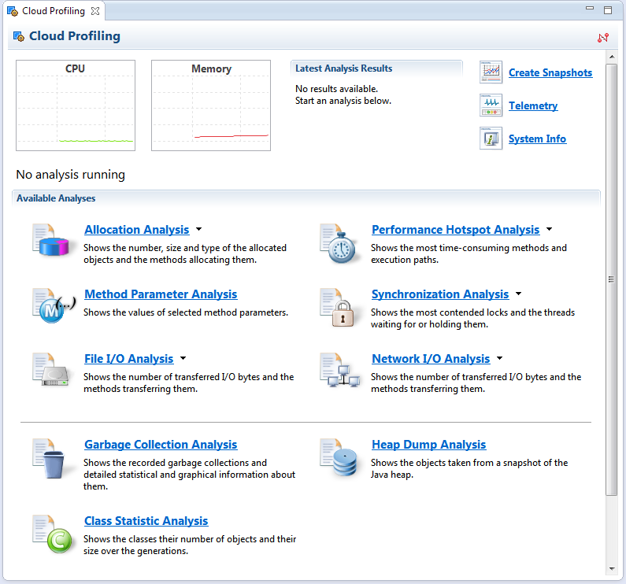

<!-- loio088e6ee6e994492d968c327119519810 -->

# Profile Applications on the Cloud

After you have created a Web application and verified that it is functionally correct, you may want to inspect its runtime behavior by profiling the application on the cloud. It is best if you first profile the Web application locally.

## Prerequisites

-   You have installed Eclipse IDE and the SAP JVM Tools for Eclipse. For more information, see [Install the SAP JVM Tools in Eclipse](../30-development-neo/install-the-sap-jvm-tools-in-eclipse-4e97452.md).

-   You have developed and deployed a Web application. For more information, see [Deploying and Updating Java Applications](../30-development-neo/deploying-and-updating-java-applications-e5dfbc6.md).

-   Optional: You have profiled your Web application locally. For more information, see [Profile Applications Locally](profile-applications-locally-db76619.md).

> ### Note:  
> Currently, it is only possible to profile Web applications on the cloud that have exactly one application process \(node\).

## Context

You can use IDE of your choice for developing the application. You must use Eclipse IDE for profiling the application on the cloud.

> ### Remember:  
> SAP Business Technology Platform, Neo environment will sunset on **December 31, 2028**, subject to terms of customer or partner contracts.
> 
> For more information, see SAP Note [3351844](https://me.sap.com/notes/3351844).

> ### Tip:  
> **This documentation refers to SAP Business Technology Platform, Neo environment. If you are looking for documentation about other environments, see [SAP Business Technology Platform](https://help.sap.com/viewer/65de2977205c403bbc107264b8eccf4b/Cloud/en-US/6a2c1ab5a31b4ed9a2ce17a5329e1dd8.html "SAP Business Technology Platform (SAP BTP) is an integrated offering comprised of the following technology portfolios: application development; process automation; integration; data, analytics, and enterprise planning; artificial intelligence. The platform offers users the ability to turn data into business value, compose end-to-end business processes, connect entire IT landscapes, and personalize, build and extend SAP applications. This reduces the overall total cost of ownership maintaining SAP landscapes and third-party software across end-to-end business processes.") :arrow_upper_right:.**

## Procedure

1.  Run your Web application on SAP BTP.

2.  Open the Eclipse IDE, choose *Run*, and then *Profile Configurations*.

3.  Create a new profile configuration of type *SAP HANA Cloud Profiler*.

4.  In the *Project* section, choose the Java project that is already imported in the Eclipse IDE.

5.  In the *Connection Properties* section, provide the application data.

6.  Choose *Profile*.

7.  Open the *Profiling* perspective.

8.  Start a profiling analysis.

    

## Results

You have successfully initiated a profiling run of a Web application on the cloud. Now, you can trigger your workload, create snapshots of the profiling data and analyze the profiling results.

## Next Steps

When you have finished with your profiling session, you can stop it by disconnecting the profiling session from the *Profile* view.

Refer to the SAP JVM Profiler documentation for details about the available analysis options. The documentation is available as part of the SAP JVM Profiler plugin in the Eclipse IDE and you can find it via *Help* \> *Help Contents* \> *SAP JVM Profiler*.

