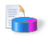

<!-- loio8967d195af3c4c249cfeef80736ea21e -->

# Profiling Applications

The SAP JVM Profiler helps you analyze resource-related problems in your Java application regardless of whether the JVM is running locally or on the cloud.

> ### Remember:  
> SAP Business Technology Platform, Neo environment will sunset on **December 31, 2028**, subject to terms of customer or partner contracts.
> 
> For more information, see SAP Note [3351844](https://me.sap.com/notes/3351844).

> ### Tip:  
> **This documentation refers to SAP Business Technology Platform, Neo environment. If you are looking for documentation about other environments, see [SAP Business Technology Platform](https://help.sap.com/docs/btp/sap-business-technology-platform/sap-business-technology-platform?version=Cloud) .**

Typically, you first profile the application locally. Then you may continue and profile it also on the cloud. The basic procedure is the following:

1.  Attach the SAP JVM Profiler to the JVM to be analyzed.
2.  Analyze the retrieved profiling data in statistics and graphs.

## Features

SAP JVM Profiler provides the following traces:

<table>
<tr>
<td valign="top">

</td>
<td valign="top">

**Allocation Trace**

</td>
<td valign="top">

Shows the number, size and type of the allocated objects and the methods allocating them

</td>
</tr>
<tr>
<td valign="top">

</td>
<td valign="top">

**Performance Hotspot Trace**

</td>
<td valign="top">

Shows the most time-consuming methods and execution paths

</td>
</tr>
<tr>
<td valign="top">

</td>
<td valign="top">

**Garbage Collection Trace** 

</td>
<td valign="top">

Shows all details about the processed garbage collections

</td>
</tr>
<tr>
<td valign="top">

</td>
<td valign="top">

**Method Parameter Trace** 

</td>
<td valign="top">

Shows the values of a selected method parameters

</td>
</tr>
<tr>
<td valign="top">

</td>
<td valign="top">

**Synchronization Trace** 

</td>
<td valign="top">

Shows the most contended locks and the threads waiting for or holding them

</td>
</tr>
<tr>
<td valign="top">

</td>
<td valign="top">

**File I/O Trace** 

</td>
<td valign="top">

Shows the number of bytes transferred from or to files and the methods transferring them

</td>
</tr>
<tr>
<td valign="top">

</td>
<td valign="top">

**Network I/O Trace**

</td>
<td valign="top">

Shows the number of bytes transferred from or to the network and the methods transferring them

</td>
</tr>
</table>

Additionally, the following operations are supported:

<table>
<tr>
<td valign="top">

</td>
<td valign="top">

**Heap Dump**

</td>
<td valign="top">

Shows a complete snapshot of the Java Heap

</td>
</tr>
<tr>
<td valign="top">

</td>
<td valign="top">

**Class Statistic** 

</td>
<td valign="top">

Shows the classes, the number and size of their objects currently residing in the Java Heap generations

</td>
</tr>
</table>

## Tasks

[Profile Applications Locally](profile-applications-locally-db76619.md)

[Profile Applications on the Cloud](profile-applications-on-the-cloud-088e6ee.md)

**Related Information**  

[Debugging Applications](../30-development-neo/debugging-applications-6ac5536.md "After you have created a Web application and tested it locally, you may want to inspect its runtime behavior and state by debugging the application in SAP BTP.")

