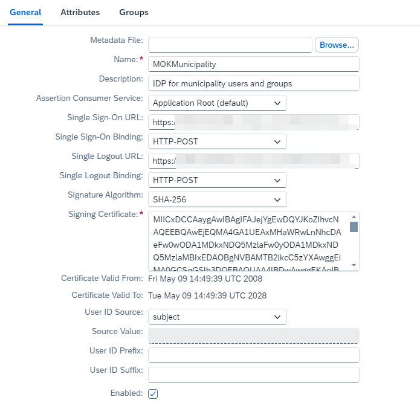

<!-- loiodc618538d97610148155d97dcd123c24 -->

# Application Identity Provider

The application identity provider supplies the user base for your applications. For example, you can use your corporate identity provider for your applications. This is called identity federation. SAP BTP supports Security Assertion Markup Language \(SAML\) 2.0 for identity federation.

> ### Remember:  
> SAP Business Technology Platform, Neo environment will sunset on **December 31, 2028**, subject to terms of customer or partner contracts.
> 
> For more information, see SAP Note [3351844](https://me.sap.com/notes/3351844).

> ### Tip:  
> **This documentation refers to SAP Business Technology Platform, Neo environment. If you are looking for documentation about other environments, see [SAP Business Technology Platform](https://help.sap.com/viewer/65de2977205c403bbc107264b8eccf4b/Cloud/en-US/6a2c1ab5a31b4ed9a2ce17a5329e1dd8.html "SAP Business Technology Platform (SAP BTP) is an integrated offering comprised of four technology portfolios: database and data management, application development and integration, analytics, and intelligent technologies. The platform offers users the ability to turn data into business value, compose end-to-end business processes, and build and extend SAP applications quickly.") :arrow_upper_right:.**


## Contents

-   [Prerequisites](application-identity-provider-dc61853.md#loiodc618538d97610148155d97dcd123c24__prereq)
-   [Configure the Local Service Provider](application-identity-provider-dc61853.md#loiodcdfe339f94947bc96508daa686cc56d)
-   [\(Optional\) Using External Key and Certificate](application-identity-provider-dc61853.md#loio53aaeda0568e44928c5def2e2930ebc0)
-   [Configure Trust to the SAML Identity Provider](application-identity-provider-dc61853.md#loiob6cfc4bb4bff4ace90afc71b0962fcb5)
-   [Using Multiple Identity Providers](application-identity-provider-dc61853.md#loioade5359a931b45b680301ebc3b6f3cb3)


<a name="loiodc618538d97610148155d97dcd123c24__prereq"/>

## Prerequisites

-   You have a key pair and certificate for signing the information you exchange with the IdP on behalf of SAP BTP. This ensures the privacy and integrity of the data exchanged. You can use your pre-generated ones or use the generation option in the cockpit.

-   You have provided the IdP with the above certificate. This allows the IdP administrator to configure its trust settings.

-   You have the IdP signing certificate to enable you to configure the cloud trust settings.

-   You have negotiated with the IdP administrator which information the SAML 2.0 assertion will contain for each user. For example, this could be a first name, last name, company, position, or an e-mail.

-   You know the authorizations and attributes the users logged by this IdP need to have on SAP BTP.


> ### Tip:  
> You can configure your SAP BTP account for identity federation with more than one identity provider. In such case, make sure all user identities are unique across all identity providers, and no user is available in more than one identity provider. Otherwise, this could lead to wrong assignment of security roles at SAP BTP.

<a name="loiodcdfe339f94947bc96508daa686cc56d"/>

<!-- loiodcdfe339f94947bc96508daa686cc56d -->

## Configure the Local Service Provider

Your SAP BTP subaccount is the local service provider in the SAML communication. Configure signing keys, certificates, and other trust settings.


## Context

For more information, see [Security Assertion Markup Language \(SAML\) 2.0](http://en.wikipedia.org/wiki/SAML_2.0) protocol specification.

> ### Tip:  
> Each SAP BTP subaccount is a separate service provider. If you need each of your applications to be represented by its own service provider, you must create and use a separate subaccount for each application. See [Create a Subaccount](https://help.sap.com/viewer/65de2977205c403bbc107264b8eccf4b/Cloud/en-US/05280a123d3044ae97457a25b3013918.html "Create subaccounts in your global account using the SAP BTP cockpit.") :arrow_upper_right:.

> ### Note:  
> In this documentation and SAP BTP user interface, we use the term **local service provider** to describe the SAP BTP subaccount as a service provider in the SAML 2.0 communication.

You need to configure how the local service provider communicates with the identity provider. This includes, for example, setting a signing key and certificate to verify the service provider’s identity and encrypt data. You can use the configuration settings described in the table that follows.


<table>
<tr>
<th valign="top">

Local Service Provider Configuration

</th>
<th valign="top">

Description

</th>
<th valign="top">

When to Use

</th>
</tr>
<tr>
<td valign="top">

Default

</td>
<td valign="top">

The local provider's own trust settings will inherit the SAP BTP default configuration \(which is trust to **SAP ID service**\).

</td>
<td valign="top">

For testing and exploring the scenario

</td>
</tr>
<tr>
<td valign="top">

None

</td>
<td valign="top">

The local provider will have no trust settings, and it will not participate in any identity federation scenario.

</td>
<td valign="top">

For disabling identity federation for your account

</td>
</tr>
<tr>
<td valign="top">

Custom

</td>
<td valign="top">

The local provider settings will have a specific configuration, different from the default configuration for SAP BTP.

</td>
<td valign="top">

For identity federation with a corporate identity provider or Identity Authentication tenant

</td>
</tr>
</table>

In addition, you can configure the following local service provider settings:


<table>
<tr>
<th valign="top">

Local Service Provider Configuration \(Additional\)

</th>
<th valign="top">

Description

</th>
</tr>
<tr>
<td valign="top">

Principal Propagation

</td>
<td valign="top">

If you set it to *Enabled*, you enable applications to propagate principal information to each other. Choose this value if you want to enable application-to-application single sign-on. Otherwise, set this option to *Disabled*.

</td>
</tr>
<tr>
<td valign="top">

Force authentication

</td>
<td valign="top">

If you set it to *Enabled*, you enable force authentication for your application \(despite SSO, users will have to re-authenticate each time they access it\). Otherwise, set this option to *Disabled*.

</td>
</tr>
</table>


## Procedure

1.  In your Web browser, log on to the SAP BTP cockpit, and select an account.

    Make sure that you have selected the relevant global account to be able to select the right account.

2.  Choose the *Security* \> *Trust* section.

3.  Choose the *Local Service Provider* tab.

4.  Choose *Edit*.

5.  Choose *Custom* as *Configuration Type*.

6.  Enter the local provider name.

    > ### Note:  
    > It is recommended to use a URI as the local provider name.

7.  In *Signing Key* and *Signing Certificate*, place the Base64-encoded signing key and certificate. You can use one generated with the SAP BTP cockpit \(using the *Generate Key Pair* button\) or externally generated one.

    > ### Note:  
    > Certificates generated using the SAP BTP cockpit have validity of 10 years. If you want your identifying certificate to have different validity, generate the key and certificate pair using an external tool, and copy the contents in the *Signing Key* and *Signing Certificate* fields respectively in the SAP BTP cockpit.

    > ### Note:  
    > For more information how to use an externally generated key and certificate pair, see [\(Optional\) Using External Key and Certificate](application-identity-provider-dc61853.md#loio53aaeda0568e44928c5def2e2930ebc0).

8.  Choose the required value of the *Principal Propagation* and *Force authentication* option.

9.  Save the changes.

10. Choose *Get Metadata* to download the SAML 2.0 metadata describing SAP BTP as a service provider. You will have to import this metadata into the IdP to configure trust to SAP BTP.

    


<a name="loio53aaeda0568e44928c5def2e2930ebc0"/>

<!-- loio53aaeda0568e44928c5def2e2930ebc0 -->

## \(Optional\) Using External Key and Certificate

If you want to use for the local service provider a signing key and certificate generated using an **external tool** \(such as OpenSSL\), use the following guidelines:

-   Use RSA as a signing algorithm for the private key
-   Convert the private key file into the unencrypted PKCS\#8 format
-   Strip off the tags `—–BEGIN PRIVATE KEY—–` and `—–END PRIVATE KEY—–` from the private key
-   Strip off the tags `—–BEGIN CERTIFICATE—–` and `—–END CERTIFICATE—–` from the certificate.


### Example

You want to use OpenSSL as a tool for key pair generation.

First, create the key pair using the following command:

```
openssl req -x509 -nodes -days 365 -sha256 -subj 
“/CN=https:\/\/SAP BTP host>\/<your account name>” -newkey rsa:2048 
-keyout spkey.pem -out spcert.pem
```

In the command above, replace <code>&lt;SAP BTP host&gt;</code> and `<your account name>` accordingly. For more information about the SAP BTP hosts, see [Regions and Hosts Available for the Neo Environment](../10-concepts-neo/regions-and-hosts-available-for-the-neo-environment-d722f7c.md).

As a result, OpenSSL generates two files in your current folder: `spkey.pem` \(your private key\) and `spcert.pem` \(a self-signed signing certificate\).

> ### Note:  
> If you need the certificate to be signed by a certificate authority \(CA\), you need to proceed with a few more steps:
> 
> 1.  Generate a certificate signing request \(CSR\) by executing the following command in the folder of your `spkey.pem`:
> 
>     ```
>     openssl req -new -sha256 -key spkey.pem -out spkey.csr
>     ```
> 
>     OpenSSL will ask you to enter the fields of the CSR. For the `Common Name` field, we recommend that you use the following format:
> 
>     <code>https:\/\/&lt;SAP BTP host&gt;\/&lt;your account name&gt;</code>.
> 
>     As a result, OpenSSL generates one more file in your current folder: `spkey.csr` \(the CSR for your key/certificate pair\).
> 
> 2.  Send the `spkey.csr` to your CA to get it signed.
> 
>     The CA returns the signed certificate. You can use that certificate in the steps below.

Convert the private key file `spkey.pem` into the unencrypted PKCS\#8 format using the following command:

```
openssl pkcs8 -nocrypt -topk8 -inform PEM -outform PEM -in spkey.pem -out spkey.pk8
```

Now open the file `spkey.pk8` in a text editor and copy all contents except for the tags `—–BEGIN PRIVATE KEY—–`, `—–END PRIVATE KEY—–` into the *Signing Key* text field in the cockpit. Then open the file `spcert.pem` in a text editor and copy all contents except for the tags `—–BEGIN CERTIFICATE—–` and `—–END CERTIFICATE—–` into the *Signing Certificate* text field in the cockpit.

After clicking *Save* you should get a message that you can proceed with the configuring of your trusted identity provider settings.

<a name="loiob6cfc4bb4bff4ace90afc71b0962fcb5"/>

<!-- loiob6cfc4bb4bff4ace90afc71b0962fcb5 -->

## Configure Trust to the SAML Identity Provider


## Context

> ### Note:  
> To benefit from fully-featured identity federation with SAML identity providers, you need to have chosen the *Custom* configuration type in the *Local Service Provider* section.
> 
> For *Default* configuration type, you have non-editable trust to **SAP ID Service as default identity provider**. You can add other identity providers but they can be used for**IdP-initiated single sign-on \(SSO\)** only.
> 
> For *None*, you don't have any trust settings.


## Procedure

1.  In the SAP BTP cockpit, navigate to the required SAP BTP subaccount. See [Navigate in the Cockpit](https://help.sap.com/viewer/65de2977205c403bbc107264b8eccf4b/Cloud/en-US/0874895f1f78459f9517da55a11ffebd.html "Learn how to navigate to your global accounts and subaccounts in the SAP BTP cockpit.") :arrow_upper_right:.

2.  Enter the *Security* \> *Trust* \> *Application Identity Provider* section.

3.  Click *Add Trusted Identity Provider*.

4.  In the *General* tab, upload the IdP metadata xml file or manually enter he communication settings negotiated between SAP BTP and the IdP. On IdP metadata upload, the fields are populated with the parsed data from the XML file. The minimum configuration is to complete all required fields.

    


    <table>
    <tr>
    <th valign="top">

    Field
    
    </th>
    <th valign="top">

    Description
    
    </th>
    </tr>
    <tr>
    <td valign="top">
    
    Metadata File
    
    </td>
    <td valign="top">
    
    The metadata XML file of the identity provider.
    
    </td>
    </tr>
    <tr>
    <td valign="top">
    
    Name
    
    </td>
    <td valign="top">
    
    The entity ID of the IdP, also known as the issuer.
    
    </td>
    </tr>
    <tr>
    <td valign="top">
    
    Description
    
    </td>
    <td valign="top">
    
    A short description of the IdP.
    
    </td>
    </tr>
    <tr>
    <td valign="top">
    
    Assertion Consumer Service
    
    </td>
    <td valign="top">
    
    The SAP BTP endpoint type \(application root or assertion consumer service\). The IdP will send the SAML assertion to that endpoint.

    In the common case, select *Application Root* as value.

    If you have an identity provider that would not send the SAML assertion to unknown URLs to them, select the *Assertion Consumer Service* option. This is the case with Microsoft ADFS, for example.
    
    </td>
    </tr>
    <tr>
    <td valign="top">
    
    Single Sign-on URL
    
    </td>
    <td valign="top">
    
    The IdP's endpoint \(URL\) to which the SP's authentication request will be sent.
    
    </td>
    </tr>
    <tr>
    <td valign="top">
    
    Single Sign-on Binding
    
    </td>
    <td valign="top">
    
    The SAML-specified HTTP binding used by the SP to send the authentication request.
    
    </td>
    </tr>
    <tr>
    <td valign="top">
    
    Single Logout URL
    
    </td>
    <td valign="top">
    
    The IdP's endpoint \(URL\) to which the SP's logout request will be sent.

    > ### Note:  
    > If there is no single logout \(SLO\) end point specified, no request to the IdP SLO point will be sent, and only the local session will be invalidated.


    
    </td>
    </tr>
    <tr>
    <td valign="top">
    
    Signature Algorithm
    
    </td>
    <td valign="top">
    
    The cryptographic algorithm used to compute the digest of the digital signatures in the SAML protocol messages.
    
    </td>
    </tr>
    <tr>
    <td valign="top">
    
    Signing Certificate
    
    </td>
    <td valign="top">
    
    The X.509 certificate used by the IdP to digitally sign the SAML protocol messages.
    
    </td>
    </tr>
    <tr>
    <td valign="top">
    
    User ID Source
    
    </td>
    <td valign="top">
    
    Location in the SAML assertion from where the user's unique name \(ID\) is taken when logging into the Cloud. If you choose subject, this is taken from the name identifier in the assertions's subject \(<saml:Subject\>\) element. If you choose attribute, the user's name is taken from an SAML attribute in the assertion.
    
    </td>
    </tr>
    <tr>
    <td valign="top">
    
    Source Value
    
    </td>
    <td valign="top">
    
    Name of the SAML attribute that defines the user ID on the cloud.
    
    </td>
    </tr>
    <tr>
    <td valign="top">
    
    User ID Prefix
    
    </td>
    <td valign="top">
    
    An optional prefix added to the user ID on the cloud.
    
    </td>
    </tr>
    <tr>
    <td valign="top">
    
    User ID Suffix
    
    </td>
    <td valign="top">
    
    An optional suffix appended to the user ID on the cloud.
    
    </td>
    </tr>
    <tr>
    <td valign="top">
    
    Enabled
    
    </td>
    <td valign="top">
    
    If an IdP is enabled, it can be used for authentication by the applications in this subaccount. Otherwise, it cannot be used. Only the SAML assertions coming from it will be validated by SAP BTP.

    > ### Note:  
    > If nothing else is specified, the default IdP is used for authentication. Alternatively, you can use a different IdP using a URL parameter. See [Using Multiple Identity Providers](application-identity-provider-dc61853.md#loioade5359a931b45b680301ebc3b6f3cb3).


    
    </td>
    </tr>
    <tr>
    <td valign="top">
    
    Only for IDP-initiated SSO
    
    </td>
    <td valign="top">
    
    If this checkbox is marked, this identity provider can be used only for IdP-initiated single sign-on scenarios. The applications deployed at SAP BTP cannot use it for user authentication from their login pages, for example. Only users coming from links to the application at the IdP side will be able to authenticate.

    > ### Note:  
    > When you add a new application identity provider and you have selected *Default* configuration type in the *Local Service Provider* section, this checkbox is always marked. This means that SAP ID Service \(accounts.sap.com\) will be used for authentication when accessing applications/services on SAP BTP, and the additional application identity provider can be used only for IDP-initiated SSO.


    
    </td>
    </tr>
    <tr>
    <td valign="top">
    
    Only for OAuth2 SAML Bearer flow
    
    </td>
    <td valign="top">
    
    The IdP will only be used to validate SAML Assertions received via the OAuth SAML Bearer Flow. This allows a more fine-granular and secure control of which IdPs are allowed during login.
    
    </td>
    </tr>
    </table>
    
5.  In the *Attributes* tab, configure the user attribute mappings for this identity provider.

    User attributes can contain any other information in addition to the user ID.

    Default attributes are user attributes that all users logged by this IdP will have. For example, if we know that "*My IdP*" is used to authenticate users from *MyCompany*, we can set a default user attribute for that IdP "`company=MyCompany`".

    To add a default attribute, proceed as follows:

    1.  On the *Attributes* tab page, choose *Add Default Attribute*.
    2.  Enter the attribute name and attribute value in the respective fields.

    **Assertion-based attributes** define a mapping between user attributes sent by the identity provider \(in the SAML assertion\) and user attributes consumed by applications on SAP BTP \(**principal attributes**\). This allows you to easily map the user information sent by the IdP to the format required by your application without having to change your application code. For example, the IdP sends the first name and last name user information in attributes named `first_name` and `last_name`. You, on the other hand, have a cloud application that retrieves user attributes named `firstName` and `lastName`. You need to define the relevant mapping in the *Assertion-Based Attributes* section so the application uses the information from that identity provider properly.

    > ### Note:  
    > -   There are no default mappings of assertion attributes to user attributes. You need to define those if you need them.
    > -   The attributes are case sensitive.
    > -   You can specify that all assertion attributes will be mapped to the corresponding principal attributes without a change, by specifying mapping `*` to `*`.
    > -   SAML assertions larger than 25K are **not** supported.
    > -   We recommend that you avoid sending from the IdP side unnecessary user attributes \(the same applies also for unnecessary groups mapping\) as assertion attributes. Too many assertion attributes will result in a very long SAML assertion, which may put unnecessary load on communication \(and potentially result in errors\). Send only the user attributes that your cloud applications will really need.

    To add an assertion-based attribute, proceed as follows:

    1.  On the *Attributes* tab page, choose *Add Assertion-Based Attribute*.
    2.  In *Assertion Attribute*, enter the name of the attribute contained in the SAML 2.0 assertion issued by the IdP. When this IdP logs a user on SAP BTP, the value of this attribute is mapped as the value for the specified user attribute \(*Principal Attribute*\).
    3.  In *Principal Attribute*, enter the name of the user attribute on SAP BTP.

    

    In the screenshot above, all users authenticated by this IdP will have an attribute *organization="MOKMunicipality"* and *type="Government"*. In addition, several attributes \(corresponding to first name, last name and e-mail\) from the SAML assertion will also be added to authenticated users. Note that those attribute names provided in the assertion by the IdP are different from the principal attributes, which are the attributes used by the cloud applications.

    For more information about using user attributes in your application, see [Authentication](authentication-e637f62.md#loioe637f62abb571014857cb0232adc43a7).

6.  In the *Groups* tab, configure the groups associated with this IdP's users.

    Groups that you define on the cloud are later mapped to Java EE application *roles*. As specified in Java EE, in the *web.xml*, you define the roles authorized to access a protected resource in your application. You therefore define the groups that exist there and the roles to which each group is mapped via the *Groups* tab in the SAP BTP cockpit. For each different IdP, you then define a set of rules specifying to which groups a user logged by this IdP belongs.

    For more information about configuring groups, see [Managing Groups and Roles](managing-roles-db8175b.md).

    > ### Note:  
    > You must have defined groups in advance before you define default or assertion-based groups for this IdP.

    Default groups are the groups all users logged by this IdP will have. For example, all users logged by the company IdP can belong to the group "*Internal*".

    To add a default group, proceed as follows:

    1.  On the *Groups* tab page, choose *Add Default Group*.
    2.  From the dropdown list that appears, choose the required group.


    Assertion-based groups are groups determined by values of attributes in the SAML 2.0 assertion. For example, if the assertion contains the attribute "`contract=temporary`", you may want all such users to be added to the group "*TEMPORARY*".

    To add an assertion-based group, proceed as follows:

    1.  On the *GROUPS* tab page, choose *Add Assertion-Based Group*. A new row appears and a new mapping rule is now being created.
    2.  Enter the name of the group to which users will be mapped. Then define the rule for this mapping.

    3.  In the first field of the *Mapping Rules* section, enter the SAML 2.0 assertion attribute name to be used as the mapping source. In other words, the value of this attribute will be compared with the value you specify \(in the last field of *Mapping Rules*\).

    4.  Choose the comparison operator.

        -   Choose *Equals* if you want the value of the SAML 2.0 assertion attribute to match exactly the string you specify. Note that if you want to use more sophisticated relations, such as "starts with" or "contains", you need to use the *Regular expression* option.
        -   Choose *Regular expression* if you want to specify more sophisticated matching rules. You can use all regular expression rules described in the[Java RegEx API](http://docs.oracle.com/javase/6/docs/api/java/util/regex/Pattern.html).

            **Example 1**: You want to add authenticated SAP employees to group *Employees*. And SAP employees are users with e-mail address ending with *sap.com*. Hence, you choose the mapping rule to be *email*, matched using the following regular expression:

            *.\*@sap.com$*

            **Example 2**: You want all users with name starting with admin to be added to group *Administrators*. Hence, you choose the mapping rule to be userid, matched using the following regular expression:

            *^\(admin\).\** 


    5.  In the last field of *Mapping Rules*, enter the value with which you compare the specified SAML 2.0 assertion attribute.

    6.  You can specify more than one mapping rule for a specific group. Use the plus button to add as many rules as required. In this case, mapping is based on a logical AND operation for all rules, that is, if one of your rules applies, the user is added to the group.


    

    In the image above, all users logged by this IdP are added to the group *Citizens*.

    All users from the *ITSupport* department \(of organization MOKMunicipality\) and the user with e-mail *admin@mokmunicipality.org* are added to group *MOKMunicipalityAdmins* for this subaccount. The rest of the employees at MOKMunicipality \(having an e-mail address in the mokmunicipality.org domain\) are assigned to group *Government*.

    You can see the group assignments visualized in the graphic below.

    


<a name="loioade5359a931b45b680301ebc3b6f3cb3"/>

<!-- loioade5359a931b45b680301ebc3b6f3cb3 -->

## Using Multiple Identity Providers

You may need to use a different identity provider \(IdP\) for each security scenario. For example, one IdP for user authentication, another one for IdP-initiated single sign-on \(SSO\), and a third one for OAuth 2.0 SAML Bearer flow.


<a name="loioade5359a931b45b680301ebc3b6f3cb3__steps_k2t_xxq_mmb"/>

## Procedure

1.  In the SAP BTP cockpit, configure trust with all required identity providers for your scenarios. See [Configure Trust to the SAML Identity Provider](application-identity-provider-dc61853.md#loiob6cfc4bb4bff4ace90afc71b0962fcb5).

    One of the identity providers configured for the subaccount is *the default* one. This is the identity provider that will be used for user authentication. All the rest can be used either for IdP-initiated SSO, or for OAuth 2.0 SAML Bearer flow. Mark the respective option when registering the identity provider:


    <table>
    <tr>
    <th valign="top">

    Field
    
    </th>
    <th valign="top">

    Description
    
    </th>
    </tr>
    <tr>
    <td valign="top">
    
    Only for IDP-initiated SSO
    
    </td>
    <td valign="top">
    
    If this checkbox is marked, this identity provider can be used only for IdP-initiated single sign-on scenarios. The applications deployed at SAP BTP cannot use it for user authentication from their login pages, for example. Only users coming from links to the application at the IdP side will be able to authenticate.

    > ### Note:  
    > When you add a new application identity provider and you have selected *Default* configuration type in the *Local Service Provider* section, this checkbox is always marked. This means that SAP ID Service \(accounts.sap.com\) will be used for authentication when accessing applications/services on SAP BTP, and the additional application identity provider can be used only for IDP-initiated SSO.


    
    </td>
    </tr>
    <tr>
    <td valign="top">
    
    Only for OAuth2 SAML Bearer flow
    
    </td>
    <td valign="top">
    
    The IdP will only be used to validate SAML Assertions received via the OAuth SAML Bearer Flow. This allows a more fine-granular and secure control of which IdPs are allowed during login.
    
    </td>
    </tr>
    </table>
    
2.  In your application, request the identity provider you need \(for IdP-initiated SSO or OAuth 2.0 SAML Bearer flow\) using a special request parameter `saml2idp` with value the desired IdP name. For example:.

    `https://<app name>.hana.ondemand.com/index.jsp?saml2idp=<idp name>`

3.  \(For IdP-initiated SSO only\) On the identity provider side, use the following service provider names to configure trust with your SAP BTP subaccount:


    <table>
    <tr>
    <th valign="top">

    Technical Key of Region
    
    </th>
    <th valign="top">

    Service Provider Name
    
    </th>
    </tr>
    <tr>
    <td valign="top">
    
    neo-eu1
    
    </td>
    <td valign="top">
    
    https://netweaver.ondemand.com
    
    </td>
    </tr>
    <tr>
    <td valign="top">
    
    neo-eu2
    
    </td>
    <td valign="top">
    
    https://eu2.hana.ondemand.com/
    
    </td>
    </tr>
    <tr>
    <td valign="top">
    
    neo-eu3
    
    </td>
    <td valign="top">
    
    https://eu3.hana.ondemand.com
    
    </td>
    </tr>
    <tr>
    <td valign="top">
    
    neo-us1
    
    </td>
    <td valign="top">
    
    https://us1.hana.ondemand.com/
    
    </td>
    </tr>
    <tr>
    <td valign="top">
    
    neo-us2
    
    </td>
    <td valign="top">
    
    https://us2.hana.ondemand.com
    
    </td>
    </tr>
    <tr>
    <td valign="top">
    
    neo-us3
    
    </td>
    <td valign="top">
    
    https://us3.hana.ondemand.com
    
    </td>
    </tr>
    <tr>
    <td valign="top">
    
    neo-us4
    
    </td>
    <td valign="top">
    
    https://us4.hana.ondemand.com
    
    </td>
    </tr>
    <tr>
    <td valign="top">
    
    neo-ap1
    
    </td>
    <td valign="top">
    
    ap1.hana.ondemand.com
    
    </td>
    </tr>
    <tr>
    <td valign="top">
    
    neo-ap2
    
    </td>
    <td valign="top">
    
    https://ap2.hana.ondemand.com
    
    </td>
    </tr>
    <tr>
    <td valign="top">
    
    neo-jp1
    
    </td>
    <td valign="top">
    
    https://jp1.hana.ondemand.com
    
    </td>
    </tr>
    <tr>
    <td valign="top">
    
    neo-jp2
    
    </td>
    <td valign="top">
    
    https://jp2.hana.ondemand.com
    
    </td>
    </tr>
    <tr>
    <td valign="top">
    
    neo-cn1
    
    </td>
    <td valign="top">
    
    https://cn1.hana.ondemand.com
    
    </td>
    </tr>
    <tr>
    <td valign="top">
    
    neo-cn2
    
    </td>
    <td valign="top">
    
    https://cn2.hana.ondemand.com
    
    </td>
    </tr>
    <tr>
    <td valign="top">
    
    neo-br1
    
    </td>
    <td valign="top">
    
    https://br1.hana.ondemand.com
    
    </td>
    </tr>
    <tr>
    <td valign="top">
    
    neo-br2
    
    </td>
    <td valign="top">
    
    https://br2.hana.ondemand.com
    
    </td>
    </tr>
    <tr>
    <td valign="top">
    
    neo-ae1
    
    </td>
    <td valign="top">
    
    https://ae1.hana.ondemand.com
    
    </td>
    </tr>
    <tr>
    <td valign="top">
    
    CA1
    
    </td>
    <td valign="top">
    
    https://ca1.hana.ondemand.com
    
    </td>
    </tr>
    </table>
    
    See [Regions in the Neo Environment](../10-concepts-neo/regions-in-the-neo-environment-21c30a4.md).


