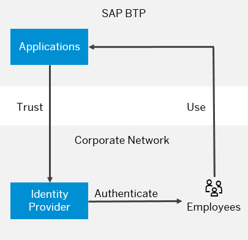
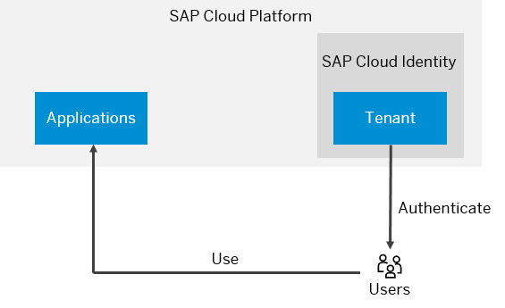
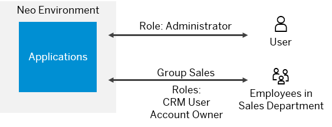

<!-- loioe6b196abbb5710148c8ec6a698441b1e -->

# Authorization and Trust Management in the Neo Environment

The Neo environment of SAP BTP supports identity federation and single sign-on with external identity providers. The current section provides an overview of the supported scenarios.

> ### Remember:  
> SAP Business Technology Platform, Neo environment will sunset on **December 31, 2028**, subject to terms of customer or partner contracts.
> 
> For more information, see SAP Note [3351844](https://me.sap.com/notes/3351844).

> ### Tip:  
> **This documentation refers to SAP Business Technology Platform, Neo environment. If you are looking for documentation about other environments, see [SAP Business Technology Platform](https://help.sap.com/viewer/65de2977205c403bbc107264b8eccf4b/Cloud/en-US/6a2c1ab5a31b4ed9a2ce17a5329e1dd8.html "SAP Business Technology Platform (SAP BTP) is an integrated offering comprised of four technology portfolios: database and data management, application development and integration, analytics, and intelligent technologies. The platform offers users the ability to turn data into business value, compose end-to-end business processes, and build and extend SAP applications quickly.") :arrow_upper_right:.**

## Contents

-   [Identity Federation with a Corporate Identity Provider](authorization-and-trust-management-in-the-neo-environment-e6b196a.md#loioe6b196abbb5710148c8ec6a698441b1e__IdP)
-   [Identity Federation with an Identity Authentication Tenant](authorization-and-trust-management-in-the-neo-environment-e6b196a.md#loioe6b196abbb5710148c8ec6a698441b1e__SCI)
-   [Default Identity Federation with SAP ID Service](authorization-and-trust-management-in-the-neo-environment-e6b196a.md#loioe6b196abbb5710148c8ec6a698441b1e__IDS)
-   [Managing Roles](authorization-and-trust-management-in-the-neo-environment-e6b196a.md#loioe6b196abbb5710148c8ec6a698441b1e__roles)

<a name="loioe6b196abbb5710148c8ec6a698441b1e__IdP"/>

## Identity Federation with a Corporate Identity Provider

SAP BTP applications can delegate authentication and identity management to an existing corporate IdP that can, for example, authenticate your company's employees. It aims at providing a simple and flexible solution: your employees \(or customers, partners, and so on\) can single sign-on with their corporate user credentials, without a separate user store and subaccount in SAP BTP. All information required by SAP BTP about the employee can be passed securely with the logon process, based on a proven and standardized security protocol. There is no need to manage additional systems that take care for complex user account synchronization or provisioning between the corporate network and SAP BTP. Only the configuration of already existing components on both sides is needed, which simplifies administration and lowers total cost of ownership significantly. Even existing applications can be "federation-enabled" without changing a single line of code.

The following graphic illustrates this scenario.

You need to configure trust at several levels:

-   At the service provider of your subaccount in SAP BTP
-   Configuring trust on SAP BTP to the corporate IdP
-   Configuring trust on the corporate IdP to SAP BTP

See [Application Identity Provider](application-identity-provider-dc61853.md#loiodc618538d97610148155d97dcd123c24).

<a name="loioe6b196abbb5710148c8ec6a698441b1e__SCI"/>

## Identity Federation with an Identity Authentication Tenant

You can use Identity Authentication as an identity provider for your applications. is a cloud solution for identity lifecycle management. Using it, you can benefit from features such as user base, user provisioning, corporate branding or logo, and social IdP integration. See [Identity Authentication](https://help.hana.ondemand.com/cloud_identity/frameset.htm?d17a116432d24470930ebea41977a888.html).

Identity Authentication provides an easy way for your applications to delegate authentication and identity management and keep developers focused on the business logic. It allows authentication decisions to be removed from the application and handled in a central service.

SAP BTP offers solid integration with Identity Authentication. When you request an Identity Authentication tenant for your SAP BTP subaccount, you can automatically use it as a trusted IdP.

See [Identity Authentication Tenant as an Application Identity Provider](identity-authentication-tenant-as-an-application-identity-provider-d3df5b4.md).

<a name="loioe6b196abbb5710148c8ec6a698441b1e__IDS"/>

## Default Identity Federation with SAP ID Service

SAP ID service is the place where you have to register to get initial access to SAP BTP. If you are a new user, you can use the self-service registration option at the [SAP Web site](https://www.sap.com) or [SAP ID Service](https://accounts.sap.com). SAP ID Service manages the users of official SAP sites, including the SAP developer and partner community. If you already have such a user, then you are already registered with SAP ID Service.

In addition, you can use SAP ID Service as an identity provider for your identity federation scenario, or if you do not want to use identity federation. Trust to SAP ID Service is pre-configured on SAP BTP by default, so you can start using it without further configuration. Optionally, on SAP BTP you can configure additional trust settings, such as service provider registration, role assignments to users and groups, and so on.

SAP ID service consists of the following main components:

-   A central user store for all your identities that require access to protected resources of your application\(s\)
-   A standards-based Single Sign-On \(SSO\) service that enables users to log on only once and get seamless access to all your applications deployed using SAP BTP

The following graphic illustrates the identity federation with SAP ID Service scenario.

<a name="loioe6b196abbb5710148c8ec6a698441b1e__roles"/>

## Managing Roles

Roles allow you to control the access to application resources in SAP BTP, as specified in Java EE. In SAP BTP, you can assign groups or individual users to a role. Groups are collections of roles that allow the definition of business-level functions within your subaccount. They are similar to the actual business roles existing in an organization.

The following graphic illustrates a sample scenario for role, user and group management in SAP BTP. It shows a person, John Doe, with corporate role: sales representative. On SAP BTP, all sales representatives belong to group Sales, which has two roles: CRM User and Account Owner. On SAP BTP, John Doe inherits all roles of the Sales group, and has an additional role: Administrator.

See [Managing Roles](managing-roles-db8175b.md).

## Using an On-Premise User Store

You can use a user store from an on-premise system for user authentication scenarios. SAP BTP supports two types of on-premise user stores:

-   SAP Single Sign-On

-   Microsoft Active Directory

See [On-Premise User Store](on-premise-user-store-04cbd0f.md).

