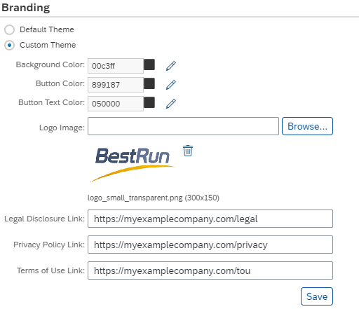
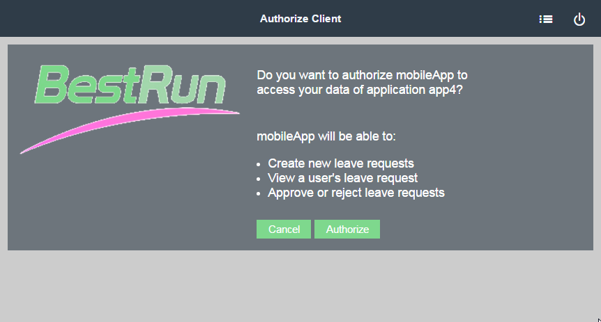

<!-- loio9ff990bdc95c4efc9925bb45dc9e12b5 -->

# Customize Corporate Branding

You can customize the lookandfeel of the authorization page displayed to end users with your corporate branding. This will make it easier for them to recognize your organization.

## Context

## Procedure

1.  In your Web browser, log on to the cockpit, and navigate to your subaccount. See [Navigate in the Cockpit](https://help.sap.com/viewer/65de2977205c403bbc107264b8eccf4b/Cloud/en-US/0874895f1f78459f9517da55a11ffebd.html "Learn how to navigate to your global accounts and subaccounts in the SAP BTP cockpit.") :arrow_upper_right:.

2.  Go to the *Security* \> *OAuth* \> *Branding* section.

3.  Configure the branding settings.

    \(Optional\) You can customize the page theme, colors and logo icon.

    \(Optional\) You can also add custom legal links to your page.

    

4.  Save the settings.

## Results

The authorization page that end users see contains the company logo and colors you specify. The following image shows an example of a customized end user authorization page.

