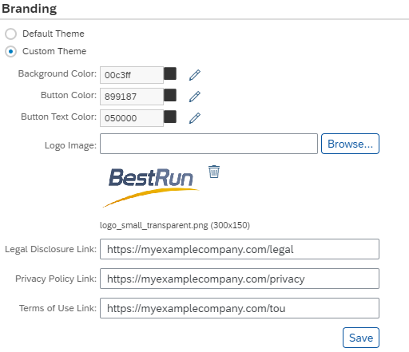
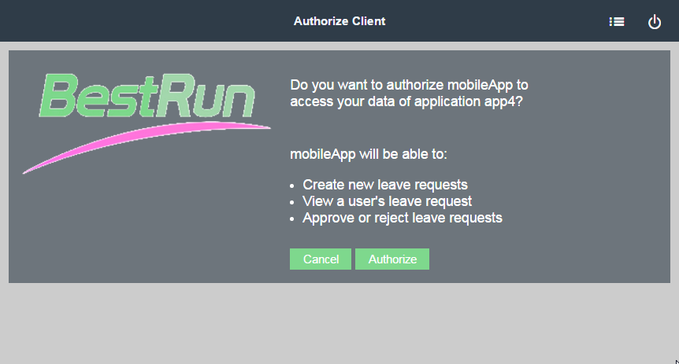

<!-- loio9ff990bdc95c4efc9925bb45dc9e12b5 -->

# Customize Corporate Branding

You can customize the lookandfeel of the authorization page displayed to end users with your corporate branding. This will make it easier for them to recognize your organization.

## Context

> ### Caution:  
> SAP Business Technology Platform, Neo environment will sunset on **December 31, 2028**, subject to terms of customer or partner contracts.
> 
> For more information, see SAP Note [3351844](https://me.sap.com/notes/3351844).

> ### Tip:  
> **This documentation refers to SAP Business Technology Platform, Neo environment. If you are looking for documentation about other environments, see [SAP Business Technology Platform](https://help.sap.com/docs/btp/sap-business-technology-platform/sap-business-technology-platform?version=Cloud) .**

> ### Tip:  
> Additional IP outbound addresses will soon be used in all regions in the Neo environment. For more information, see [Additional IP Addresses Added to SAP BTP, Neo Runtime Regions](https://help.sap.com/whats-new/cf0cb2cb149647329b5d02aa96303f56?version=Cloud&Component=Region&Valid_as_Of=2026-11-02:2026-11-02). To subscribe to such notifications, see SAP Note [3513325](https://me.sap.com/notes/3513325).

## Procedure

1.  In your Web browser, log on to the cockpit, and navigate to your subaccount. See [Navigate in the Cockpit](https://help.sap.com/viewer/65de2977205c403bbc107264b8eccf4b/Cloud/en-US/0874895f1f78459f9517da55a11ffebd.html "Learn how to navigate to your global accounts, directories, and subaccounts in the SAP BTP cockpit.") :arrow_upper_right:.

2.  Go to the *Security* \> *OAuth* \> *Branding* section.

3.  Configure the branding settings.

    \(Optional\) You can customize the page theme, colors and logo icon.

    \(Optional\) You can also add custom legal links to your page.

    

4.  Save the settings.

## Results

The authorization page that end users see contains the company logo and colors you specify. The following image shows an example of a customized end user authorization page.

