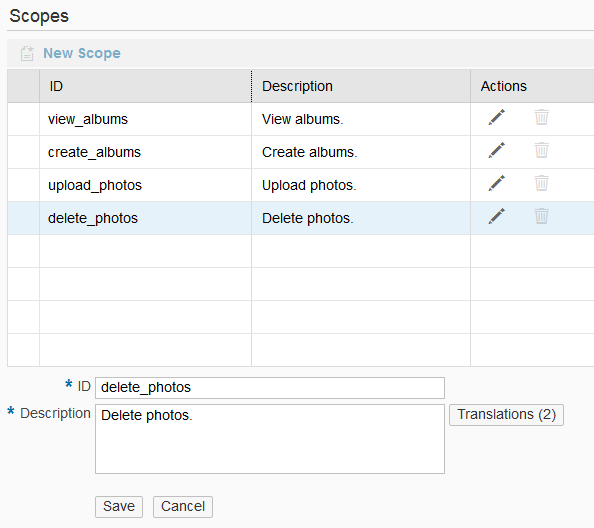

<!-- loio6604c6627270419583398f4df6997f98 -->

# Define OAuth Scopes

Define scopes for your OAuth-protected application to fine-grain the access rights to it.

## Context

> ### Caution:  
> SAP Business Technology Platform, Neo environment will sunset on **December 31, 2028**, subject to terms of customer or partner contracts.
> 
> For more information, see SAP Note [3351844](https://me.sap.com/notes/3351844).

> ### Tip:  
> **This documentation refers to SAP Business Technology Platform, Neo environment. If you are looking for documentation about other environments, see [SAP Business Technology Platform](https://help.sap.com/docs/btp/sap-business-technology-platform/sap-business-technology-platform?version=Cloud) .**

> ### Tip:  
> Additional IP outbound addresses will soon be used in all regions in the Neo environment. For more information, see [Additional IP Addresses Added to SAP BTP, Neo Runtime Regions](https://help.sap.com/whats-new/cf0cb2cb149647329b5d02aa96303f56?version=Cloud&Component=Region&Valid_as_Of=2026-11-02:2026-11-02). To subscribe to such notifications, see SAP Note [3513325](https://me.sap.com/notes/3513325).

## Procedure

1.  In your Web browser, log on to the cockpit, and select your global account.

2.  Select your subaccount in the Neo environment.

3.  In the *Applications* \> *Java Applications* section, select the OAuth-protected application.

4.  For the application, go to the *Security* \> *OAuth Scopes* section.

5.  Choose *New Scope*.

    

6.  Enter the scope ID and description.

7.  Optionally, if you want to provide localization for different languages, choose *Translations* and enter the required data.

8.  Save the new scope.

