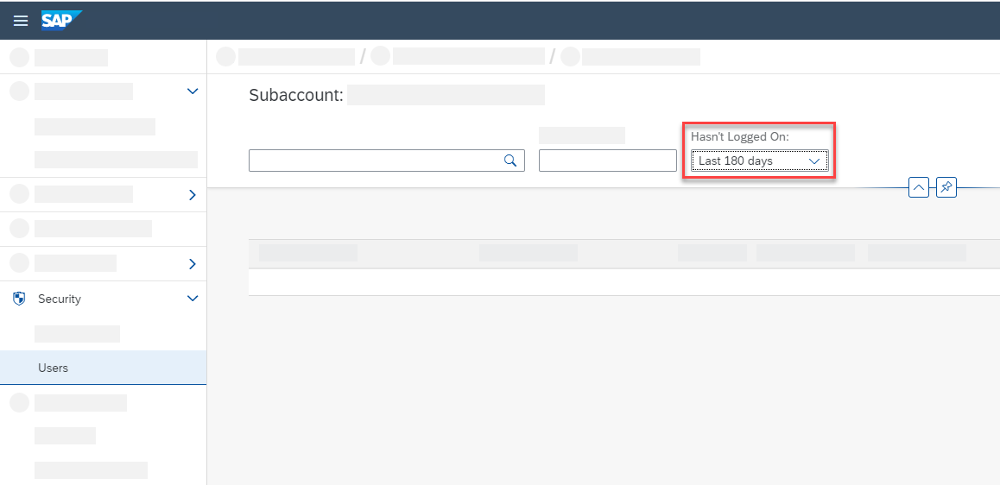
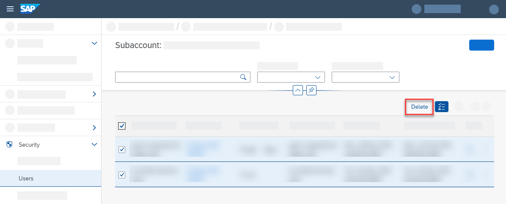

<!-- loio893c5ac43ffb47a589a9bf2b98fbd2fb -->

# Delete Shadow Users for Data Protection and Privacy Using the Cockpit

Data privacy regulations or policies may require you to delete this data, for example, when the user has left your organization. SAP BTP cockpit offers an application to select and delete shadow users.

<a name="loio893c5ac43ffb47a589a9bf2b98fbd2fb__prereq_brm_42l_mqb"/>

## Prerequisites

You have the required authorizations.

For more information, see [Security Administration: Managing Authentication and Authorization](https://help.sap.com/viewer/ae8e8427ecdf407790d96dad93b5f723/Cloud/en-US/1ff47b2d980e43a6b2ce294352333708.html "This section describes the tasks of administrators in the Cloud Foundry environment of SAP BTP. Administrators ensure user authentication and assign authorization information to users and user groups.") :arrow_upper_right: or [Role Collections and Roles in Global Accounts, Directories, and Subaccounts [Feature Set B]](https://help.sap.com/viewer/65de2977205c403bbc107264b8eccf4b/Cloud/en-US/0039cf082d3d43eba9200fe15647922a.html "In the cloud management tools feature set B, SAP BTP provides a set of role collections to set up administrator access to your global account and subaccounts.") :arrow_upper_right:.

## Context

> ### Note:  
> When handling personal data, consider the legislation in the various countries and regions where your organization operates. After the data has passed the end of purpose, regulations might require you to delete the data. For more information on data protection and privacy, see the related link.

The User Account and Authentication service stores user-related data records in the form of shadow users. The UAA uses the information of the shadow users to issue tokens that refer to the specific user. If automatic shadow user creation is enabled, the UAA creates the shadow users when the user authenticates. Otherwise, the UAA creates the shadow user as soon as you assign the user a role collection. These conditions apply to platform users and business users. For more information about shadow users, see the Cloud Foundry documentation.

> ### Note:  
> You can also delete users using the User Management \(SCIM\) API.
> 
> For more information, see [Delete Shadow Users for Data Protection and Privacy Using APIs](delete-shadow-users-for-data-protection-and-privacy-using-apis-eb70f16.md).

<a name="loio893c5ac43ffb47a589a9bf2b98fbd2fb__steps_b4y_4b5_bnb"/>

## Procedure

1.  Open the SAP BTP cockpit.

2.  Go to your global account, directory, or subaccount \(see [Navigate in the Cockpit](https://help.sap.com/viewer/65de2977205c403bbc107264b8eccf4b/Cloud/en-US/0874895f1f78459f9517da55a11ffebd.html "Learn how to navigate to your global accounts and subaccounts in the SAP BTP cockpit.") :arrow_upper_right:\).

3.  Choose *Security* \> *Users*.

    > ### Note:  
    > For directories, choose *Users*. There is no *Security* menu item.

4.  From the list of users, select the users to delete.

       
      
    **Filter for Users Who Haven't Logged On**

      

    > ### Recommendation:  
    > Users, who have left your organization, haven't logged on recently. Use the *Hasn't Logged On* filter option to find users who haven't logged on in the last 180 days.
    > 
    > The last logon date you filter for varies from situation to situation. The filter value must meet the following requirements:
    > 
    > -   Be long enough that the filter doesn't catch users who are simply on vacation or don't work regularly in the system.
    > 
    > -   Not be so long that the filter no longer meets your data protection and privacy requirements.
    > 
    > 
    > Think about users on parental leave or on a longer leave of absence, too.

    > ### Caution:  
    > You can't undo the deletion of a user. When you delete a user, you delete any direct assignments of role collections to that user. You also potentially invalidate any application referencing that user.
    > 
    > For example, an application saves some data relating to a user. When you delete the user, that data points to an ID that no longer exists. You can recreate the user, but the new user has a different ID, even though other attributes, such as e-mail, first name, and last name, are identical.

5.  Delete the selected users.

       
      
    **Delete Selected Users**

      

**Related Information**  

[Delete Users](https://help.sap.com/viewer/ae8e8427ecdf407790d96dad93b5f723/Cloud/en-US/51000c2254864a39b9f8629715f2c5f1.html "As an administrator, you can delete users from your subaccount. When you delete a user, you also delete the user&apos;s role collection assignments.") :arrow_upper_right:

[Data Protection and Privacy](data-protection-and-privacy-7e513d3.md "Data protection is associated with numerous legal requirements and privacy concerns. In addition to compliance with general data protection and privacy acts, it is necessary to consider compliance with industry-specific legislation in different countries.")

[Switch Off Automatic Creation of Shadow Users](https://help.sap.com/viewer/ae8e8427ecdf407790d96dad93b5f723/Cloud/en-US/d8525671e8b14147b96ef497e1e1af80.html "To switch off the creation of shadow users in the trust configuration of custom identity providers, administrators must explicitly allow users to log on. Administrators then have full control over who is allowed to log on.") :arrow_upper_right:

[Shadow Users in the Cloud Foundry Documentation](https://docs.cloudfoundry.org/uaa/uaa-concepts.html#%23shadow)

