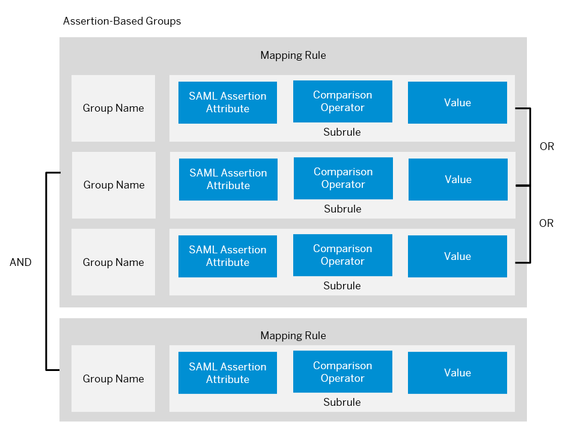

<!-- loiodb8175b9d976101484e6fa303b108acd -->

# Managing Roles

In SAP BTP, you can use Java EE roles to define access to the application resources.

## Context

> ### Remember:  
> SAP Business Technology Platform, Neo environment will sunset on **December 31, 2028**, subject to terms of customer or partner contracts.
> 
> For more information, see SAP Note [3351844](https://me.sap.com/notes/3351844).

> ### Tip:  
> **This documentation refers to SAP Business Technology Platform, Neo environment. If you are looking for documentation about other environments, see [SAP Business Technology Platform](https://help.sap.com/viewer/65de2977205c403bbc107264b8eccf4b/Cloud/en-US/6a2c1ab5a31b4ed9a2ce17a5329e1dd8.html "SAP Business Technology Platform (SAP BTP) is an integrated offering comprised of four technology portfolios: database and data management, application development and integration, analytics, and intelligent technologies. The platform offers users the ability to turn data into business value, compose end-to-end business processes, and build and extend SAP applications quickly.") :arrow_upper_right:.**

**Terms**

<table>
<tr>
<th valign="top">

Term

</th>
<th valign="top">

Description

</th>
</tr>
<tr>
<td valign="top">

Role

</td>
<td valign="top">

Roles allow you to diversify user access to application resources \(role-based authorizations\).

> ### Note:  
> Role names are case sensitive.

</td>
</tr>
<tr>
<td valign="top">

Predefined roles

</td>
<td valign="top">

Predefined roles are ones defined in the *web.xml*of an application.

See [Authentication](authentication-e637f62.md#loioe637f62abb571014857cb0232adc43a7).

After you deploy the application to SAP BTP, the role becomes visible in the Cockpit, and you can assign groups or individual users to that role. If you undeploy your application, these roles are removed.

Predefined roles can be:

-   Shared - they are shared by default. A shared role is visible and accessible within all accounts subscribed to this application.
-   Restricted - an application administrator could restrict a shared role. A restricted role is visible and accessible only within the subaccount that deployed the application, and not to accounts subscribed to the application.

> ### Note:  
> If you restrict a shared role, you hide it from visibility for new assignments from subscribed accounts but all existing assignments will continue to take effect.

</td>
</tr>
<tr>
<td valign="top">

Custom roles

</td>
<td valign="top">

Custom roles are ones defined using the Cockpit. Custom roles are interpreted in the same way as predefined roles at SAP BTP: they differ only in the way they are created, and in their scope.

You can add custom roles to an application to configure additional access permissions to it without modifying the application's source code.

Custom roles are visible and accessible only within the subaccount where they are created. That’s why different accounts subscribed to the same application could have different custom roles.

</td>
</tr>
<tr>
<td valign="top">

User

</td>
<td valign="top">

Users are principals managed by identity providers \(SAP ID service or others\).

> ### Note:  
> SAP BTP does not have a user database on its own. It cares to map the users authorized by identity providers to groups, and groups to roles.

> ### Note:  
> When a user logs in, its roles are stored in the user's current browser session. They are **not** updated dynamically, and removed from there only if the session is terminated or invalidated. This means if you change the set of roles for a user currently logged, they will take effect only after logout or session invalidation.

</td>
</tr>
<tr>
<td valign="top">

Group

</td>
<td valign="top">

Groups are collections of roles that allow the definition of business-level functions within your subaccount. They are similar to the actual business roles existing in an organization, such as "manager", "employee", "external" and so on. They help you to get better alignment between technical Java EE roles and organizational roles.

> ### Note:  
> Group names are case insensitive.

For each identity provider \(IdP\) for your subaccount, you define a set of rules specifying the groups a user for this IdP belongs to.

See [Using a Custom Identity Provider](application-identity-provider-dc61853.md#loiodc618538d97610148155d97dcd123c24).

</td>
</tr>
</table>

<a name="task_hky_cs1_sn"/>

<!-- task\_hky\_cs1\_sn -->

## 1. Define the Roles

## Context

This can be done in two ways: using *predefined roles* in the web.xml at development time, or using *custom roles* in the UI.

> ### Tip:  
> If you need to do mass role or group assignment, to a very large number of users simultaneously, we recommend using the Authorization Management API instead of the cockpit UI. See [Using Platform APIs](../30-development-neo/using-platform-apis-392af9d.md).

<a name="task_hky_cs1_sn__steps-unordered_gww_4dr_j4"/>

## Procedure

-   Predefined Roles

    1.  In the *web.xml* of the required application, define the roles authorized to access the application resources.

        See [Authentication](authentication-e637f62.md#loioe637f62abb571014857cb0232adc43a7).

    2.  Deploy the application to SAP BTP.

        See [Deploying and Updating Java Applications](../30-development-neo/deploying-and-updating-java-applications-e5dfbc6.md).

    3.  Optionally, if you want to restrict the roles to the current application only, deselect the *Share* option for them in the Cockpit.

-   Custom roles with applications from the same subaccount

    1.  In the cockpit, go to the *Applications* \> *Java Applications* section.

    2.  Click the required application link.

    3.  Enter the *Roles* section.

    4.  Choose *Create*.

    5.  Type the role name and choose *Create*.

-   Custom roles with applications subscribed from other accounts

    1.  In the cockpit, go to the *Applications* \> *Subscriptions* section.

    2.  In the list of subscribed aplications, click the required application link.

    3.  Enter the *Roles* section.

    4.  Choose *Create*.

    5.  Type the role name and choose *Create*.

<a name="task_aqq_xzd_mr"/>

<!-- task\_aqq\_xzd\_mr -->

## 2. \(Optional\) Create Groups

## Context

Groups allow you to easily manage the role assignments to collections of users instead of individual users.

<a name="task_aqq_xzd_mr__steps_zht_m12_mr"/>

## Procedure

1.  In the cockpit, go to the *Security* \> *Authorizations* section for the subaccount.

2.  Enter the *Groups* tab.

3.  Choose *Create*.

4.  Enter the group name and choose *Create*.

<a name="task_n24_4s1_sn"/>

<!-- task\_n24\_4s1\_sn -->

## 3. Assign Users or Groups to the Roles

## Context

You can assign individual users to the roles or, more conveniently, assign groups for collective role management.

You can do it in either of the two ways: using the *Security* \> *Roles* section for the application, or using the *Security* \> *Authorizations* section for the subaccount.

<a name="task_n24_4s1_sn__steps-unordered_odm_khy_j4"/>

## Procedure

-   Using the *Roles* section

    1.  In the cockpit, go to the *Applications* \> *Java Applications* section.

    2.  Click the required application link.

    3.  Enter the *Security* \> *Roles* section.

    4.  Select the role you want to manage assignments for.

    5.  To assign a new user or group, choose *Assign* for the *Users* or *Groups* section respectively.

    6.  Enter the user or group name.

    7.  Choose *Assign*, and specify the required user or group name.

-   Alternatively, you can do it using the *Authorizations* section for the subaccount.

    1.  In the cockpit, go to the *Security* \> *Authorizations* section for the subaccount.

    2.  Enter the *Users* or *Groups* tab respectively.

    3.  For the *Users* tab, enter the name of the required user and choose *Show Assignments*. For the *Groups* tab, choose the required group from the list, or create a new one and choose it.

        The *Roles* table below shows all roles that are already assigned to this user or group.

    4.  In the *Roles* table, choose *Assign*, and specify the required role.

<a name="task_lbt_xs1_sn"/>

<!-- task\_lbt\_xs1\_sn -->

## \(Optional\) \(If Using an Identity Provider\) 4. Define Automatic Assignments of Users to Groups

<a name="task_lbt_xs1_sn__prereq_flg_3yb_bzb"/>

## Prerequisites

-   Your subaccount has a *Custom* trust configuration with at least one fully configured application identity provider. See [Application Identity Provider](application-identity-provider-dc61853.md#loiodc618538d97610148155d97dcd123c24) and [Identity Authentication Tenant as an Application Identity Provider](identity-authentication-tenant-as-an-application-identity-provider-d3df5b4.md).
-   You have defined the groups and their role assignments in the *Security* \> *Authorizations* section of the cockpit. See *Step 2* and *Step 3*.

## Context

For each different identity provider \(IdP\), you can define a set of rules specifying automatic group assignments for the users logged by this IdP. If you have already assigned those groups to roles, this will result in the IdP users automatically getting the required roles.

<a name="task_lbt_xs1_sn__steps_fmq_kzb_bzb"/>

## Procedure

1.  Go to the *Security* \> *Trust* \> *Application Identity Provider* section in the cockpit.

2.  Select the required application identity provider from the list.

3.  In the identity provider settings, go to the *Groups* section.

    There are two IdP group types: default groups and assertion-based groups.

    <table>
    <tr>
    <th valign="top">

    IdP Group Type
    
    </th>
    <th valign="top">

    Description
    
    </th>
    <th valign="top">

    Example
    
    </th>
    </tr>
    <tr>
    <td valign="top">
    
    Default group
    
    </td>
    <td valign="top">
    
    All users logged by this IdP will have this group assignment.
    
    </td>
    <td valign="top">
    
    All users logged by the company IdP can be assigned to the group *Internal*. You may decide to give this group the role *Access Internal Corporate Portal*.
    
    </td>
    </tr>
    <tr>
    <td valign="top">
    
    Assertion-based group
    
    </td>
    <td valign="top">
    
    Determined by values of attributes in the SAML 2.0 assertion.Only the IdP users that have the required values will be assigned to it.
    
    </td>
    <td valign="top">
    
    The users with SAML 2.0 assertion containing the attribute `contract=temporary` will be assigned to the group *TEMPORARY*. The users with SAML 2.0 assertion containing the attribute `contract=permanent` will be assigned to the group *PERMANENT*. The two groups will have different role assignments.
    
    </td>
    </tr>
    </table>
    
4.  Define the groups as required.

    -   Default groups

        Choose *Add Default Group*, and select the required group from the drop-down list.

        > ### Note:  
        > If the list is empty or the group you need is missing, you can create it from the *Security* \> *Trust* \> *Authorizations* \> *Groups* section in the cockpit. You can then assign the required roles for it in the same section.

    -   Assertion-based groups
        1.  Choose *Add Assertion-Based Group*, and select the required group from the drop-down list..

            > ### Note:  
            > If the list is empty or the group you need is missing, you can create it from the *Security* \> *Trust* \> *Authorizations* \> *Groups* section in the cockpit. You can then assign the required roles for it in the same section.

        2.  Specify the mapping rules.

            In the first field of the *Mapping Rules* section, enter the SAML 2.0 assertion attribute name to be used as the mapping source. In other words, the value of this attribute will be compared with the value you specify \(in the last field of *Mapping Rules*\).

        3.  Choose the comparison operator.

            <table>
            <tr>
            <td valign="top">
            
            Equals
            
            </td>
            <td valign="top">
            
            Choose *Equals* if you want the value of the SAML 2.0 assertion attribute to match exactly the string you specify. Note that if you want to use more sophisticated relations, such as "starts with" or "contains", you need to use the *Regular expression* option.
            
            </td>
            </tr>
            <tr>
            <td valign="top">
            
            Regular expression
            
            </td>
            <td valign="top">
            
            Choose *Regular expression* if you want to specify more sophisticated matching rules. You can use all regular expression rules described in the[Java RegEx API](http://docs.oracle.com/javase/6/docs/api/java/util/regex/Pattern.html).

            **Example 1**: You want to add authenticated SAP employees to group *Employees*. And SAP employees are users with e-mail address ending with *sap.com*. Hence, you choose the mapping rule to be *email*, matched using the following regular expression:

            *.\*@sap.com$*

            **Example 2**: You want all users with name starting with admin to be added to group *Administrators*. Hence, you choose the mapping rule to be userid, matched using the following regular expression:

            *^\(admin\).\** 
            
            </td>
            </tr>
            </table>
            
        4.  In the last field of *Mapping Rules*, enter the value with which you compare the specified SAML 2.0 assertion attribute.

            > ### Note:  
            > Adding a new rule binds it to the rest using a logical OR operator.

            > ### Note:  
            > Adding a new subrule binds it to the rest of the subrules using a logical AND operator.

            

            In the graphic below, all users logged by this IdP are added to the group *Government*. The users that have an arrtibute corresponding to their department name will also be assigned to the respective department groups.

            

            When you open the *Groups* tab page of the *Authorizations* section, you can see the identity provider mappings for this group.

<a name="task_tmp_4t1_sn"/>

<!-- task\_tmp\_4t1\_sn -->

## 5. Test

Try to access the required application logging on with users with and without the required roles respectively.

<a name="task_wjs_jct_qx"/>

<!-- task\_wjs\_jct\_qx -->

## \(Optional\) Configure Role Caching

## Context

You may use the following steps to configure default role caching settings. This may be required if you have automated test procedures for role assignments in your applications. Tests may not work properly with the default subaccount settings.

The default role caching behavior is as follows:

If there are more than `com.sap.security.um.ratelimiter.cache.maximum_requests_per_user` \(default is `20`\) stateless requests within `com.sap.security.um.ratelimiter.cache.time_period` \(default is `2 minutes`\) with the same user to check the user permission, we cache hers roles for `com.sap.security.um.ratelimiter.cache.validity` \(default is `5 minutes`\). This means that new assignments/unassignments will not work for 5 minutes.

> ### Tip:  
> You can take one of the following approaches:
> 
> -   Increase the time in which the requests are counted to more than the default 2 minutes.
> -   Increase the number of requests – instead of the default 20, set 100 or 200, for example.

The table below shows the VM system properties available for configuring role caching:

<table>
<tr>
<th valign="top">

VM Property

</th>
<th valign="top">

Description

</th>
<th valign="top">

Default Value

</th>
</tr>
<tr>
<td valign="top">

com.sap.security.um.ratelimiter.cache.maximum\_user\_entries

</td>
<td valign="top">

The maximum user entries stored in the role cache.

</td>
<td valign="top">

1000

</td>
</tr>
<tr>
<td valign="top">

com.sap.security.um.ratelimiter.cache.validity

</td>
<td valign="top">

The cache validity in time.

</td>
<td valign="top">

5 \(in minutes\)

</td>
</tr>
<tr>
<td valign="top">

com.sap.security.um.ratelimiter.cache.time\_period

</td>
<td valign="top">

The time period for role caching.

</td>
<td valign="top">

2 \(in minutes\)

</td>
</tr>
<tr>
<td valign="top">

com.sap.security.um.ratelimiter.cache.maximum\_requests\_per\_user

</td>
<td valign="top">

The maximum requests per user stored in the role cache.

</td>
<td valign="top">

20

</td>
</tr>
</table>

<a name="task_wjs_jct_qx__steps_clt_pgt_qx"/>

## Procedure

Set the required values to the required VM system properties as described in [Configure VM Arguments](../50-administration-and-ops-neo/configure-vm-arguments-b82d392.md).

