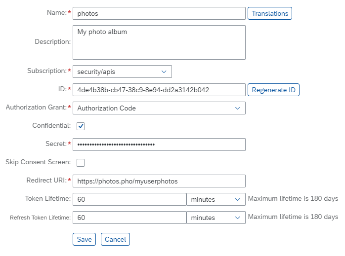
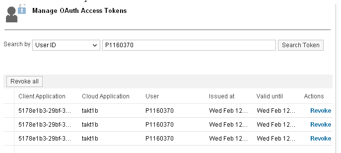
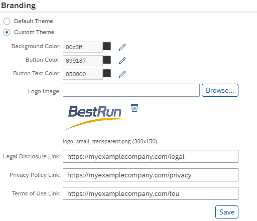
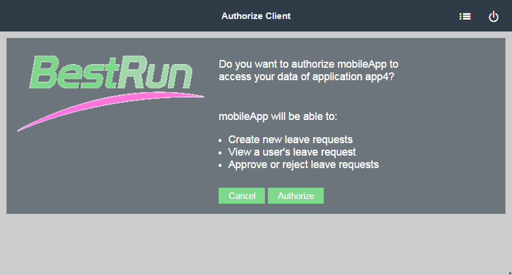

<!-- loio7e658b3e4cea4a79b035d0f1d2798c1f -->

# OAuth 2.0 Configuration

Register clients, manage access tokens, configure scopes and perform other OAuth configuration tasks in the Neo environment of SAP BTP.

> ### Tip:  
> **This documentation refers to SAP Business Technology Platform, Neo environment. If you are looking for documentation about other environments, see [SAP Business Technology Platform](https://help.sap.com/viewer/65de2977205c403bbc107264b8eccf4b/Cloud/en-US/6a2c1ab5a31b4ed9a2ce17a5329e1dd8.html "SAP Business Technology Platform (SAP BTP) is an integrated offering comprised of four technology portfolios: database and data management, application development and integration, analytics, and intelligent technologies. The platform offers users the ability to turn data into business value, compose end-to-end business processes, and build and extend SAP applications quickly.") :arrow_upper_right:.**

**Prerequisites**

-   You have an account with administrator role in SAP BTP. See [Managing Member Authorizations in the Neo Environment](../50-administration-and-ops-neo/managing-member-authorizations-in-the-neo-environment-a1ab5c4.md).
-   You have developed an OAuth-protected application \(resource server\). See [OAuth 2.0 Authorization Code Grant](oauth-2-0-authorization-code-grant-b7b5893.md).
-   You have deployed the application on SAP BTP. See [Deploying and Updating Java Applications](../30-development-neo/deploying-and-updating-java-applications-e5dfbc6.md).

## Contents:

-   [Register an OAuth Client](oauth-2-0-configuration-7e658b3.md#loio61d8095aa39547c7b30d9aeda771497f)
-   [Define OAuth Scopes](oauth-2-0-configuration-7e658b3.md#loio6604c6627270419583398f4df6997f98)
-   [Revoke OAuth Access Tokens](oauth-2-0-configuration-7e658b3.md#loiof5eac83ceb4d4d72b64424f518f878fd)
-   [Use a QR Code for Mobile Access](oauth-2-0-configuration-7e658b3.md#loio3225447dbcc8442794efab7c4b0d0abe)
-   [Customize Corporate Branding](oauth-2-0-configuration-7e658b3.md#loio9ff990bdc95c4efc9925bb45dc9e12b5)

 <a name="loio61d8095aa39547c7b30d9aeda771497f"/>

<!-- loio61d8095aa39547c7b30d9aeda771497f -->

## Register an OAuth Client

To authorize a device to access an OAuth-protected application, you need to register it as a client.

## Context

## Procedure

1.  In your Web browser, log on to the cockpit, and select an account.

2.  In the *Security* \> *OAuth* section, go to the *Clients* tab.

3.  Choose *Register new Client*.

    

4.  Enter the client data as required \(see the table below\).

    <table>
    <tr>
    <th valign="top">

    Field

    
    </th>
    <th valign="top">

    Description

    
    </th>
    </tr>
    <tr>
    <td valign="top">

    *Name*

    
    </td>
    <td valign="top">

    The client name.

    
    </td>
    </tr>
    <tr>
    <td valign="top">

    *Description*

    
    </td>
    <td valign="top">

    A free-text description of the client.

    
    </td>
    </tr>
    <tr>
    <td valign="top">

    *Subscription*

    
    </td>
    <td valign="top">

    The application for which you are registering this client. To be able to register for a particular application, this account must be subscribed to it. For more information, see [Register an OAuth Client](oauth-2-0-configuration-7e658b3.md#loio61d8095aa39547c7b30d9aeda771497f).

    
    </td>
    </tr>
    <tr>
    <td valign="top">

    *ID*

    
    </td>
    <td valign="top">

    Required. The ID of the client authorized to access the resource server running on SAP BTP. If you already have a client with a defined ID at the client device, enter its value here. Otherwise, you can choose *Generate ID* and *Secret* to use a system-generated ID, or enter a custom value. In that case, you must provide that value to the user of the client device.

    > ### Note:  
    > The client ID must be globally unique within the entire SAP BTP.

    
    </td>
    </tr>
    <tr>
    <td valign="top">

    *Confidential*

    
    </td>
    <td valign="top">

    If you mark this box, the client ID will be protected with a password. You will need to supply the password here, and provide it to the client.

    
    </td>
    </tr>
    <tr>
    <td valign="top">

    *Secret*

    
    </td>
    <td valign="top">

    A secret \(password\) that allows the authorization server to authenticate before the client on behalf of the resource owner \(user\).

    It will also be needed by the client.

    
    </td>
    </tr>
    <tr>
    <td valign="top">

    *Skip Consent Screen*

    
    </td>
    <td valign="top">

    If you mark this option, no end user action will be required for authorizing this client. Otherwise, the end user will have to confirm granting the requested authorization.

    
    </td>
    </tr>
    <tr>
    <td valign="top">

    *Redirect URI*

    
    </td>
    <td valign="top">

    The application URI to which the authorization server will connect the client with the authorization code.

    
    </td>
    </tr>
    <tr>
    <td valign="top">

    *Token Lifetime*

    
    </td>
    <td valign="top">

    The token lifetime.This value applies to the access token and authorization code.

    
    </td>
    </tr>
    <tr>
    <td valign="top">

    *Refresh Token Lifetime*

    
    </td>
    <td valign="top">

    The refresh token lifetime.

    
    </td>
    </tr>
    <tr>
    <td valign="top">

    *Translations*

    
    </td>
    <td valign="top">

    Optionally, you can provide translations of the client name and description for localization purposes. Choose the *Translations* button and enter the required language translation there.

    
    </td>
    </tr>
    </table>
    
5.  Save the new client.

## Results

The device with the defined ID will be recognized as a registered client.

 <a name="loio6604c6627270419583398f4df6997f98"/>

<!-- loio6604c6627270419583398f4df6997f98 -->

## Define OAuth Scopes

Define scopes for your OAuth-protected application to fine-grain the access rights to it.

## Context

## Procedure

1.  In your Web browser, log on to the cockpit, and select an account.

2.  In the *Applications* \> *Java Applications* section, select the OAuth-protected application.

3.  For the application, go to the *Security* \> *OAuth Scopes* section.

4.  Choose *New Scope*.

    

5.  Enter the scope ID and description.

6.  Optionally, if you want to provide localization for different languages, choose *Translations* and enter the required data.

7.  Save the new scope.

 <a name="loiof5eac83ceb4d4d72b64424f518f878fd"/>

<!-- loiof5eac83ceb4d4d72b64424f518f878fd -->

## Revoke OAuth Access Tokens

With revoking access tokens, you can immediately reject access rights you have previously granted. You may wish to revoke an access token if you believe the token is be stolen, for example.

> ### Restriction:  
> You can revoke only the default persistent type of accesss tokes. If you use JWT tokens as access tokens, you cannot revoke them as they are not stored persistently. See [Best Practices for Resilient OAuth 2.0 Communication](best-practices-for-resilient-oauth-2-0-communication-11fe332.md).

There are two UIs for revoking access tokens:

-   The Cockpit - an administrator user may use the Cockpit to revoke tokens on behalf of different end users
-   The end user UI - an end user may access its tokens \(and no other user's\) and revoke the required using that UI

Using the Cockpit \(for administrators\):

1.  In your Web browser, open the Cockpit.
2.  Go to the *Security* \> *Authorizations* \> *Token* section.
3.  Search for access tokens either by client ID or by user ID.
4.  Choose *Revoke* for the required tokens.

Using the End User UI:

1.  In the Cockpit, choose the *Security* \> *OAuth* section, and go to the *Branding* tab.
2.  Click the *End User UI* link.You are now opening the end user UI in a new browser window. You can see all access tokens issued for the current user.
3.  Choose the *Revoke* button for the tokens to revoke.

 <a name="loio3225447dbcc8442794efab7c4b0d0abe"/>

<!-- loio3225447dbcc8442794efab7c4b0d0abe -->

## Use a QR Code for Mobile Access

Use a QR code for easier copying of the OAuth authorization code on mobile devices.

## Context

When your account is configured for trust with a corporate identity provider \(IdP\), it is often impossible to connect to the IdP directly using a personal mobile device. The corporate IdP is often part of a protected corporate network, which does not allow personal devices to access it. To facilitate OAuth authentication on mobile devices, you can use the end user UI's QR code generation option. It provides as a scannable QR code the authorization code sent by the OAuth authorization server.

## Procedure

1.  In the Cockpit, choose the *Security* \> *OAuth* \> *Branding* section.

2.  Click the *End User UI* link. You are now opening the end user UI in a new browser window.

3.  Choose *Code*.

4.  Select the client from the list of registered clients for this user.

5.  Select the required scopes.

6.  Choose *Generate QR Code*.

7.  Use your mobile device to scan this QR code \(prerequisite: you have QR code scanning software installed\), and copy it to your device's clipboard.

8.  Paste the code from the clipboard to your mobile application \(prerequisite: your mobile application allows you to paste the authorization code from the clipboard and will send in this case the access token request directly to the OAuth authorization server\).

    

 <a name="loio9ff990bdc95c4efc9925bb45dc9e12b5"/>

<!-- loio9ff990bdc95c4efc9925bb45dc9e12b5 -->

## Customize Corporate Branding

You can customize the lookandfeel of the authorization page displayed to end users with your corporate branding. This will make it easier for them to recognize your organization.

## Context

## Procedure

1.  In your Web browser, log on to the cockpit, and navigate to your subaccount. See [Navigate in the Cockpit](https://help.sap.com/viewer/65de2977205c403bbc107264b8eccf4b/Cloud/en-US/0874895f1f78459f9517da55a11ffebd.html "Learn how to navigate to your global accounts and subaccounts in the SAP BTP cockpit.") :arrow_upper_right:.

2.  Go to the *Security* \> *OAuth* \> *Branding* section.

3.  Configure the branding settings.

    \(Optional\) You can customize the page theme, colors and logo icon.

    \(Optional\) You can also add custom legal links to your page.

    

4.  Save the settings.

## Results

The authorization page that end users see contains the company logo and colors you specify. The following image shows an example of a customized end user authorization page.

