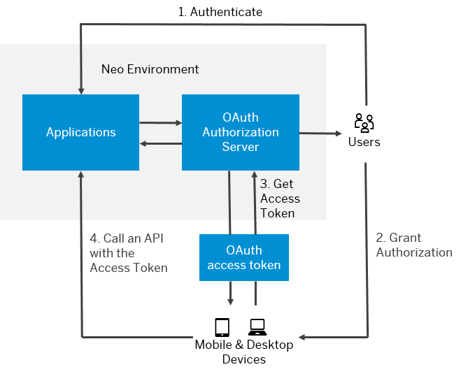

<!-- loioe526ca3998954d62833ffd5a19ec4523 -->

# OAuth 2.0 Service

Use OAuth 2.0 service on SAP BTP to protect applications in the Neo environment using the OAuth 2.0 protocol.

> ### Remember:  
> SAP Business Technology Platform, Neo environment will sunset on **December 31, 2028**, subject to terms of customer or partner contracts.
> 
> For more information, see SAP Note [3351844](https://me.sap.com/notes/3351844).

> ### Tip:  
> **This documentation refers to SAP Business Technology Platform, Neo environment. If you are looking for documentation about other environments, see [SAP Business Technology Platform](https://help.sap.com/viewer/65de2977205c403bbc107264b8eccf4b/Cloud/en-US/6a2c1ab5a31b4ed9a2ce17a5329e1dd8.html "SAP Business Technology Platform (SAP BTP) is an integrated offering comprised of the following technology portfolios: application development; process automation; integration; data, analytics, and enterprise planning; artificial intelligence. The platform offers users the ability to turn data into business value, compose end-to-end business processes, connect entire IT landscapes, and personalize, build and extend SAP applications. This reduces the overall total cost of ownership maintaining SAP landscapes and third-party software across end-to-end business processes.") :arrow_upper_right:.**

<a name="loioe526ca3998954d62833ffd5a19ec4523__OAuth"/>

## Protecting Applications with OAuth 2.0

OAuth 2.0 is a widely adopted security protocol for protection of resources over the Internet. It is used by many social network providers and by corporate networks. It allows an application to request authentication on behalf of users with third-party user accounts, without the user having to grant its credentials to the application. SAP BTP provides an API for developing OAuth-protected applications. You can configure the required scopes and clients using the SAP BTP cockpit.

The following graphic illustrates protecting applications with OAuth on SAP BTP.

SAP BTP supports two basic OAuth 2.0 flows:

-   Authorization code grant - there is a human user who authorizes a mobile application to access resources on his or her behalf. See [OAuth 2.0 Authorization Code Grant](oauth-2-0-authorization-code-grant-b7b5893.md).

-   Client credentials grant - there is no human user but a device instead. In such case, the access token is granted on the basis of client credentials only. See [OAuth 2.0 Client Credentials Grant](oauth-2-0-client-credentials-grant-f69fa87.md).

**Related Information**  

[OAuth 2.0 Authorization Code Grant](oauth-2-0-authorization-code-grant-b7b5893.md "Use OAuth 2.0 service in the Neo environment of SAP BTP to enable your cloud applications for authorization code grant flow. Authorization code grant is one of the basic flows specified in the OAuth 2.0 protocol.")

[OAuth 2.0 Client Credentials Grant](oauth-2-0-client-credentials-grant-f69fa87.md "Use OAuth 2.0 service in the Neo environment of SAP BTP to enable your cloud applications for client credentials grant flow.")

[OAuth 2.0 Configuration](oauth-2-0-configuration-7e658b3.md "Register clients, manage access tokens, configure scopes and perform other OAuth configuration tasks in the Neo environment of SAP BTP.")

[Principal Propagation to OAuth-Protected Applications](principal-propagation-to-oauth-protected-applications-310f39e.md "Propagate users from external applications with SAML identity federation to OAuth-protected applications running in the Neo environment of SAP BTP. Exchange the user ID and attributes from a SAML assertion for an OAuth access token, and use the access token to access the OAuth-protected application.")

