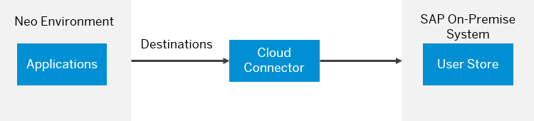
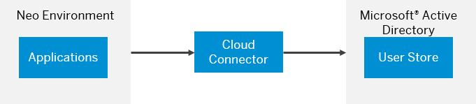

<!-- loio04cbd0f30d524612aa438ed0b0eed217 -->

# On-Premise User Store

If you already have an existing on-premise system with a populated user store, you can configure SAP BTP applications to use that on-premise user store. This approach is similar to implementing identity federation with a corporate identity provider. In that way, applications do not need to keep the whole user database, but request the necessary information from the on-premise system.

## Context

> ### Remember:  
> SAP Business Technology Platform, Neo environment will sunset on **December 31, 2028**, subject to terms of customer or partner contracts.
> 
> For more information, see SAP Note [3351844](https://launchpad.support.sap.com/#/notes/3351844).

> ### Tip:  
> **This documentation refers to SAP Business Technology Platform, Neo environment. If you are looking for documentation about other environments, see [SAP Business Technology Platform](https://help.sap.com/viewer/65de2977205c403bbc107264b8eccf4b/Cloud/en-US/6a2c1ab5a31b4ed9a2ce17a5329e1dd8.html "SAP Business Technology Platform (SAP BTP) is an integrated offering comprised of four technology portfolios: database and data management, application development and integration, analytics, and intelligent technologies. The platform offers users the ability to turn data into business value, compose end-to-end business processes, and build and extend SAP applications quickly.") :arrow_upper_right:.**

Applications can use the on-premise system to:

-   check credentials

-   search for users

-   retrieve user details

-   retrieve information about the groups a specific user is a member of. You can use this information for user authorizations. See [Managing Roles](managing-roles-db8175b.md).

You can use two types of on-premise user store:

-   SAP Single Sign-On with a SAP NetWeaver Application Server for Java System - the applications on SAP BTP connect to the SAP on-premise system using Destination API \(and, if necessary, SAP HANA Cloud Connector\), and make use of the user store there.

    

-   Microsoft Active Directory - this is an LDAP server that can serve as an on-premise user store. The applications on SAP BTP connect to the LDAP server using SAP Cloud Connector, and make use of the user store there.

    

Alternatively to the above scenarios, you can implement identity federation with a Identity Authentication tenant, where the tenant is configured to use an on-premise user store. See:

-   [Identity Authentication Tenant as an Application Identity Provider](identity-authentication-tenant-as-an-application-identity-provider-d3df5b4.md)

-   [\(Identity Authentication documentation\) Corporate User Store](https://help.hana.ondemand.com/cloud_identity/frameset.htm?461d71c148594608b9c8b6d016e0a0c5.html)

**Related Information**  

[Using an SAP System as an On-Premise User Store](using-an-sap-system-as-an-on-premise-user-store-71fdf1c.md "")

[Using Microsoft Active Directory as an On-Premise User Store](using-microsoft-active-directory-as-an-on-premise-user-store-28a03e4.md "You can use Microsoft Active Directory as an on-premise LDAP server providing a user store for your SAP BTP applications.")

