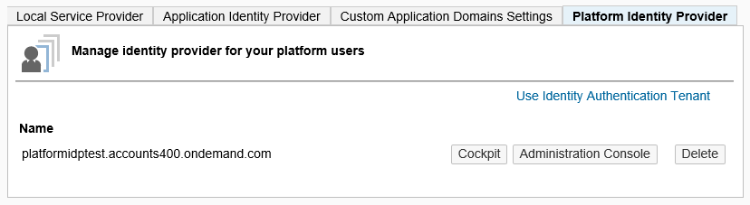
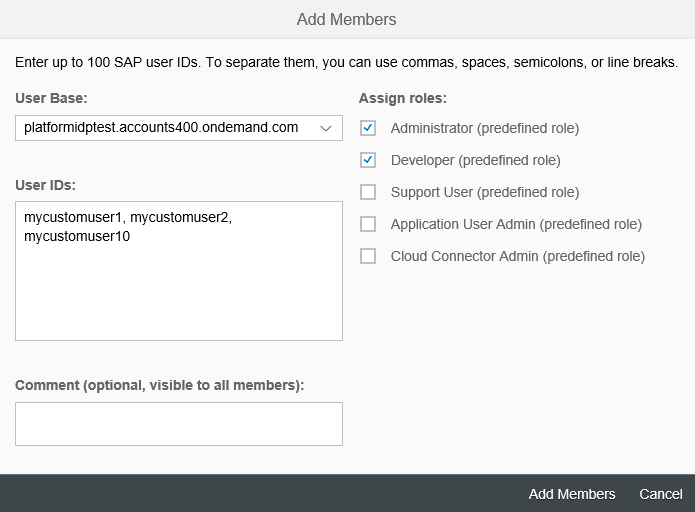

<!-- loio80edbe70b8f3478d8a59c21a91a47aa6 -->

# Platform Identity Provider

The platform identity provider is the user base for access to your SAP BTP subaccount in the Neo environment. The default user base is provided by SAP ID Service. You can switch to an Identity Authentication tenant if you want to use a custom user base.

**Related Information**  


[Authorization and Trust Management in the Neo Environment](authorization-and-trust-management-in-the-neo-environment-e6b196a.md "The Neo environment of SAP BTP supports identity federation and single sign-on with external identity providers. The current section provides an overview of the supported scenarios.")

[OAuth 2.0 Service](oauth-2-0-service-e526ca3.md "Use OAuth 2.0 service on SAP BTP to protect applications in the Neo environment using the OAuth 2.0 protocol.")

[Keystore Service](keystore-service-a18327e.md "The Keystore Service provides a repository for cryptographic keys and certificates to the applications in the Neo environment of SAP BTP.")

[Audit Logging in the Neo Environment](audit-logging-in-the-neo-environment-02c3971.md "In this section you can find information for audit log functionalities in the SAP BTP Neo environment.")

[Principal Propagation](principal-propagation-f70fcf1.md "Exchange user ID information between systems or environments in SAP BTP.")

[Protection from Web Attacks](protection-from-web-attacks-52750a8.md "To protect your applications from different kind of web attacks, Neo environment provides mechanisms for you to use with your applications.")

[Data Protection and Privacy](data-protection-and-privacy-7e513d3.md "Data protection is associated with numerous legal requirements and privacy concerns. In addition to compliance with general data protection and privacy acts, it is necessary to consider compliance with industry-specific legislation in different countries.")

 <a name="concept_pnx_wmb_r1b"/>

<!-- concept\_pnx\_wmb\_r1b -->

## Overview

> ### Tip:  
> **This documentation refers to SAP Business Technology Platform, Neo environment. If you are looking for documentation about other environments, see [SAP Business Technology Platform](https://help.sap.com/viewer/65de2977205c403bbc107264b8eccf4b/Cloud/en-US/6a2c1ab5a31b4ed9a2ce17a5329e1dd8.html "SAP Business Technology Platform (SAP BTP) is an integrated offering comprised of four technology portfolios: database and data management, application development and integration, analytics, and intelligent technologies. The platform offers users the ability to turn data into business value, compose end-to-end business processes, and build and extend SAP applications quickly.") :arrow_upper_right:.**

> ### Note:  
> Platform identity provider is supported only for Feature Set A.

By default, the SAP BTP cockpit and console client are configured to use SAP ID Service as the **platform identity provider** \(providing the user base for subaccount members\). SAP ID Service, however, uses the SAP user base \(providing, for example, your s- or p-user\). If you want to have subaccount members from your custom user base, and use custom security configuration \(such as two-factor user authentication, or corporate user store, for example\), you can switch to a custom Identity Authentication tenant as a platform identity provider.

> ### Note:  
> There is a difference between a **platform** identity provider and **application** identity provider at SAP BTP.
> 
> The diagram below describes the basic features of platform identity providers and application identity providers, and provides a brief comparison between them.


> ### Note:  
> Changing the **platform** identity provider settings \(*Security* \> *Trust* \> *Platform Identity Provider* in the SAP BTP cockpit\) does **not** affect the **application** identity provider settings \(*Security* \> *Trust* \> *Platform Identity Provider* in the SAP BTP cockpit\) for this subaccount. See [Application Identity Provider](application-identity-provider-dc61853.md#loiodc618538d97610148155d97dcd123c24).

 <a name="task_ckk_3q5_q1b"/>

<!-- task\_ckk\_3q5\_q1b -->

## 1. Create Trust with the Identity Authentication Tenant


## Prerequisites

-   You have a user with Administrator role for your subaccount \(provided by the default user base, SAP ID Service\).

-   You have enabled the Platform Identity Provider service. See [Using Services in the Neo Environment](../30-development-neo/using-services-in-the-neo-environment-a32d3d5.md#loioa32d3d532e2d4dceaaca4ebab68df037).

-   You have an Identity Authentication tenant registered for the SAP customer user \(s-user\) who owns your global account \(see \).

-   The Identity Authentication tenant is configured. See [Identity Authentication documentation](https://help.sap.com/viewer/6d6d63354d1242d185ab4830fc04feb1/Cloud/en-US/d17a116432d24470930ebea41977a888.html).


## Procedure

1.  Log in to the SAP BTP cockpit with the Administrator user from the default user base.

2.  Navigate to the required SAP BTP subaccount. See [Navigate in the Cockpit](https://help.sap.com/viewer/65de2977205c403bbc107264b8eccf4b/Cloud/en-US/0874895f1f78459f9517da55a11ffebd.html "Learn how to navigate to your global accounts and subaccounts in the SAP BTP cockpit.") :arrow_upper_right:.

3.  Go to the *Security* \> *Trust* section.

4.  Go to the *Platform Identity Provider* tab.

5.  Choose *Use Identity Authentication Tenant*.

6.  Choose the required tenant and save.

    

    

    The Identity Authentication tenant appears as a platform identity provider. The trust configuration with it is complete. You can proceed with adding tenant users as subaccount members, and the rest of the steps described in this document.


 <a name="task_ccp_skb_r1b"/>

<!-- task\_ccp\_skb\_r1b -->

## 2. Add Identity Authentication Tenant Users as Subaccount Members


<a name="task_ccp_skb_r1b__context_dzl_glb_r1b"/>

## Context

Now that you have switched the user base, you need to add the users that you will use for access to this subaccount as subaccount members.

Go to the *Members* tab in the SAP BTP cockpit. You can see all cockpit users, with their IDs, roles and user base, listed here. To add a new member, choose *Add Members* and configure the member users from the respective user base \(Identity Authentication tenant\). See also [Add Members to Your Neo Subaccount](../50-administration-and-ops-neo/add-members-to-your-neo-subaccount-a253570.md).

> ### Note:  
> The account members for access to this subaccount from the console client must have Administrator role.



 <a name="task_xwz_klb_r1b"/>

<!-- task\_xwz\_klb\_r1b -->

## \(Optional\) 3. Configure the Identity Authentication Tenant for the Required Scenarios


<a name="task_xwz_klb_r1b__context_tsq_nlb_r1b"/>

## Context

You can configure the Identity Authentication tenant for specific authentication scenarios using its Administration Console UI.

To do so, choose the *Administration Console* button next to the registered tenant in the *Security* \> *Trust* \> *Platform Identity Provider* section of the SAP BTP cockpit.

In the tenant's Administration Console you will notice it displays the SAP BTP cockpit as a registered application. The application has `<Identity Authentication tenant ID>` as *display name*, and `https://account.hana.ondemand.com/<account name>/admin` as *SP name*.

Related information in the documentation of Identity Authentication:

-   [Corporate User Store](https://help.sap.com/viewer/6d6d63354d1242d185ab4830fc04feb1/Cloud/en-US/461d71c148594608b9c8b6d016e0a0c5.html#loio461d71c148594608b9c8b6d016e0a0c5)
-   [Configure Kerberos Authentication](https://help.sap.com/viewer/6d6d63354d1242d185ab4830fc04feb1/Cloud/en-US/b0301657df074ab081ab7556854aca56.html#loiob0301657df074ab081ab7556854aca56)
-   [User Management](https://help.sap.com/viewer/6d6d63354d1242d185ab4830fc04feb1/Cloud/en-US/228428f9f476449cafd841a68d75b234.html#loio228428f9f476449cafd841a68d75b234)
-   [Configure Risk-Based Authentication](https://help.sap.com/viewer/6d6d63354d1242d185ab4830fc04feb1/Cloud/en-US/bc52fbf3d59447bbb6aa22f80d8b6056.html#loiobc52fbf3d59447bbb6aa22f80d8b6056)
-   [Operation Guide](https://help.sap.com/viewer/6d6d63354d1242d185ab4830fc04feb1/Cloud/en-US/6a8e67cf98bf41968ea2849dfd0b6bbd.html)

 <a name="task_eg5_wlb_r1b"/>

<!-- task\_eg5\_wlb\_r1b -->

## Accessing the SAP BTP Cockpit with the Tenant User Base


<a name="task_eg5_wlb_r1b__context_z1x_fmb_r1b"/>

## Context

If you open the default cockpit URL, <code>https://account.&lt;SAP BTP host&gt;/cockpit</code>, SAP ID Service will be used for user authentication.

To request the SAP BTP cockpit using the Identity Authentication tenant user base, use the following URL:

<code>https://account-&lt;subaccount-name&gt;.&lt;SAP BTP host&gt;</code>

For the SAP BTP host, see [Regions](https://help.sap.com/viewer/65de2977205c403bbc107264b8eccf4b/Cloud/en-US/350356d1dc314d3199dca15bd2ab9b0e.html "You can deploy applications in different regions. Each region represents a geographical location (for example, Europe, US East) where applications, data, or services are hosted.") :arrow_upper_right:.

> ### Tip:  
> Make sure you use the **subaccount name**, not the subaccount **display** name, which could be different. Check the value of the subaccount name in the subaccount overview section in the cloud cockpit.

> ### Note:  
> -   You can see only those subaccounts that are in the region of the tenant cockpit URL.
> 
> -   If you want to use risk-based authentication, for example, to enable two-factor authentication \(TFA\), you have to enable it for **all** subaccounts in your global account. This means for each subaccount you need to configure the platform identity provider to be an Identity Authentication tenant configured properly for risk-based authentication.
> 
>     For more information about TFA in your Identity Authentication tenant, see [Two-Factor Authentication](https://help.sap.com/viewer/6d6d63354d1242d185ab4830fc04feb1/Cloud/en-US/0d41cd49f6504f3eaf29b58d616b040f.html#loio0d41cd49f6504f3eaf29b58d616b040f).


<a name="task_eg5_wlb_r1b__steps_cjr_qhq_r1b"/>

## Procedure

1.  In an incognito browser window, open the tenant cockpit URL. This is required to make sure you are not logged in with the SAP ID Service user.

2.  Log in with a user name and password from the Identity Authentication tenant.


 <a name="task_sm3_mmb_r1b"/>

<!-- task\_sm3\_mmb\_r1b -->

## Using the Console Client with the Tenant User Base


<a name="task_sm3_mmb_r1b__context_wt5_mmb_r1b"/>

## Context

When using the console client with a custom platform identity provider, you must supply a user from your custom Identity Authentication tenant. For example, you want to execute the `list-schemas` command. In the corresponding command parameter, you can provide the login id or email address of your user in the Identity Authentication tenant as follows:

```
neo list-schemas -a <name of the subaccount> -h <region host> -u <login id or email of the user>
```

If you have enabled two-factor authentication \(TFA\) in your Identity Authentication tenant, you can enter the 6-digit passcode after the user’s password when the console client prompts you for password.

For more information about two-factor authentication in your Identity Authentication tenant, see [Two-Factor Authentication](https://help.sap.com/viewer/6d6d63354d1242d185ab4830fc04feb1/Cloud/en-US/0d41cd49f6504f3eaf29b58d616b040f.html#loio0d41cd49f6504f3eaf29b58d616b040f).

> ### Tip:  
> If you want to switch back to the default user base of SAP ID Service in the console client, you need to remove the custom platform identity provider configuration you created.

