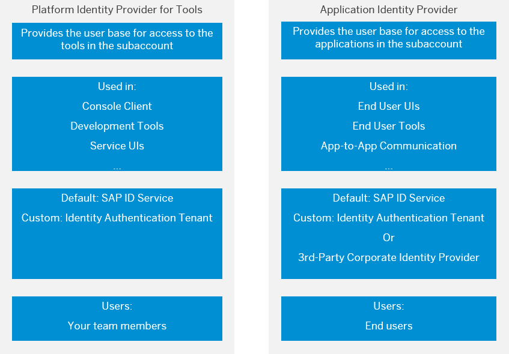

<!-- loio80edbe70b8f3478d8a59c21a91a47aa6 -->

# Platform Identity Provider

The platform identity provider is the user base for access to your SAP BTP subaccount in the Neo environment. The default user base is provided by SAP ID Service. You can switch to an Identity Authentication tenant if you want to use a custom user base.

 <a name="concept_pnx_wmb_r1b"/>

<!-- concept\_pnx\_wmb\_r1b -->

## Overview

> ### Tip:  
> **This documentation refers to SAP Business Technology Platform, Neo environment. If you are looking for documentation about other environments, see [SAP Business Technology Platform](https://help.sap.com/viewer/65de2977205c403bbc107264b8eccf4b/Cloud/en-US/6a2c1ab5a31b4ed9a2ce17a5329e1dd8.html "SAP Business Technology Platform (SAP BTP) is an integrated offering comprised of four technology portfolios: database and data management, application development and integration, analytics, and intelligent technologies. The platform offers users the ability to turn data into business value, compose end-to-end business processes, and build and extend SAP applications quickly.") :arrow_upper_right:.**

By default, the SAP BTP cockpit and console client are configured to use SAP ID Service as the **platform identity provider** \(providing the user base for subaccount members\). SAP ID Service, however, uses the SAP user base \(providing, for example, your s- or p-user\). If you want to have subaccount members from your custom user base, and use custom security configuration \(such as two-factor user authentication, or corporate user store, for example\), you can switch to a custom Identity Authentication tenant as a platform identity provider.

> ### Note:  
> There is a difference between a **platform** identity provider and **application** identity provider at SAP BTP.
> 
> The diagram below describes the basic features of platform identity providers and application identity providers, and provides a brief comparison between them.

> ### Note:  
> Changing the **platform** identity provider settings \(*Security* \> *Trust* \> *Platform Identity Provider* in the SAP BTP cockpit\) does **not** affect the **application** identity provider settings \(*Security* \> *Trust* \> *Platform Identity Provider* in the SAP BTP cockpit\) for this subaccount. See [Application Identity Provider](application-identity-provider-dc61853.md#loiodc618538d97610148155d97dcd123c24).

**Related Information**  

[Configuring Platform Identity Provider \[Feature Set A\]](configuring-platform-identity-provider-feature-set-a-c39c320.md "Use the procedures below to configure an Identity Authentication tenant as platform identity provider in your Neo subaccount in Feature Set A.")

[Configuring Platform Identity Provider \[Feature Set B\]](configuring-platform-identity-provider-feature-set-b-277c2c6.md "Use the procedures below to configure an Identity Authentication tenant as platform identity provider in your Neo subaccount in Feature Set B.")

