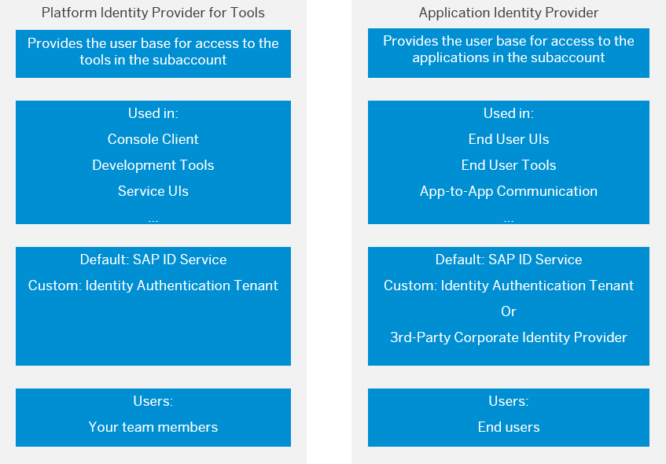

<!-- loio80edbe70b8f3478d8a59c21a91a47aa6 -->

# Platform Identity Provider for Tools

Configure the platform identity provider to be used for authentication in service and platform tools \(for example, Neo console client, Cloud Connector, SAP Git Service, and so on\). The default user base is provided by SAP ID Service. You can switch to an Identity Authentication tenant if you want to use a custom user base.

<a name="concept_pnx_wmb_r1b"/>

<!-- concept\_pnx\_wmb\_r1b -->

## Overview

> ### Note:  
> The platform identity provider for tools is *not* used for accessing the *SAP BTP cockpit*. For accessing the SAP BTP cockpit, you use the *custom identity provider for platform users* configured at *global account level*. For more information, see [Establish Trust and Federation of Custom Identity Providers for Platform Users](https://help.sap.com/viewer/65de2977205c403bbc107264b8eccf4b/Cloud/en-US/c36898473d704e07a33268c9f9d29515.html "You want to use a custom identity provider for the platform users of SAP BTP in different environments and at the different account levels: global account, directory, and subaccount. By default, platform users in multi-environment subaccounts are users in the default identity provider.") :arrow_upper_right:.

> ### Remember:  
> SAP Business Technology Platform, Neo environment will sunset on **December 31, 2028**, subject to terms of customer or partner contracts.
> 
> For more information, see SAP Note [3351844](https://me.sap.com/notes/3351844).

> ### Tip:  
> **This documentation refers to SAP Business Technology Platform, Neo environment. If you are looking for documentation about other environments, see [SAP Business Technology Platform](https://help.sap.com/docs/btp/sap-business-technology-platform/sap-business-technology-platform?version=Cloud) .**

By default, the console client, and service and platform tools are configured to use SAP ID Service as the **platform identity provider for tools** \(providing the user base for subaccount members\). SAP ID Service, however, uses the SAP user base \(providing, for example, your *s-* or *p-user*\). If you want to have subaccount members from your custom user base, and use custom security configuration \(such as two-factor user authentication, or corporate user store, for example\), you can switch to a custom Identity Authentication tenant as a platform identity provider.

> ### Note:  
> There is a difference between a **platform identity provider for tools** and **application identity provider** at SAP BTP.
> 
> The diagram below describes the basic features of platform identity providers and application identity providers, and provides a brief comparison between them.

> ### Note:  
> Changing the **platform** identity provider for tools settings \(*Security* \> *Trust* \> *Platform Identity Provider for Tools* in the SAP BTP cockpit\) does **not** affect the **application** identity provider settings \(*Security* \> *Trust* \> *Application Identity Provider* in the SAP BTP cockpit\) for this subaccount. See [Application Identity Provider](application-identity-provider-dc61853.md#loiodc618538d97610148155d97dcd123c24).

The platform identity provider you configure will be used for accessing service and platform tools, such as:

-   [Console Client for the Neo Environment](../50-administration-and-ops-neo/console-client-for-the-neo-environment-7613230.md)
-   [Git Service](https://help.sap.com/docs/git-service?version=Cloud)
-   [Cloud Connector \(Neo environment\)](https://help.sap.com/docs/connectivity/sap-btp-connectivity-neo/cloud-connector-neo-environment?version=Cloud)
-   [SAP Solutions Management Service for SAP BTP](https://help.sap.com/docs/btp/sap-btp-neo-environment/configuring-access-to-sap-solution-lifecycle-management-service?version=Cloud) when BASIC \(user name and password\) authentication is used in applications
-   SAP HANA system from SAP HANA Studio \(see [Tutorial: Add an SAP HANA System](https://help.sap.com/docs/SAP_HANA_PLATFORM/52715f71adba4aaeb480d946c742d1f6/abedb1c22b0746a8a44a38b810c99b58.html)\)

<a name="task_gzt_ltv_jcc"/>

<!-- task\_gzt\_ltv\_jcc -->

### Prerequisite: Configure Trust at Global Account Level

<a name="task_gzt_ltv_jcc__context_hzt_ltv_jcc"/>

## Context

To configure an Identity Authentication tenant as a platform identity provider for you Neo subaccount, you need to have a trust configuration at *global account level* with it. For more inormation, see [Establish Trust and Federation of Custom Identity Providers for Platform Users](https://help.sap.com/viewer/65de2977205c403bbc107264b8eccf4b/Cloud/en-US/c36898473d704e07a33268c9f9d29515.html "You want to use a custom identity provider for the platform users of SAP BTP in different environments and at the different account levels: global account, directory, and subaccount. By default, platform users in multi-environment subaccounts are users in the default identity provider.") :arrow_upper_right:.

> ### Note:  
> When you configure trust at global account level, the trusted Identity Authentication tenant creates an application with the name *SAP Business Technology Platform*. All security settings in this application apply to *all Neo subaccounts*.

<a name="task_o2r_svc_lxb"/>

<!-- task\_o2r\_svc\_lxb -->

### Configure the Platform Identity Provider at Neo Subaccount Level

<a name="task_o2r_svc_lxb__steps_pjc_1wc_lxb"/>

## Procedure

1.  In your web browser, open the SAP BTP cockpit, and navigate to your Neo subaccount.

    See [Navigate in the Cockpit](https://help.sap.com/viewer/65de2977205c403bbc107264b8eccf4b/Cloud/en-US/0874895f1f78459f9517da55a11ffebd.html "Learn how to navigate to your global accounts, directories, and subaccounts in the SAP BTP cockpit.") :arrow_upper_right:.

2.  Go to *Security* \> *Trust* \> *Platform Identity Provider for Tools*.

    The screen shows the platform identity provider in use. By default, this is SAP ID Service.

3.  Choose the *Select Identity Authentication Tenant* button.

    A list of all tenants available for your current Neo subaccount appears.

4.  Select the required tenant from the list.

    The screen now shows the Identity Authentication tenant as the platform identity provider in use.

    You can reset to SAP ID Service \(using the respective button\) or change to another tenant \(if available\).

