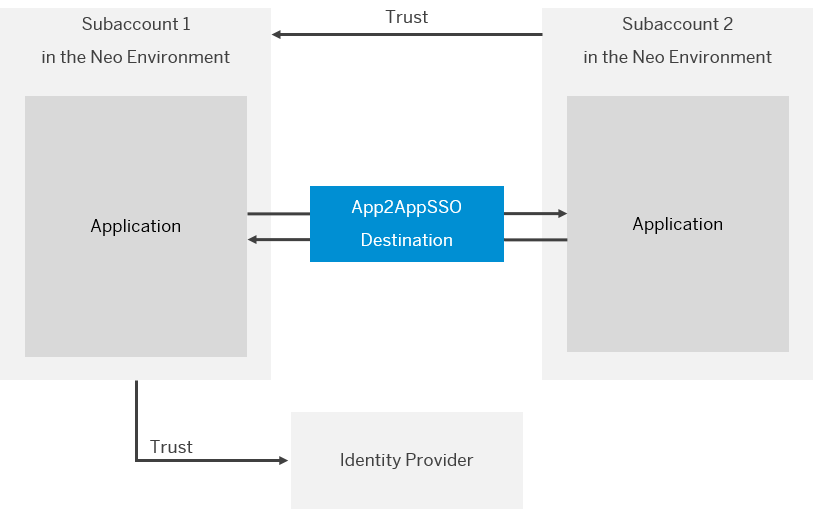
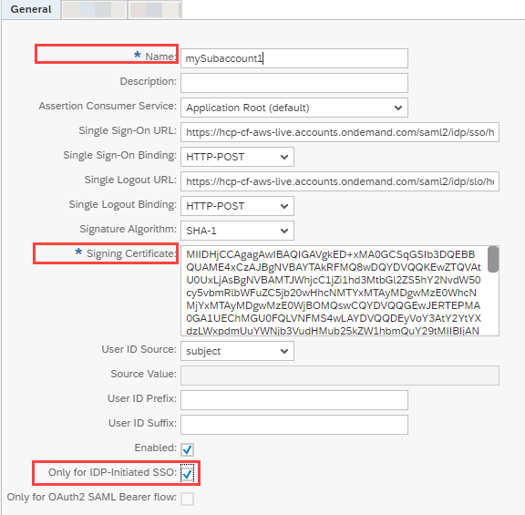
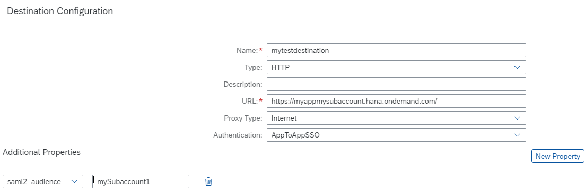

<!-- loio038c9de27e5c4867a3f13cda9e8c0823 -->

# Principal Propagation Between Neo Subaccounts

Enable an application in your subaccount \(Neo environment\) to access an application in another account \(Neo environment\) without user login / user interaction in the second application. The second application propagates its logged-in user to the first application using an AppToAppSSO destination.

> ### Remember:  
> SAP Business Technology Platform, Neo environment will sunset on **December 31, 2028**, subject to terms of customer or partner contracts.
> 
> For more information, see SAP Note [3351844](https://me.sap.com/notes/3351844).

> ### Tip:  
> **This documentation refers to SAP Business Technology Platform, Neo environment. If you are looking for documentation about other environments, see [SAP Business Technology Platform](https://help.sap.com/viewer/65de2977205c403bbc107264b8eccf4b/Cloud/en-US/6a2c1ab5a31b4ed9a2ce17a5329e1dd8.html "SAP Business Technology Platform (SAP BTP) is an integrated offering comprised of four technology portfolios: database and data management, application development and integration, analytics, and intelligent technologies. The platform offers users the ability to turn data into business value, compose end-to-end business processes, and build and extend SAP applications quickly.") :arrow_upper_right:.**

The graphic below illustrates the overall setup of the scenario.

## Contents

-   [Create Trust Between the Subaccounts](principal-propagation-between-neo-subaccounts-038c9de.md#loio059e603255fe4769bfa784701d63f7f1)

-   [Create a Destination](principal-propagation-between-neo-subaccounts-038c9de.md#loio0ed1d761ca8e4fc396189d8605dcd6bc)

<a name="loio059e603255fe4769bfa784701d63f7f1"/>

<!-- loio059e603255fe4769bfa784701d63f7f1 -->

## Create Trust Between the Subaccounts

<a name="loio059e603255fe4769bfa784701d63f7f1__prereq_tdl_tv5_41b"/>

## Prerequisites

-   You have an account with *Administrator* role in both SAP BTP subaccounts. See [Managing Member Authorizations in the Neo Environment](../50-administration-and-ops-neo/managing-member-authorizations-in-the-neo-environment-a1ab5c4.md).

-   You have deployed both applications on SAP BTP. See [Deploying and Updating Java Applications](../30-development-neo/deploying-and-updating-java-applications-e5dfbc6.md).
-   You have a *custom* local service provider configuration in both subaccounts \(this means in *cloud cockpit* \> *Security* \> *Trust* \> *Local Service Provider* \> ** you have chosen *Configuration Type* \> *Custom*\). See [Configure the Local Service Provider](application-identity-provider-dc61853.md#loiodcdfe339f94947bc96508daa686cc56d).

## Procedure

1.  Get the *Local Provider Name* and the *Signing Certificate* from the first subaccount.

    1.  In SAP BTP cockpit, choose the first subaccount. See [Navigate in the Cockpit](https://help.sap.com/viewer/65de2977205c403bbc107264b8eccf4b/Cloud/en-US/0874895f1f78459f9517da55a11ffebd.html "Learn how to navigate to your global accounts and subaccounts in the SAP BTP cockpit.") :arrow_upper_right:.

    2.  Navigate to *Security* \> *Trust* \> *Local Service Provider*.

    3.  Save into a file the values of *Local Provider Name* and *Signing Certificate*.

    4.  Make sure the value of *Principal Propagation* is set to *Enabled*.

2.  Create trust on the second subaccount.

    1.  In the SAP BTP cockpit, choose the second subaccount and navigate to the *Trust* tab.

    2.  On the *Application Identity Provider* tab, choose *Add Trusted Identity Provider*. Provide the following information:

        <table>
        <tr>
        <th valign="top">

        Field

        
        </th>
        <th valign="top">

        Description

        
        </th>
        </tr>
        <tr>
        <td valign="top">
        
        Name

        
        </td>
        <td valign="top">
        
        The *Local Provider Name* of the first subaccount, which you copied in step 1.

        
        </td>
        </tr>
        <tr>
        <td valign="top">
        
        Signing Certificate

        
        </td>
        <td valign="top">
        
        The *Signing Certificate* of the first subaccount, which you copied in step 1.

        
        </td>
        </tr>
        </table>
        
    3.  Make sure the checkbox *Only for IDP-Initiated SSO* is marked.

    4.  Save the changes.

    

<a name="loio0ed1d761ca8e4fc396189d8605dcd6bc"/>

<!-- loio0ed1d761ca8e4fc396189d8605dcd6bc -->

## Create a Destination

<a name="loio0ed1d761ca8e4fc396189d8605dcd6bc__context_d1h_yyv_m1b"/>

## Context

Connect the first subaccount, to the second subaccount by describing the source connection properties in a destination. For more information see [Modeling Destinations](../30-development-neo/modeling-destinations-37bddb4.md).

## Procedure

1.  Choose the first subaccount and navigate to *Connectivity* \> *Destinations*.

2.  Choose the *New Destination* tab.

3.  Provide the following information:

    <table>
    <tr>
    <th valign="top">

    Field

    
    </th>
    <th valign="top">

    Description

    
    </th>
    </tr>
    <tr>
    <td valign="top">
    
    Name

    
    </td>
    <td valign="top">
    
    Technical name of the destination. It can be used later on to get an instance of that destination. It should be unique for the current application.

    > ### Note:  
    > The name can contain only alphanumeric characters, underscores, and dashes. The maximum length is 200 characters.

    
    </td>
    </tr>
    <tr>
    <td valign="top">
    
    URL

    
    </td>
    <td valign="top">
    
    The URL of the protected resource that you want to access \(the first application\). See [Configuring Application URLs](../50-administration-and-ops-neo/configuring-application-urls-7ceeaa5.md).

    Example: `https://myappmysubaccount.hana.ondemand.com/`

    
    </td>
    </tr>
    <tr>
    <td valign="top">
    
    Authentication

    
    </td>
    <td valign="top">
    
    AppToAppSSO

    
    </td>
    </tr>
    </table>
    
4.  Choose the *New Property* button. In the fields that appear, fill in: *saml2\_audience*and enter the *Local Provider Name* of the second subaccount.

5.  Save the changes.

    

6.  Use the destination, as described in the [Application-to-Application SSO Authentication](https://help.sap.com/viewer/b865ed651e414196b39f8922db2122c7/Cloud/en-US/e022a5eebaec4dbbabef7f5d60e13dd4.html "") :arrow_upper_right: documentation.

<a name="loio0ed1d761ca8e4fc396189d8605dcd6bc__result_l2k_nv1_p1b"/>

## Results

Using application-to-application communication you can now propagate the logged-in user of the second application.

**Related Information**  

[Application-to-Application SSO Authentication](https://help.sap.com/viewer/b865ed651e414196b39f8922db2122c7/Cloud/en-US/e022a5eebaec4dbbabef7f5d60e13dd4.html "") :arrow_upper_right:

[Principal Propagation](https://help.sap.com/viewer/b865ed651e414196b39f8922db2122c7/Cloud/en-US/d4d3e1e9b2dd44318b49a4812cd51383.html "Forward the identity of cloud users to an on-premise system to enable single sign-on (Neo environment).") :arrow_upper_right:

