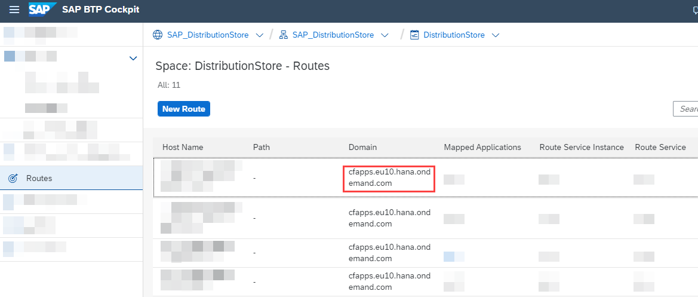
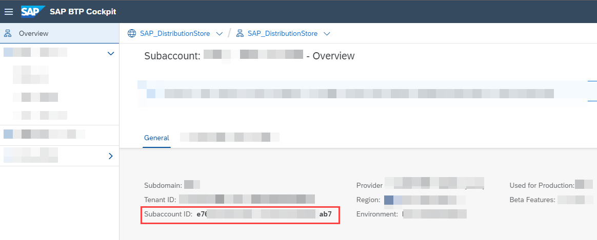
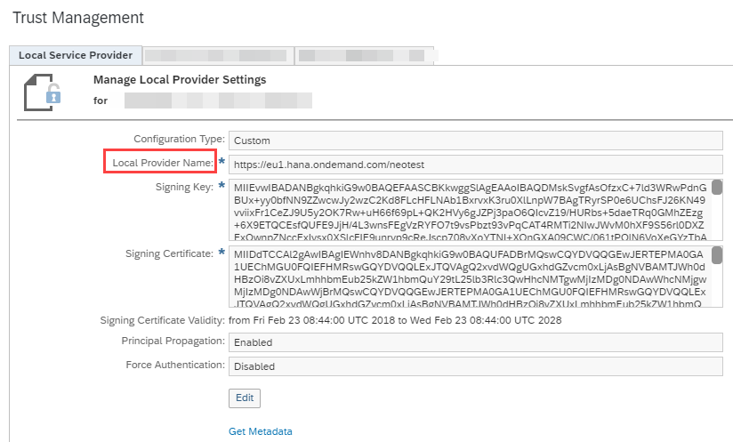
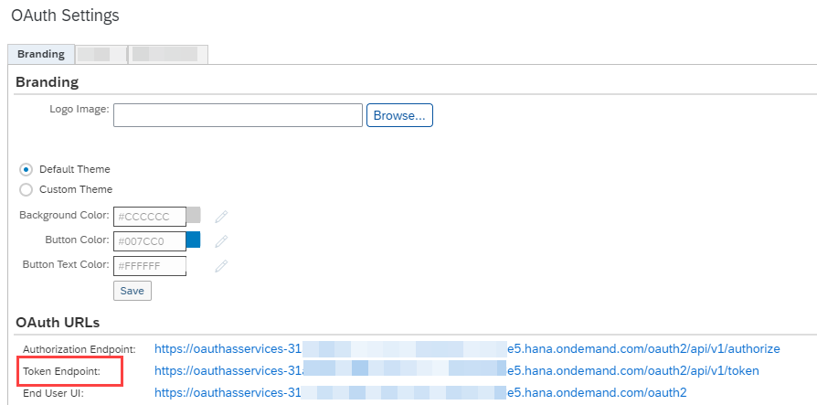
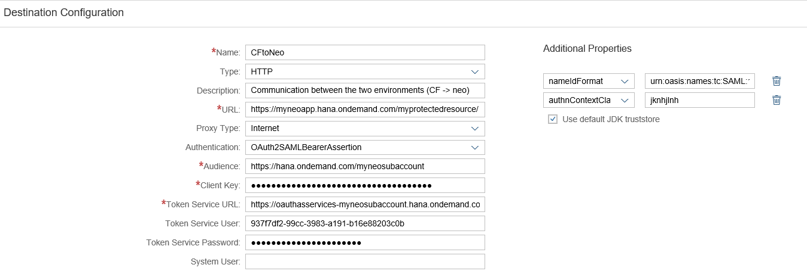

<!-- loio391e9ed92ff448e0b4bacac69f853516 -->

# Principal Propagation from the Cloud Foundry to the Neo Environment

Enable an application in your subaccount in the Cloud Foundry environment to access an OAuth-protected application in a subaccount in the Neo environment without user login \(and user interaction\) in the second application. For this scenario to work, the two subaccounts need to be in mutual trust, and in trust with the same identity provider. The first application will propagate its logged-in user to the second application using an OAuth2SAMLBearer destination.

> ### Tip:  
> **This documentation refers to SAP Business Technology Platform, Neo environment. If you are looking for documentation about other environments, see [SAP Business Technology Platform](https://help.sap.com/viewer/65de2977205c403bbc107264b8eccf4b/Cloud/en-US/6a2c1ab5a31b4ed9a2ce17a5329e1dd8.html "SAP Business Technology Platform (SAP BTP) is an integrated offering comprised of four technology portfolios: database and data management, application development and integration, analytics, and intelligent technologies. The platform offers users the ability to turn data into business value, compose end-to-end business processes, and build and extend SAP applications quickly.") :arrow_upper_right:.**

The graphic below illustrates the overall setup of the scenario.

<a name="loio391e9ed92ff448e0b4bacac69f853516__prereq"/>

## Prerequisites

-   You have a user account with *Administrator* role in both SAP BTP subaccounts. See [Managing Member Authorizations in the Neo Environment](../50-administration-and-ops-neo/managing-member-authorizations-in-the-neo-environment-a1ab5c4.md).

-   You have a *custom* local service provider configuration \(this means in *cloud cockpit* \> *Security* \> *Trust* \> *Local Service Provider* \> ** you have chosen *Configuration Type* \> *Custom*\) in your subaccount in the Neo environment. See [Configure the Local Service Provider](application-identity-provider-dc61853.md#loiodcdfe339f94947bc96508daa686cc56d).
-   Both accounts have a trust configuration to the same identity provider. See:
    -    [Configure Trust to the SAML Identity Provider](application-identity-provider-dc61853.md#loiob6cfc4bb4bff4ace90afc71b0962fcb5) \(for the Neo environment\)
    -   [Establish Trust with Any SAML 2.0 Identity Provider in a Subaccount](https://help.sap.com/viewer/65de2977205c403bbc107264b8eccf4b/Cloud/en-US/2ce3938c66d94479848bff3090999027.html#loio8a213ea1a8664e6b96c0593e71339e0e "You want to use an SAML 2.0 identity provider. This is where the business users for SAP BTP are stored.") :arrow_upper_right: \(for the Cloud Foundry environment\)

-   The application in the Neo environment is protected using OAuth 2.0. See [OAuth 2.0 Service](oauth-2-0-service-e526ca3.md).
-   The application in the Cloud Foundry environment is bound to an instance of the following services:
    -   *Destination Service*. See [Create and Bind a Destination Service Instance](https://help.sap.com/viewer/cca91383641e40ffbe03bdc78f00f681/Cloud/en-US/9fdad3cad92e4b63b73d5772014b380e.html).
    -   *xsuaa*

-   You have deployed both applications, each in the corresponding subaccount.

> ### Note:  
> All configuration steps described in this tutorial are done using the cloud cockpit.

<a name="loio391e9ed92ff448e0b4bacac69f853516__section_tbq_kzx_rcb"/>

## Contents

-   [Create Trust Between the Subaccounts](principal-propagation-from-the-cloud-foundry-to-the-neo-environment-391e9ed.md#loio5ff035ce421c4d6c80f0cff028c7df1a)
-   [Create an OAuth Client](principal-propagation-from-the-cloud-foundry-to-the-neo-environment-391e9ed.md#loiofb9a98644f674d7481e179f97ae26c72)
-   [Create a Destination](principal-propagation-from-the-cloud-foundry-to-the-neo-environment-391e9ed.md#loio3b8d026b714240ff89ae73cf250af799)

 <a name="loio5ff035ce421c4d6c80f0cff028c7df1a"/>

<!-- loio5ff035ce421c4d6c80f0cff028c7df1a -->

## Create Trust Between the Subaccounts

Exchange keys and certificates between the subaccounts, and configure trust between them. This will enable the subaccounts to communicate using HTTP destinations.

## Procedure

1.  In the cloud cockpit, log on with the Administrator user.

2.  Save locally the identifying X509 certificate of the subaccount in the Cloud Foundry environment.

    1.  In SAP BTP cockpit, navigate to the subaccount in the Cloud Foundry environment.

    2.  Navigate to *Connectivity* \> *Destinations*.

    3.  Choose *Download Trust* and save the X509 certificate identifying this subaccount.

3.  In the subaccount in the Neo environment, create trust to the subaccount in the Cloud Foundry environment.

    1.  Navigate to the subaccount in the Neo environment.

    2.  Navigate to *Security* \> *Trust* \> *Application Identity Provider*.

    3.  Choose *Add Trusted Identity Provider* and configure the new trust configuration settings:

        -   In the *Name* field, enter the following:

            `<your Cloud Foundry domain host>/<Cloud Foundry subaccount ID>`

            > ### Tip:  
            > You can view the **Cloud Foundry domain host** in *cockpit* \> *<your global account\>* \> *<your subaccount\>* \> *<your space\>* \> *Routes*.

            

            > ### Tip:  
            > You can view the **subaccount ID** in *cockpit* \> *<your global account\>* \> *<your subaccount\>* \> *Overview*.

            

        -   In the *Signing Certificate* field, enter the X509 certificate of the Cloud Foundry account.

            > ### Note:  
            > Make sure you remove the `BEGIN CERTIFICATE` and `END CERTIFICATE` parts.

        -   Mark the *Only for IDP-initiated SSO* option.

    4.  Save the new trust configuration.

 <a name="loiofb9a98644f674d7481e179f97ae26c72"/>

<!-- loiofb9a98644f674d7481e179f97ae26c72 -->

## Create an OAuth Client

You need an OAuth client to get an access token for the OAuth-protected resources in the application in the Neo environment.

<a name="loiofb9a98644f674d7481e179f97ae26c72__context_mlr_kfn_fsb"/>

## Context

For more information about working with OAuth clients, see [Create an OAuth Client](principal-propagation-from-the-cloud-foundry-to-the-neo-environment-391e9ed.md#loiofb9a98644f674d7481e179f97ae26c72).

## Procedure

1.  In the cockpit, navigate to the subaccount in the Neo environment.

2.  Navigate to *Security* \> *OAuth* \> *Clients*, and choose *Register New Client*.

3.  Create an OAuth client with the following configuration settings:

    -   *Name* - the OAuth client name. You will need to provide this name as value of the *Token Service User* property of the destination below.
    -   *Authorization Grant* - choose the *Authorization Code* option.
    -   Mark the *Confidential* option, and provide a secret \(password\).

4.  Save the client.

    > ### Note:  
    > When creating the required **OAuthSAMLBearer destination** later, you will need the following information from the OAuth client:
    > 
    > -   *ID*
    > -   *Secret*

 <a name="loio3b8d026b714240ff89ae73cf250af799"/>

<!-- loio3b8d026b714240ff89ae73cf250af799 -->

## Create a Destination

<a name="loio3b8d026b714240ff89ae73cf250af799__context_d1h_yyv_m1b"/>

## Context

Connect the two subaccounts by describing the connection properties in a destination. For more information, see [Modeling Destinations](../30-development-neo/modeling-destinations-37bddb4.md).

<a name="loio3b8d026b714240ff89ae73cf250af799__steps_xlw_tjx_rcb"/>

## Procedure

1.  Choose the subaccount in the Cloud Foundry environment, and navigate to *Connectivity* \> *Destinations*.

2.  Choose *New Destination*.

3.  In the new destination, provide the following information:

    <table>
    <tr>
    <th valign="top">

    Field

    
    </th>
    <th valign="top">

    Description

    
    </th>
    </tr>
    <tr>
    <td valign="top">
    
        Name

    
    </td>
    <td valign="top">
    
        Technical name of the destination. It can be used later on to get an instance of that destination. It must be unique for the global account.

    
    </td>
    </tr>
    <tr>
    <td valign="top">
    
        Description

    
    </td>
    <td valign="top">
    
        Free-text description.

    
    </td>
    </tr>
    <tr>
    <td valign="top">
    
        Type

    
    </td>
    <td valign="top">
    
        HTTP

    
    </td>
    </tr>
    <tr>
    <td valign="top">
    
        URL

    
    </td>
    <td valign="top">
    
        The URL of the protected resource in the Neo environment.

    Example: `https://myneoapp.hana.ondemand.com/myprotectedresource/`

    
    </td>
    </tr>
    <tr>
    <td valign="top">
    
        Authentication

    
    </td>
    <td valign="top">
    
        OAuth2SAMLBearerAssertion

    
    </td>
    </tr>
    <tr>
    <td valign="top">
    
        Proxy Type

    
    </td>
    <td valign="top">
    
        Internet

    
    </td>
    </tr>
    <tr>
    <td valign="top">
    
        Audience

    
    </td>
    <td valign="top">
    
        The value of the local service provider name in the subaccount in the Neo environment.

    Copy the value from *cockpit* \> *<your Neo subaccount\>* \> *Security* \> *Trust* \> *Local Service Provider* \> *Local Service Provider Name*.

    

    
    </td>
    </tr>
    <tr>
    <td valign="top">
    
        Client Key

    
    </td>
    <td valign="top">
    
        The ID of the OAuth client for the application in the Neo environment.

    
    </td>
    </tr>
    <tr>
    <td valign="top">
    
        Token Service URL

    
    </td>
    <td valign="top">
    
        Copy the value of *Token Endpoint* from the following place: *cockpit* \> *<your Neo subaccount\>* \> *Security* \> *OAuth* \> *Branding*.

    

    
    </td>
    </tr>
    <tr>
    <td valign="top">
    
        Token Service User

    
    </td>
    <td valign="top">
    
        The ID of the OAuth client for the application in the Neo environment.

    
    </td>
    </tr>
    <tr>
    <td valign="top">
    
        Token Service Password

    
    </td>
    <td valign="top">
    
        The secret from the OAuth client.

    
    </td>
    </tr>
    <tr>
    <td valign="top">
    
        System User

    
    </td>
    <td valign="top">
    
        Empty.

    
    </td>
    </tr>
    <tr>
    <td valign="top">
    
        authnContextClassRef

    
    </td>
    <td valign="top">
    
         *urn:oasis:names:tc:SAML:2.0:ac:classes:PreviousSession* 

    
    </td>
    </tr>
    <tr>
    <td valign="top">
    
        nameIdFormat

    
    </td>
    <td valign="top">
    
         *urn:oasis:names:tc:SAML:1.1:nameid-format:unspecified* if the user ID will be propagated to the Neo application or *nameIdFormat = urn:oasis:names:tc:SAML:1.1:nameid-format:emailAddress* if the user email will be propagated to the Neo application.

    
    </td>
    </tr>
    </table>
    
    

4.  Save the changes.

