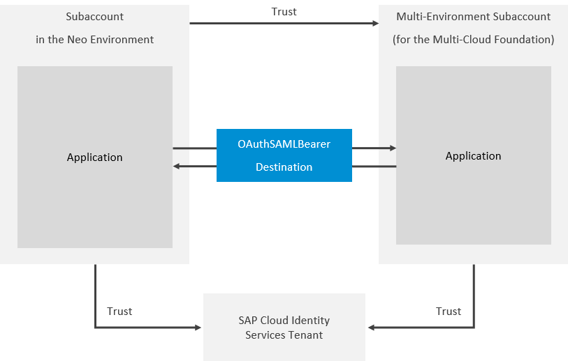

<!-- loio6e194f8e919a40bab7e39cd992677cb7 -->

# Principal Propagation from the Neo to the Cloud Foundry Environment

Enable an application in your subaccount in the Neo environment to access another application in a subaccount in the Cloud Foundry environment without user login \(and user interaction\) in the second application. For this scenario to work, the two subaccounts need to be in mutual trust, and in trust with the same Identity Authentication tenant. The second application will propagate its logged-in user to the first application using an OAuth2SAMLBearer destination.

> ### Remember:  
> SAP Business Technology Platform, Neo environment will sunset on **December 31, 2028**, subject to terms of customer or partner contracts.
> 
> For more information, see SAP Note [3351844](https://me.sap.com/notes/3351844).

> ### Tip:  
> **This documentation refers to SAP Business Technology Platform, Neo environment. If you are looking for documentation about other environments, see [SAP Business Technology Platform](https://help.sap.com/viewer/65de2977205c403bbc107264b8eccf4b/Cloud/en-US/6a2c1ab5a31b4ed9a2ce17a5329e1dd8.html "SAP Business Technology Platform (SAP BTP) is an integrated offering comprised of four technology portfolios: database and data management, application development and integration, analytics, and intelligent technologies. The platform offers users the ability to turn data into business value, compose end-to-end business processes, and build and extend SAP applications quickly.") :arrow_upper_right:.**


The graphic below illustrates the overall setup of the scenario.




<a name="loio6e194f8e919a40bab7e39cd992677cb7__prereq"/>

## Prerequisites

-   You have a user account with *Administrator* role in both SAP BTP subaccounts. See [Managing Member Authorizations in the Neo Environment](../50-administration-and-ops-neo/managing-member-authorizations-in-the-neo-environment-a1ab5c4.md).

-   You have a custom local service provider configuration \(signing keys and certificates, etc.\) in your subaccount in the Neo environment. See [Configure the Local Service Provider](application-identity-provider-dc61853.md#loiodcdfe339f94947bc96508daa686cc56d).
-   Both accounts have a trust configuration to the same Identity Authentication tenant. See:
    -   [Identity Authentication Tenant as an Application Identity Provider](identity-authentication-tenant-as-an-application-identity-provider-d3df5b4.md) \(for the Neo environment\)
    -   [Manually Establish Trust and Federation Between SAP Authorization and Trust Management Service and Identity Authentication](https://help.sap.com/viewer/65de2977205c403bbc107264b8eccf4b/Cloud/en-US/7c6aa87459764b179aeccadccd4f91f3.html#loio7c6aa87459764b179aeccadccd4f91f3 "Use your SAP Cloud Identity Services - Identity Authentication tenant as an identity provider or a proxy to your own identity provider hosting your business users. Exchange SAML metadata to establish trust with the Identity Authentication tenant and then register your subaccount with the tenant. To complete federation, maintain the federation attributes of the user groups.") :arrow_upper_right: \(for the Cloud Foundry environment\)

-   You have developed and deployed both applications, each in the corresponding subaccount.

> ### Note:  
> All configuration steps described in this tutorial are done using the cloud cockpit.


<a name="loio6e194f8e919a40bab7e39cd992677cb7__section_fkt_rx2_gcb"/>

## Requirements to the Application in the Neo Environment

The application is running on a Java Web Tomcat 8 runtime.

In the source code, the application needs to reference the destination that we are about to create as a later step. The sample source code below illustrates a complete servlet working with the destination with name `pptest`.

```
package com.sap.cloud.samples;

import java.io.BufferedReader;
import java.io.IOException;
import java.io.InputStreamReader;
import java.net.URL;
import java.net.URLConnection;
import java.security.KeyStore;
import java.util.List;

import javax.naming.Context;
import javax.naming.InitialContext;
import javax.net.ssl.HttpsURLConnection;
import javax.net.ssl.SSLContext;
import javax.net.ssl.SSLSocketFactory;
import javax.net.ssl.TrustManagerFactory;
import javax.servlet.ServletException;
import javax.servlet.annotation.WebServlet;
import javax.servlet.http.HttpServlet;
import javax.servlet.http.HttpServletRequest;
import javax.servlet.http.HttpServletResponse;

import org.slf4j.Logger;
import org.slf4j.LoggerFactory;

import com.sap.core.connectivity.api.authentication.AuthenticationHeader;
import com.sap.core.connectivity.api.authentication.AuthenticationHeaderProvider;
import com.sap.core.connectivity.api.configuration.ConnectivityConfiguration;
import com.sap.core.connectivity.api.configuration.DestinationConfiguration;

@WebServlet("/neotocf")
public class NeoToCF extends HttpServlet {
  private static final long serialVersionUID = 1L;
  private static final Logger LOGGER = LoggerFactory.getLogger(NeoToCF.class);
  private static final String ON_PREMISE_PROXY = "OnPremise";

  protected void doGet(HttpServletRequest request, HttpServletResponse response)
           throws ServletException, IOException {
    response.getWriter().println("Served to: " + request.getUserPrincipal().getName());

    try {		
      // Look up the connectivity configuration API
      Context ctx = new InitialContext();
      ConnectivityConfiguration configuration = (ConnectivityConfiguration) ctx
					.lookup("java:comp/env/connectivityConfiguration");

      // Get destination configuration
      DestinationConfiguration destConfiguration = configuration.getConfiguration("pptest");

      if (destConfiguration == null) {
        response.sendError(HttpServletResponse.SC_INTERNAL_SERVER_ERROR,
						String.format(
								"Destination %s is not found. Hint:" +
                                       " Make sure to have the destination configured.",
								"pptest"));
				return;
      }
			
      AuthenticationHeaderProvider authHeaderProvider = (AuthenticationHeaderProvider) ctx
					.lookup("java:comp/env/myAuthHeaderProvider");

      // retrieve the authorization header for OAuth SAML Bearer principal propagation
      List<AuthenticationHeader> samlBearerHeader = authHeaderProvider
					.getOAuth2SAMLBearerAssertionHeaders(destConfiguration);
      LOGGER.debug("JWT token from CF XSUAA: " + samlBearerHeader.get(1).getValue());
			
      // get the configured truststore
      KeyStore trustStore = destConfiguration.getTrustStore();
			 
      // create sslcontext
      TrustManagerFactory tmf = TrustManagerFactory.getInstance(TrustManagerFactory.getDefaultAlgorithm());
      tmf.init(trustStore);
					 
      SSLContext sslcontext = SSLContext.getInstance("TLS");
      sslcontext.init(null, tmf.getTrustManagers(), null);
      SSLSocketFactory sslSocketFactory = sslcontext.getSocketFactory();
			 
      // get the destination URL
      String value = destConfiguration.getProperty("URL");
      URL url = new URL(value);
			 
      // use the sslcontext for url connection
      URLConnection urlConnection = url.openConnection();
      ((HttpsURLConnection) urlConnection).setSSLSocketFactory(sslSocketFactory);
					
      urlConnection.setRequestProperty(samlBearerHeader.get(0).getName(), samlBearerHeader.get(0).getValue());
      urlConnection.setRequestProperty(samlBearerHeader.get(1).getName(), samlBearerHeader.get(1).getValue());
			
      urlConnection.connect();

      response.getWriter().println("Received from CF:");
			
      BufferedReader in = new BufferedReader(new InputStreamReader(
      urlConnection.getInputStream()));
      String inputLine;
      while ((inputLine = in.readLine()) != null) 
				response.getWriter().append(inputLine);
			in.close();
    } catch (Exception e) {
        // Connectivity operation failed
        String errorMessage = e.getMessage();
        LOGGER.error("Connectivity operation failed", e);
        response.sendError(HttpServletResponse.SC_INTERNAL_SERVER_ERROR, errorMessage);
    }
  }

  protected void doPost(HttpServletRequest request, HttpServletResponse response)
			throws ServletException, IOException {
    doGet(request, response);
  }
}
```


<a name="loio6e194f8e919a40bab7e39cd992677cb7__section_p54_mz2_gcb"/>

## Requirements to the Application in the Cloud Foundry Environment

In the Cloud Foundry environment, you need an application following the XSA security model \(protected with SAML, UAA service binding using JWT token needed, roles configured in the *xs-security.json*\).

See:

-   [Application Router](https://help.sap.com/viewer/65de2977205c403bbc107264b8eccf4b/Cloud/en-US/01c5f9ba7d6847aaaf069d153b981b51.html "The application router is the single point-of-entry for an application running in the Cloud Foundry environment on SAP BTP. The application router is used to serve static content, authenticate users, rewrite URLs, and forward or proxy requests to other micro services while propagating user information.") :arrow_upper_right:
-   [Building Roles and Role Collections for Applications](https://help.sap.com/viewer/65de2977205c403bbc107264b8eccf4b/Cloud/en-US/eaa6a26291914b348e875a00b6beb729.html "As an administrator, you can maintain application roles and role collections which can be used in user management.") :arrow_upper_right:

> ### Note:  
> You can use the [XSA Security Sample Application](https://github.com/raepple/cfsectest) in GitHub \(instructions and code\) to develop and deploy an application compliant with the above requirements.

<a name="loioa4025821716e443a9091c2fa180415ab"/>

<!-- loioa4025821716e443a9091c2fa180415ab -->

## Create a Destination


<a name="loioa4025821716e443a9091c2fa180415ab__prereq_wb2_jdf_gcb"/>

## Prerequisites

Before you create the required destination, you need to note down a few properties that will be used as values in the destination settings.

1.  In the cloud cockpit, navigate to the subaccount in the Cloud Foundry environment.
2.  Navigate to the application router.
3.  Enter the *Environment Variables* section.
4.  Note down somewhere the values of the following properties:
    -   clientid
    -   clientsecret
    -   url


<a name="loioa4025821716e443a9091c2fa180415ab__context_d1h_yyv_m1b"/>

## Context

Connect the first subaccount to the second subaccount by describing the source connection properties in a destination. For more information see [Modeling Destinations](../30-development-neo/modeling-destinations-37bddb4.md).


## Procedure

1.  Choose the global account and navigate to *Connectivity* \> *Destinations*.

2.  Choose *New Destination*.

3.  In the new destination, provide the following information:


    <table>
    <tr>
    <th valign="top">

    Field
    
    </th>
    <th valign="top">

    Description
    
    </th>
    </tr>
    <tr>
    <td valign="top">
    
    Name
    
    </td>
    <td valign="top">
    
    Technical name of the destination. It can be used later on to get an instance of that destination. It must be unique for the global account.

    > ### Note:  
    > For the purposes of the example listed in this document, use *pptest* as value.


    
    </td>
    </tr>
    <tr>
    <td valign="top">
    
    URL
    
    </td>
    <td valign="top">
    
    The URL of the protected resource in the Cloud Foundry environment. See [Configuring Application URLs](../50-administration-and-ops-neo/configuring-application-urls-7ceeaa5.md).

    Example: `https://<tenant-specific-route-for-your-business-app>.cfapps.eu10.hana.ondemand.com/`
    
    </td>
    </tr>
    <tr>
    <td valign="top">
    
    Authentication
    
    </td>
    <td valign="top">
    
    OAuth2SAMLBearerAssertion
    
    </td>
    </tr>
    <tr>
    <td valign="top">
    
    Proxy Type
    
    </td>
    <td valign="top">
    
    Internet
    
    </td>
    </tr>
    <tr>
    <td valign="top">
    
    Audience
    
    </td>
    <td valign="top">
    
    Copy the value of `entityID` property of the SAML 2.0 metadata representing your subaccount in the Cloud Foundry environment.

    > ### Tip:  
    > You can open the metadata of the subaccount in the Cloud Foundry environment using the following URL:
    > 
    > `https://<your subaccount's subdomain>.authentication.<region host>/saml/metadata`
    > 
    > Example:
    > 
    > `https://demo.authentication.eu10.hana.ondemand.com/saml/metadata`
    > 
    > For the `<region host>`, see [Regions and API Endpoints Available for the Cloud Foundry Environment](https://help.sap.com/viewer/65de2977205c403bbc107264b8eccf4b/Cloud/en-US/f344a57233d34199b2123b9620d0bb41.html "") :arrow_upper_right:.

    Example of audience/entityID:

    `demo.aws-live-eu10`
    
    </td>
    </tr>
    <tr>
    <td valign="top">
    
    Client Key
    
    </td>
    <td valign="top">
    
    In the cloud cockpit, navigate to the application in the Cloud Foundry environment \(*<path to your subaccount\>* \> *Spaces* \> *<your space\>* \> *Applications* \> *<your application\>*\). Open *Environment Variables*. Copy the value of the *clientid* property in *VCAP\_SERVICES* \> *xsuaa* \> *credentials*.
    
    </td>
    </tr>
    <tr>
    <td valign="top">
    
    Token Service URL
    
    </td>
    <td valign="top">
    
    Get the **token service URL** from the SAML 2.0 metadata representing your subaccount in the Cloud Foundry environment. The **token service URL** is defined in the `Location` attribute of the element marked as `AssertionConsumerService`, like this :

    <code>&lt;md:AssertionConsumerService Location="<b>&lt;Token Service URL&gt;</b>" Binding="urn:oasis:names:tc:SAML:2.0:bindings:URI" index="1"/&gt;</code>

    > ### Tip:  
    > You can open the metadata of the subaccount in the Cloud Foundry envirnoment using the following URL:
    > 
    > `https://<your subaccount's subdomain>.authentication.<region host>/saml/metadata`
    > 
    > Example:
    > 
    > `https://demo.authentication.eu10.hana.ondemand.com/saml/metadata`
    > 
    > For the `<region host>`, see [Regions and API Endpoints Available for the Cloud Foundry Environment](https://help.sap.com/viewer/65de2977205c403bbc107264b8eccf4b/Cloud/en-US/f344a57233d34199b2123b9620d0bb41.html "") :arrow_upper_right:.

    Example of token service URL:

    `https://demo.authentication.eu10.hana.ondemand.com/oauth/token/alias/demo.aws-live-eu10`
    
    </td>
    </tr>
    <tr>
    <td valign="top">
    
    Token Service User
    
    </td>
    <td valign="top">
    
    In the cloud cockpit, navigate to the application in the Cloud Foundry environment \(*<path to your subaccount\>* \> *Spaces* \> *<your space\>* \> *Applications* \> *<your application\>*\). Open *Environment Variables*. Copy the value of the *clientid* property in *VCAP\_SERVICES* \> *xsuaa* \> *credentials*.
    
    </td>
    </tr>
    <tr>
    <td valign="top">
    
    Token Service Password
    
    </td>
    <td valign="top">
    
    In the cloud cockpit, navigate to the application in the Cloud Foundry environment \(*<path to your subaccount\>* \> *Spaces* \> *<your space\>* \> *Applications* \> *<your application\>*\). Open *Environment Variables*. Copy the value of the *clientsecret* property in *VCAP\_SERVICES* \> *xsuaa* \> *credentials*.
    
    </td>
    </tr>
    <tr>
    <td valign="top">
    
    System User
    
    </td>
    <td valign="top">
    
    Empty.
    
    </td>
    </tr>
    </table>
    
4.  Save the changes.


<a name="loio561b0623e9a34a1c9bfc20efa1e773c5"/>

<!-- loio561b0623e9a34a1c9bfc20efa1e773c5 -->

## Create Trust Between the Subaccounts


## Procedure

1.  In the cloud cockpit, log on with the Administrator user.

2.  Save locally the service provider metadata of the subaccount in the Neo environment.

    1.  In SAP BTP cockpit, navigate to the subaccount in the Neo environment. See [Navigate in the Cockpit](https://help.sap.com/viewer/65de2977205c403bbc107264b8eccf4b/Cloud/en-US/0874895f1f78459f9517da55a11ffebd.html "Learn how to navigate to your global accounts and subaccounts in the SAP BTP cockpit.") :arrow_upper_right:

    2.  Navigate to *Security* \> *Trust* \> *Local Service Provider*.

    3.  Choose *Get Metadata* and save the metadata file representing this subaccount.


3.  In the subaccount in the Cloud Foundry environment, create trust to the subaccount in the Neo environment.

    1.  Navigate to the subaccount in the Cloud Foundry environment.

    2.  Navigate to *Security* \> *Trust Configuration*

    3.  Choose *New Trust Configuration*.

    4.  In the *Metadata* field, choose the *Upload* button.

    5.  Upload the service provider metadata file representing the subaccount in the Neo environment.

    6.  Save the new trust configuration.


    After this procedure, you can use the security context from the application in the Neo environment to the application in the Cloud Foundry environment. The assigned groups from the Neo environment can be used as role collections in the Cloud Foundry environment.


