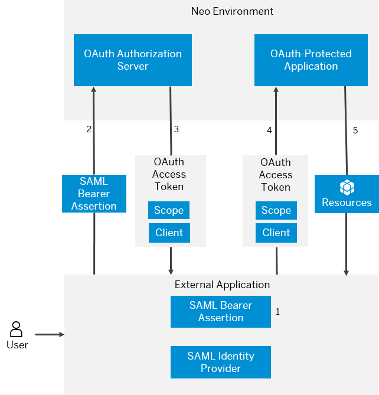

<!-- loio310f39e504024079933066db8b6c6d00 -->

# Principal Propagation to OAuth-Protected Applications

Propagate users from external applications with SAML identity federation to OAuth-protected applications running in the Neo environment of SAP BTP. Exchange the user ID and attributes from a SAML assertion for an OAuth access token, and use the access token to access the OAuth-protected application.


## Prerequisites

-   You have an application external to SAP BTP. The application is integrated with a third-party library or system functioning as a SAML identity provider. That application has a SAML assertion for each authenticated user.

    > ### Note:  
    > How the external application and its SAML identity provider work together and communicate is outside the scope of this documentation. They can be separate applications, or the external application may be using a library integrated in it.

    > ### Note:  
    > If you are using a separate third-party identity provider system for this scenario, make sure you have configured correctly trust between the external application and the identity provider system. Refer to the identity provider vendor's documentation for details.

-   You have configured SAP BTP for identity federation. See [Configure the Local Service Provider](application-identity-provider-dc61853.md#loiodcdfe339f94947bc96508daa686cc56d).
-   You have developed an OAuth-protected application. See [OAuth 2.0 Authorization Code Grant](oauth-2-0-authorization-code-grant-b7b5893.md).
-   You have deployed the OAuth-protected application at SAP BTP. See [Deploying and Updating Java Applications](../30-development-neo/deploying-and-updating-java-applications-e5dfbc6.md).


## Context

> ### Tip:  
> **This documentation refers to SAP Business Technology Platform, Neo environment. If you are looking for documentation about other environments, see [SAP Business Technology Platform](https://help.sap.com/viewer/65de2977205c403bbc107264b8eccf4b/Cloud/en-US/6a2c1ab5a31b4ed9a2ce17a5329e1dd8.html "SAP Business Technology Platform (SAP BTP) is an integrated offering comprised of four technology portfolios: database and data management, application development and integration, analytics, and intelligent technologies. The platform offers users the ability to turn data into business value, compose end-to-end business processes, and build and extend SAP applications quickly.") :arrow_upper_right:.**

This scenario follows the [SAML 2.0 Profile for OAuth 2.0 Client Authentication and Authorization Grants](https://tools.ietf.org/html/rfc7522) specification. The scenario is based on exchanging the **SAML \(bearer\) assertion** from the third-party identity provider for an **OAuth access token** from the SAP BTP authorization server. Using the access token, the external application can access the OAuth-protected application.

The graphic below illustrates the scenario implemented in terms of SAP BTP.



1.  An external application has a SAML assertion on behalf of a successfully logged user. The application needs to proparate that user and its relevant information \(attributes, privileges, and so on\) to the OAuth-protected application running at SAP BTP.

2.  The external application passes the SAML assertion to SAP BTP.

    To access the OAuth-protected application at SAP BTP, however, the external application needs an OAuth 2.0 access token, not a SAML assertion.

3.  If the SAML assertion contains all required information \(see the procedure below\) SAP BTP generates the corresponding access token. In this way, the external application can act on behalf of the user authenticated by the identity provider, within its granted privileges at SAP BTP, and within the time limits of the access token.

4.  The external application passes the received access token to the OAuth-protected application at SAP BTP.
5.  If the access token is correct and the user has the required privileges, the OAuth-protected application returns the requested resources.


## Procedure

1.  Configure SAP BTP for trust with the SAML identity provider. See [Configure Trust to the SAML Identity Provider](application-identity-provider-dc61853.md#loiob6cfc4bb4bff4ace90afc71b0962fcb5).

2.  Register the external application as an OAuth client in SAP BTP. See [Register an OAuth Client](register-an-oauth-client-61d8095.md).

3.  Make sure the SAML \(bearer\) assertion that the external application presents contains the following information:


    <table>
    <tr>
    <th valign="top">

    SAML Assertion Element


    
    </th>
    <th valign="top">

    Value Description


    
    </th>
    <th valign="top">

    Example


    
    </th>
    </tr>
    <tr>
    <td valign="top">
    
        Name ID


    
    </td>
    <td valign="top">
    
        The authenticated user ID.


    
    </td>
    <td valign="top">
    
        ```
    
    <saml:NameID 
             Format="urn:oasis:names:tc:SAML:1.1:nameid format:unspecified"
             xmlns:saml="urn:oasis:names:tc:SAML:2.0:assertion">p12356789
    </saml:NameID>
    ```


    
    </td>
    </tr>
    <tr>
    <td valign="top">
    
        Audience


    
    </td>
    <td valign="top">
    
        The local service provider name for your SAP BTP account \(in *Cockpit* \> *Security* \> *Trust* \> *Local Service Provider* \> *Local Provider Name*\).

    If you are using the default identity provider configuration for your account, take the audience value from the table below.


    <table>
    <tr>
    <th valign="top">

    Region Host


    
    </th>
    <th valign="top">

    Description


    
    </th>
    <th valign="top">

    Required Audience Value


    
    </th>
    </tr>
    <tr>
    <td valign="top">
    
        hana.ondemand.com


    
    </td>
    <td valign="top">
    
        Productive landscape, data center Europe


    
    </td>
    <td valign="top">
    
        https://netweaver.ondemand.com


    
    </td>
    </tr>
    <tr>
    <td valign="top">
    
        ap1.hana.ondemand.com


    
    </td>
    <td valign="top">
    
        Productive landscape, data center Asia-Pasific \(Australia\)


    
    </td>
    <td valign="top">
    
        ap1.hana.ondemand.com


    
    </td>
    </tr>
    <tr>
    <td valign="top">
    
        https://us1.hana.ondemand.com


    
    </td>
    <td valign="top">
    
        Productive landscape, data center United States \(US East\)


    
    </td>
    <td valign="top">
    
        https://us1.hana.ondemand.com/


    
    </td>
    </tr>
    </table>
    
    See [Regions and Hosts Available for the Neo Environment](../10-concepts-neo/regions-and-hosts-available-for-the-neo-environment-d722f7c.md).


    
    </td>
    <td valign="top">
    
        ```
    <saml:Audience>myLocalProvider</saml:Audience>
    ```

    ```
    <saml:Audience>https://us1.hana.ondemand.com/</saml:Audience>
    ```

    ```
    <saml:Audience>ap1.hana.ondemand.com</saml:Audience>
    ```


    
    </td>
    </tr>
    <tr>
    <td valign="top">
    
        Issuer ID


    
    </td>
    <td valign="top">
    
        The issuer must have as value the OAuth client ID registered at SAP BTP \(in *Cockpit* \> *Security* \> *OAuth* \> *Clients* \> *<your client\>* \> *Client ID*\).


    
    </td>
    <td valign="top">
    
        ```
    
    <saml:Issuer 
             Format="urn:oasis:names:tc:SAML:2.0:nameid-format:entity"
             xmlns:saml="urn:oasis:names:tc:SAML:2.0:assertion">myClientID 
    </saml:Issuer>
    ```


    
    </td>
    </tr>
    <tr>
    <td valign="top">
    
        Issuer Certificate


    
    </td>
    <td valign="top">
    
        The identity provider signing certificate stored in the trust configuration of SAP BTP for this identity provider \(in *Cockpit* \> *Security* \> *Trust* \> *Application Identity Provider* \> *<your identity provider* \> *General* \> *Signing Certificate*\).


    
    </td>
    <td valign="top">
    
        > ### Sample Code:  
    > ```
    > <ds:X509Certificate> …… </ds:X509Certificate>
    > ```


    
    </td>
    </tr>
    <tr>
    <td valign="top">
    
        \(Optional\) User Attributes


    
    </td>
    <td valign="top">
    
        The attributes that will be assigned to the SAP BTP user.


    
    </td>
    <td valign="top">
    
        ```
    
    <Attribute Name="mail">
        <AttributeValue xmlns:xs="http://www.w3.org/2001/XMLSchema"
                           xmlns:xsi="http://www.w3.org/2001/XMLSchema-instance"
                           xsi:type="xs:string">test@sap.com
        </AttributeValue>
    </Attribute>
    
    <Attribute Name="first_name">
        <AttributeValue xmlns:xs="http://www.w3.org/2001/XMLSchema"
                           xmlns:xsi="http://www.w3.org/2001/XMLSchema-instance"
                           xsi:type="xs:string">Jon
        </AttributeValue>
    </Attribute>
    
    ```


    
    </td>
    </tr>
    </table>
    
    See the [SAML Assertion Format](https://tools.ietf.org/html/draft-ietf-oauth-saml2-bearer-23#page-6) specification for more information.

4.  In the code of the OAuth-protected application, you can retrieve the user attributes using the relevant SAP BTP API. See [User Attributes](user-attributes-9e2e0d7.md).


