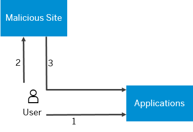

<!-- loio1f5f34e31ec64af8b5fef1796ea07c0a -->

# Protection from Cross-Site Request Forgery

> ### Remember:  
> SAP Business Technology Platform, Neo environment will sunset on **December 31, 2028**, subject to terms of customer or partner contracts.
> 
> For more information, see SAP Note [3351844](https://me.sap.com/notes/3351844).

> ### Tip:  
> **This documentation refers to SAP Business Technology Platform, Neo environment. If you are looking for documentation about other environments, see [SAP Business Technology Platform](https://help.sap.com/viewer/65de2977205c403bbc107264b8eccf4b/Cloud/en-US/6a2c1ab5a31b4ed9a2ce17a5329e1dd8.html "SAP Business Technology Platform (SAP BTP) is an integrated offering comprised of four technology portfolios: database and data management, application development and integration, analytics, and intelligent technologies. The platform offers users the ability to turn data into business value, compose end-to-end business processes, and build and extend SAP applications quickly.") :arrow_upper_right:.**

## What is Cross-Site Request Forgery \(CSRF\)

Cross-site request forgery \(CSRF or XSRF\) is also known as one-click attack or session riding. The key step of the attack is that a malicious user tricks the victim’s browser into executing an HTTP request on behalf of the valid user. As a result, a security sensitive action is performed on the server side. If the victim has already logged in the attacked site, the browser has valid session cookies and sends them automatically with subsequent requests. The server trusts these requests based on the valid cookies sent by the browser and confirms that the action has been initiated by the victim.

The predictability of the HTTP request is a prerequisite for the attacker to be able to insert a request in advance in order to make the browser execute it. Therefore, the common prevention to this attack is to embed a secret unpredictable token into the request, unique for each session or request.

The diagram that follows illustrates the CSRF process:

1.  The victim logs in and creates session for the attacked web application.
2.  The victim visits a malicious site in another browser window.
3.  The malicious site makes request to the attacked application using the victim‘s session cookies.

## How to Protect from CSRF

SAP BTP provides two CSRF protection approaches:

<table>
<tr>
<th valign="top">

CSRF Protection Mechanism

</th>
<th valign="top">

Description

</th>
<th valign="top">

When to Use

</th>
<th valign="top">

How to Use

</th>
</tr>
<tr>
<td valign="top">

URL encoding approach

</td>
<td valign="top">

Based on the [CSRF Prevention Filter](http://tomcat.apache.org/tomcat-7.0-doc/config/filter.html#CSRF_Prevention_Filter) provided by Apache Tomcat 7. The prevention mechanism is based on a token \(a nonce value\) generated on each request and stored in the session. The token is used to encode all URLs on the entry point sites. Upon request to a protected URL, the existence and value of the token is checked. The request is allowed to proceed only if the nonce from the token equals the one stored in the session. The prevention mechanism is applied for all URLs mapped to the filter except for specially defined entry points.

</td>
<td valign="top">

This is the most common CSRF protection. Use it for protecting resources that are supposed to be accessed via some sort of navigation. For example, if there is a reference to them in an entry point page \(included in links/post forms, and so on\).

</td>
<td valign="top">

See [Using the Apache Tomcat CSRF Prevention Filter](using-the-apache-tomcat-csrf-prevention-filter-e5be999.md).

</td>
</tr>
<tr>
<td valign="top">

Custom header approach

</td>
<td valign="top">

Based on a secret token \(a nonce value\) generated on server side and stored in the session, but unlike the first approach, here the token is transported as a custom header of the HTTP requests.

</td>
<td valign="top">

Use it when URL encoding is not suitable. For example, when protecting resources that are requested only as REST APIs \(one time requests that should be served independently from previous requests and are not included in links and HTML forms\). The same approach is implemented in other SAP web application servers like AS ABAP and HANA XS, and is supported by SAP UI5. Common scenarios that can benefit from this approach are those using ODATA services, REST, AJAX, etc.

</td>
<td valign="top">

See [Using Custom Header Protection](using-custom-header-protection-3756f3f.md).

</td>
</tr>
<tr>
<td valign="top">

Custom CSRF filtering implementation

</td>
<td valign="top">

If you cannot use URL encoding or custom header protection, you can implement your custom CSRF filtering

</td>
<td valign="top">

Use it when implementing single logout \(SLO\) for SAP BTP applications. Due to redirects to the SAML 2.0 identity provider, you cannot use the out-of-the-box approaches listed here \(custom header protection or URL encoding.

</td>
<td valign="top">

[Logout](logout-2eebf76.md) 

</td>
</tr>
</table>

> ### Note:  
> These approaches cannot be applied together to protect one and the same web resource.

