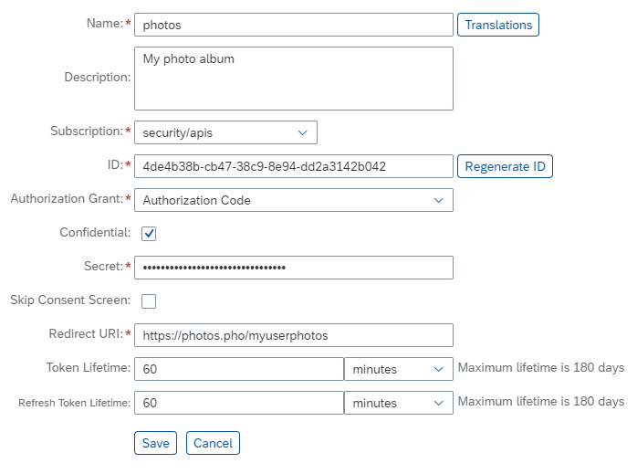

<!-- loio61d8095aa39547c7b30d9aeda771497f -->

# Register an OAuth Client

To authorize a device to access an OAuth-protected application, you need to register it as a client.

## Context

## Procedure

1.  In your Web browser, log on to the cockpit, and select an account.

2.  In the *Security* \> *OAuth* section, go to the *Clients* tab.

3.  Choose *Register New Client*.

    

4.  Enter the client data as required \(see the table below\).

    <table>
    <tr>
    <th valign="top">

    Field

    
    </th>
    <th valign="top">

    Description

    
    </th>
    </tr>
    <tr>
    <td valign="top">

    *Name*

    
    </td>
    <td valign="top">

    The client name.

    
    </td>
    </tr>
    <tr>
    <td valign="top">

    *Description*

    
    </td>
    <td valign="top">

    A free-text description of the client.

    
    </td>
    </tr>
    <tr>
    <td valign="top">

    *Subscription*

    
    </td>
    <td valign="top">

    The application for which you are registering this client. To be able to register for a particular application, this account must be subscribed to it. For more information, see [Register an OAuth Client](register-an-oauth-client-61d8095.md).

    
    </td>
    </tr>
    <tr>
    <td valign="top">

    *ID*

    
    </td>
    <td valign="top">

    SAP BTP. If you already have a client with a defined ID at the client device, enter its value here. Otherwise, you can choose *Generate ID* and *Secret* to use a system-generated ID, or enter a custom value. In that case, you must provide that value to the user of the client device.

    > ### Note:  
    > The client ID must be globally unique within the entire SAP BTP.

    
    </td>
    </tr>
    <tr>
    <td valign="top">

    *Confidential*

    
    </td>
    <td valign="top">

    If you mark this box, the client ID will be protected with a password. You will need to supply the password here, and provide it to the client.Required. The ID of the client authorized to access the resource server running on

    
    </td>
    </tr>
    <tr>
    <td valign="top">

    *Secret*

    
    </td>
    <td valign="top">

    Required. The ID of the client authorized to access theA secret \(password\) that allows the authorization server to authenticate before the client on behalf of the resource owner \(user\).

    It will also be needed by the client.

    
    </td>
    </tr>
    <tr>
    <td valign="top">

    *Skip Consent Screen*

    
    </td>
    <td valign="top">

    If you mark this option, no end user action will be required for authorizing this client. Otherwise, the end user will have to confirm granting the requested authorization.

    
    </td>
    </tr>
    <tr>
    <td valign="top">

    *Redirect URI*

    
    </td>
    <td valign="top">

    The application URI to which the authorization server will connect the client with the authorization code.

    
    </td>
    </tr>
    <tr>
    <td valign="top">

    *Token Lifetime*

    
    </td>
    <td valign="top">

    The token lifetime. Applies to the access token and authorization code. Values allowed: from 0 to 180 days.

    > ### Note:  
    > It is no longer possible to use 0 \(unlimited validity\) as value. If you have existing OAuth clients with this value, we recommend that you change them to a supported validity suitable for your scenario. For more information, see [OAuth 2.0 Clients with Unlimited Validity Tokens](oauth-2-0-clients-with-unlimited-validity-tokens-5eccd48.md).

    
    </td>
    </tr>
    <tr>
    <td valign="top">

    *Refresh Token Lifetime*

    
    </td>
    <td valign="top">

    The refresh token lifetime. Values allowed: from 0 to 180 days.

    > ### Note:  
    > It is no longer possible to use 0 \(unlimited validity\) as value. If you have existing OAuth clients with this value, we recommend that you change them to a supported validity suitable for your scenario. For more information, see [OAuth 2.0 Clients with Unlimited Validity Tokens](oauth-2-0-clients-with-unlimited-validity-tokens-5eccd48.md).

    
    </td>
    </tr>
    <tr>
    <td valign="top">

    *Translations*

    
    </td>
    <td valign="top">

    Optionally, you can provide translations of the client name and description for localization purposes. Choose the *Translations* button and enter the required language translation there.

    
    </td>
    </tr>
    </table>
    
5.  Save the new client.

## Results

The device with the defined ID will be recognized as a registered client.

