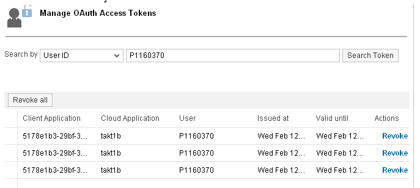
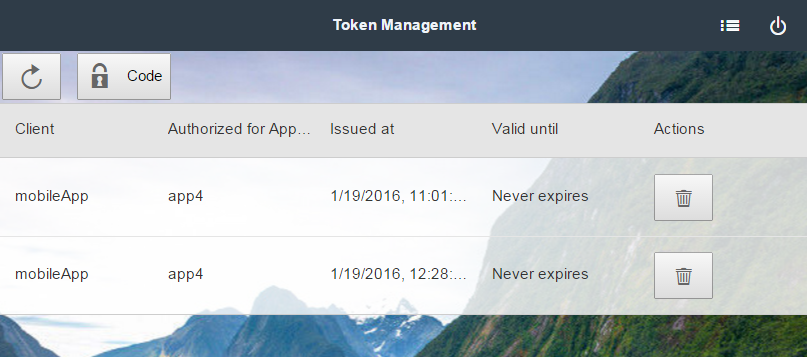

<!-- loiof5eac83ceb4d4d72b64424f518f878fd -->

# Revoke OAuth Access Tokens

With revoking access tokens, you can immediately reject access rights you have previously granted. You may wish to revoke an access token if you believe the token is be stolen, for example.

> ### Restriction:  
> You can revoke only the default persistent type of accesss tokes. If you use JWT tokens as access tokens, you cannot revoke them as they are not stored persistently. See [Best Practices for Resilient OAuth 2.0 Communication](best-practices-for-resilient-oauth-2-0-communication-11fe332.md).

There are two UIs for revoking access tokens:

-   The Cockpit - an administrator user may use the Cockpit to revoke tokens on behalf of different end users
-   The end user UI - an end user may access its tokens \(and no other user's\) and revoke the required using that UI

Using the Cockpit \(for administrators\):

1.  In your Web browser, open the Cockpit.
2.  Go to the *Security* \> *Authorizations* \> *Token* section.
3.  Search for access tokens either by client ID or by user ID.
4.  Choose *Revoke* for the required tokens.

Using the End User UI:

1.  In the Cockpit, choose the *Security* \> *OAuth* section, and go to the *Branding* tab.
2.  Click the *End User UI* link.You are now opening the end user UI in a new browser window. You can see all access tokens issued for the current user.
3.  Choose the *Revoke* button for the tokens to revoke.

