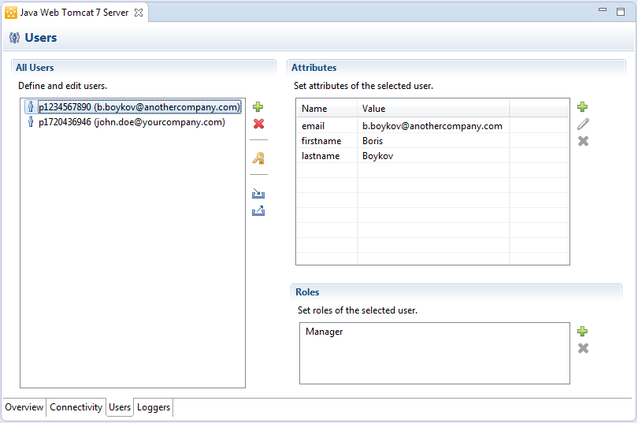
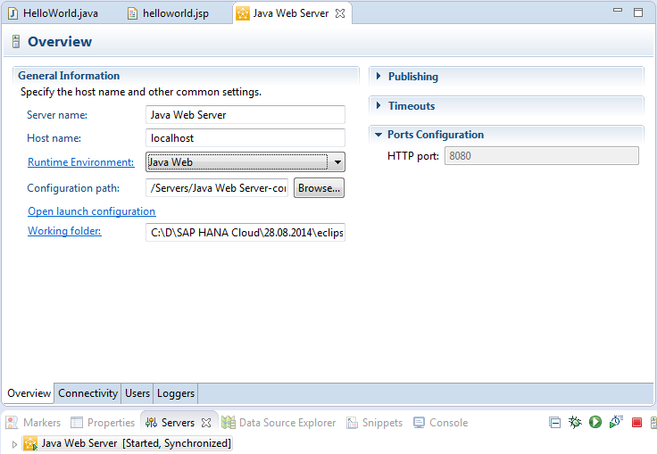
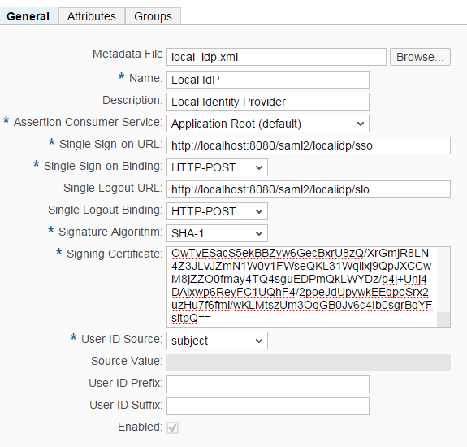
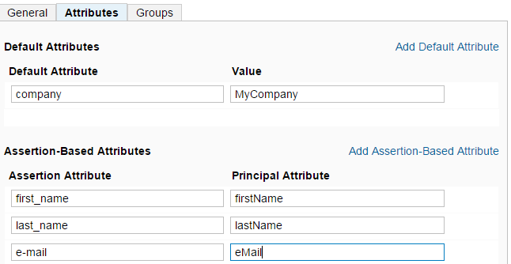
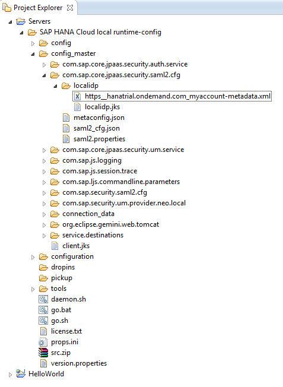

<!-- loio754818ea63874ea38843ab0ed1928765 -->

# Test Security on the Cloud \(with a Local Identity Provider\)

You can use a local test identity provider \(IdP\) to test single sign on \(SSO\) and identity federation of an SAP BTP application end-to-end.

> ### Tip:  
> **This documentation refers to SAP Business Technology Platform, Neo environment. If you are looking for documentation about other environments, see [SAP Business Technology Platform](https://help.sap.com/viewer/65de2977205c403bbc107264b8eccf4b/Cloud/en-US/6a2c1ab5a31b4ed9a2ce17a5329e1dd8.html "SAP Business Technology Platform (SAP BTP) is an integrated offering comprised of four technology portfolios: database and data management, application development and integration, analytics, and intelligent technologies. The platform offers users the ability to turn data into business value, compose end-to-end business processes, and build and extend SAP applications quickly.") :arrow_upper_right:.**

> ### Note:  
> The Java tools for Eclipse used in this page are no longer available. We are in the process of updating the content accordingly.


This scenario offers simplified testing in which developers establish trust to an application deployed in the cloud with an easy-to-use local test identity provider .

For more information about the identity provider concept in SAP BTP, see [Application Identity Provider](application-identity-provider-dc61853.md#loiodc618538d97610148155d97dcd123c24).

**Contents**:

-   [Prerequisites](test-security-on-the-cloud-with-a-local-identity-provider-754818e.md#loio754818ea63874ea38843ab0ed1928765__prereq)
-   [Procedure](test-security-on-the-cloud-with-a-local-identity-provider-754818e.md#loio754818ea63874ea38843ab0ed1928765__section_N1005F_N10012_N10001)
    -   [1. Set up the local test IdP](test-security-on-the-cloud-with-a-local-identity-provider-754818e.md#loio754818ea63874ea38843ab0ed1928765__setup)
    -   [2. Configure the service provider of your account in SAP BTP](test-security-on-the-cloud-with-a-local-identity-provider-754818e.md#loio754818ea63874ea38843ab0ed1928765__configure)
    -   [3. \(Optional \) Configure the local IdP name](test-security-on-the-cloud-with-a-local-identity-provider-754818e.md#loio754818ea63874ea38843ab0ed1928765__localidpname)
    -   [4. Configure trust on SAP BTP to the local test IdP](test-security-on-the-cloud-with-a-local-identity-provider-754818e.md#loio754818ea63874ea38843ab0ed1928765__trust)
    -   [5. Generate self sign-key pair and certificate for the local test IdP \(optional\)](test-security-on-the-cloud-with-a-local-identity-provider-754818e.md#loio754818ea63874ea38843ab0ed1928765__generate)
    -   [6. Configure trust on the local test IdP to SAP BTP](test-security-on-the-cloud-with-a-local-identity-provider-754818e.md#loio754818ea63874ea38843ab0ed1928765__test)


<a name="loio754818ea63874ea38843ab0ed1928765__prereq"/>

## Prerequisites

-   You have set up and configured the Eclipse IDE for Java EE Developers and SAP BTP Tools for Java. For more information, see [Setting Up the Tools and SDK](../30-development-neo/setting-up-the-development-environment-e815ca4.md).

-   You have developed and deployed your application on SAP BTP. For more information, see .


<a name="loio754818ea63874ea38843ab0ed1928765__section_N1005F_N10012_N10001"/>

## Procedure

The usage of the local test identity provider involves the following steps:


<a name="loio754818ea63874ea38843ab0ed1928765__setup"/>

## 1. Set up the local test IdP

1.  Open the Eclipse IDE.
2.  Go to the *Servers* view.
3.  From the context menu, choose *New* \> *Server*.
4.  In the *Define a new server* wizard, select *Java Web Server*, *Java Web Tomcat 7 Server*, or *Java EE 6 Web Profile Server* \(depending on the SDK you use\).
5.  Start the server. The local test IdP is packaged within the SDK, so when you start the server, it will start as well.
6.  Double-click the server and open the *Users* tab page.
7.  Define local test IdP users and their attributes. Exemplary data:

    


For more information about the Users editor, see [Testing User Authentication on the Local Server](authentication-e637f62.md#loioe637f62abb571014857cb0232adc43a7).


<a name="loio754818ea63874ea38843ab0ed1928765__configure"/>

## 2. Configure the service provider of your account in SAP BTP

1.  In a Web browser, open the cockpit and navigate to *Security* \> *Trust* \> *Local Service Provider*.
2.  Choose *Edit*.
3.  For *Configuration Type*, choose *Custom*.
4.  Choose *Generate Key Pair* to generate a new signing key and self-signed certificate.
5.  For the rest of the fields, leave the default values.
6.  Choose *Save*.
7.  Choose *Get Metadata* to download and save the SAML 2.0 metadata identifying your SAP BTP account as a service provider. You will have to import this metadata into the local test IdP to configure trust to SAP BTP in the procedure that follows.

    


<a name="loio754818ea63874ea38843ab0ed1928765__localidpname"/>

## 3. \(Optional \) Configure the local IdP name

You need to configure your local IdP name if you want to use more than one local IdP. Default local IdP name:`localidp`.

1.  In the Eclipse IDE, go to the already set up local server that will be used as local IdP.
2.  In the `config_master/com.sap.core.jpaas.security.saml2.cfg/` folder, create a file named `local_idp.cfg`.
3.  In the file, add a property:

    `localidp_name=<idpname you want to use>`

4.  Restart the local server.


<a name="loio754818ea63874ea38843ab0ed1928765__trust"/>

## 4. Configure trust on SAP BTP to the local test IdP

The trust settings on SAP BTP for the local test IdP are configured in the same way as with any other productive IdP.

1.  During the configuration, use the local test IdP metadata that can be requested under the following link: ***http://<idp\_host\>:<idp\_port\>/saml2/localidp/metadata***,

    where *<idp\_host\>* and *<idp\_port\>* are the local server host and port.

    To find the *<idp\_port\>*, go to *Servers*, double click on the local server and choose *Overview* \> *Ports Configuration*.

    

2.  Configure trust on the cloud to the local test IdP.

    1.  Open the cockpit in a Web browser, navigate to *Security* \> *Trust* \> *Application Identity Provider*, and then click *Add Trusted Identity Provider*.
    2.  In *General* tab page, use the *Metadata File* *Browse* button to add the local test IdP metadata.

        All the needed values are filled in automatically.

    3.  Choose *Save & Close*.

    

    For more information, see [Application Identity Provider](application-identity-provider-dc61853.md#loiodc618538d97610148155d97dcd123c24)

3.  Configure the*User Attributes*.

Assertion-based attributes are used to define a mapping between attributes in the SAML assertion issued by the local test IdP and user attributes on the Cloud.

This allows you to essentially pass any attribute exposed by the local test IdP to an attribute used in your application in the cloud.

Define user attributes in the local test IdP by using the Eclipse IDE Users editor for SAP BTP as is described in Setting up the local test IdP.

To add an assertion-based attribute, proceed as follows:

1.  Open the cockpit in a Web browser, navigate to *Security* \> *Trust* \> *Application Identity Provider*.
2.  From the table, choose the entry *localidp*, open the *Attributes* tab page, and click on *Add Assertion-Based Attribute*.
3.  In Assertion *Attribute*, enter the name of the attribute contained in the SAML 2.0 assertion issued by the local test IdP. These are the same user attributes you defined in the Eclipse IDE Users editor when setting the local test IdP.
4.  In *Principal Attribute*, enter the name of the user attribute as referred in the tested application.

    

5.  Choose *Save & Close*.


<a name="loio754818ea63874ea38843ab0ed1928765__generate"/>

## 5. Generate self sign-key pair and certificate for the local test IdP \(optional\)

If an error occurs while requesting the IdP metadata and the metadata cannot be generated, you can do the following:

1.  Generate a *localidp.jks* keyfile manually. The key and certificate are needed for signing the information that the local test IdP will exchange with SAP BTP.
2.  Open the directory `<JAVA_HOME>/jre/bin/keytool`
3.  Open a command line and execute the following command:

    ```
    keytool -genkeypair -dname "CN=localidp" -keyalg "RSA" -validity 3650 -alias localidp -storepass localidp -keypass localidp -keystore <fullpath_dir_name>\localidp.jks
    ```

    where <fullpath\_dir\_name\> is the directory path where the jks will be saved after the creation.

4.  Under the *Server* directory, go to `config_master\com.sap.core.jpaas.security.saml2.cfg` and create a directory with name *localidp*.
5.  Copy the *localidp.jks* file under *localidp* directory.


<a name="loio754818ea63874ea38843ab0ed1928765__test"/>

## 6. Configure trust on the local test IdP to SAP BTP

1.  In the Eclipse IDE, go to the already set up local test IdP Server.
2.  Copy the file with the metadata describing SAP BTP as a service provider under the local server directory `config_master/com.sap.core.jpaas.security.saml2.cfg/localidp`. To get this metadata, in the cockpit, choose *Security* \> *Trust* \> *Local Service Provider* \> *Get Metadata*.

    


## Result

You can now access your application, deployed on the cloud, and test it against the local test IdP and its defined users and attributes.

